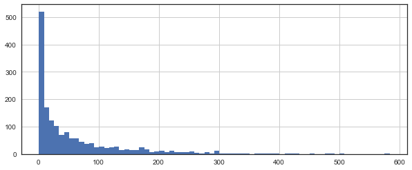
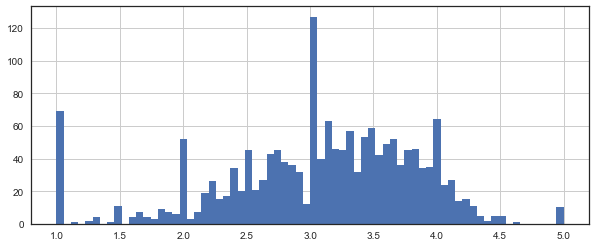
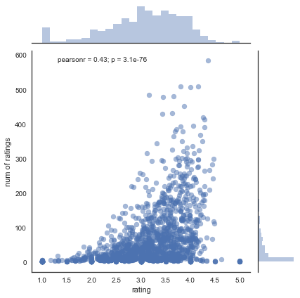

# Recommender System for the MovieLens dataset

## Importing Libraries and dataset


```python
import numpy as np
import pandas as pd
```


```python
column_names = ['user_id', 'item_id', 'rating', 'timestamp']
df = pd.read_csv('u.data', sep='\t', names=column_names)
```


```python
df.head()
```


<div>
<style>
    .dataframe thead tr:only-child th {
        text-align: right;
    }

    .dataframe thead th {
        text-align: left;
    }

    .dataframe tbody tr th {
        vertical-align: top;
    }
</style>
<table border="1" class="dataframe">
  <thead>
    <tr style="text-align: right;">
      <th></th>
      <th>user_id</th>
      <th>item_id</th>
      <th>rating</th>
      <th>timestamp</th>
    </tr>
  </thead>
  <tbody>
    <tr>
      <th>0</th>
      <td>0</td>
      <td>50</td>
      <td>5</td>
      <td>881250949</td>
    </tr>
    <tr>
      <th>1</th>
      <td>0</td>
      <td>172</td>
      <td>5</td>
      <td>881250949</td>
    </tr>
    <tr>
      <th>2</th>
      <td>0</td>
      <td>133</td>
      <td>1</td>
      <td>881250949</td>
    </tr>
    <tr>
      <th>3</th>
      <td>196</td>
      <td>242</td>
      <td>3</td>
      <td>881250949</td>
    </tr>
    <tr>
      <th>4</th>
      <td>186</td>
      <td>302</td>
      <td>3</td>
      <td>891717742</td>
    </tr>
  </tbody>
</table>
</div>


Getiing and merging movie titles:


```python
movie_titles = pd.read_csv("Movie_Id_Titles")
movie_titles.head()
```


<div>
<style>
    .dataframe thead tr:only-child th {
        text-align: right;
    }

    .dataframe thead th {
        text-align: left;
    }

    .dataframe tbody tr th {
        vertical-align: top;
    }
</style>
<table border="1" class="dataframe">
  <thead>
    <tr style="text-align: right;">
      <th></th>
      <th>item_id</th>
      <th>title</th>
    </tr>
  </thead>
  <tbody>
    <tr>
      <th>0</th>
      <td>1</td>
      <td>Toy Story (1995)</td>
    </tr>
    <tr>
      <th>1</th>
      <td>2</td>
      <td>GoldenEye (1995)</td>
    </tr>
    <tr>
      <th>2</th>
      <td>3</td>
      <td>Four Rooms (1995)</td>
    </tr>
    <tr>
      <th>3</th>
      <td>4</td>
      <td>Get Shorty (1995)</td>
    </tr>
    <tr>
      <th>4</th>
      <td>5</td>
      <td>Copycat (1995)</td>
    </tr>
  </tbody>
</table>
</div>


```python
df = pd.merge(df,movie_titles,on='item_id')
df.head()
```


<div>
<style>
    .dataframe thead tr:only-child th {
        text-align: right;
    }

    .dataframe thead th {
        text-align: left;
    }

    .dataframe tbody tr th {
        vertical-align: top;
    }
</style>
<table border="1" class="dataframe">
  <thead>
    <tr style="text-align: right;">
      <th></th>
      <th>user_id</th>
      <th>item_id</th>
      <th>rating</th>
      <th>timestamp</th>
      <th>title</th>
    </tr>
  </thead>
  <tbody>
    <tr>
      <th>0</th>
      <td>0</td>
      <td>50</td>
      <td>5</td>
      <td>881250949</td>
      <td>Star Wars (1977)</td>
    </tr>
    <tr>
      <th>1</th>
      <td>290</td>
      <td>50</td>
      <td>5</td>
      <td>880473582</td>
      <td>Star Wars (1977)</td>
    </tr>
    <tr>
      <th>2</th>
      <td>79</td>
      <td>50</td>
      <td>4</td>
      <td>891271545</td>
      <td>Star Wars (1977)</td>
    </tr>
    <tr>
      <th>3</th>
      <td>2</td>
      <td>50</td>
      <td>5</td>
      <td>888552084</td>
      <td>Star Wars (1977)</td>
    </tr>
    <tr>
      <th>4</th>
      <td>8</td>
      <td>50</td>
      <td>5</td>
      <td>879362124</td>
      <td>Star Wars (1977)</td>
    </tr>
  </tbody>
</table>
</div>


# EDA

What are some best rated movies

## Visualization Imports


```python
import matplotlib.pyplot as plt
import seaborn as sns
sns.set_style('white')
%matplotlib inline
```

Creating a ratings dataframe with average rating and number of ratings:


```python
df.groupby('title')['rating'].mean().sort_values(ascending=False).head()
```


    title
    Marlene Dietrich: Shadow and Light (1996)     5.0
    Prefontaine (1997)                            5.0
    Santa with Muscles (1996)                     5.0
    Star Kid (1997)                               5.0
    Someone Else's America (1995)                 5.0
    Name: rating, dtype: float64


```python
df.groupby('title')['rating'].count().sort_values(ascending=False).head()
```


    title
    Star Wars (1977)             584
    Contact (1997)               509
    Fargo (1996)                 508
    Return of the Jedi (1983)    507
    Liar Liar (1997)             485
    Name: rating, dtype: int64


```python
ratings = pd.DataFrame(df.groupby('title')['rating'].mean())
ratings.head()
```


<div>
<style>
    .dataframe thead tr:only-child th {
        text-align: right;
    }

    .dataframe thead th {
        text-align: left;
    }

    .dataframe tbody tr th {
        vertical-align: top;
    }
</style>
<table border="1" class="dataframe">
  <thead>
    <tr style="text-align: right;">
      <th></th>
      <th>rating</th>
    </tr>
    <tr>
      <th>title</th>
      <th></th>
    </tr>
  </thead>
  <tbody>
    <tr>
      <th>'Til There Was You (1997)</th>
      <td>2.333333</td>
    </tr>
    <tr>
      <th>1-900 (1994)</th>
      <td>2.600000</td>
    </tr>
    <tr>
      <th>101 Dalmatians (1996)</th>
      <td>2.908257</td>
    </tr>
    <tr>
      <th>12 Angry Men (1957)</th>
      <td>4.344000</td>
    </tr>
    <tr>
      <th>187 (1997)</th>
      <td>3.024390</td>
    </tr>
  </tbody>
</table>
</div>


Number of ratings column:


```python
ratings['num of ratings'] = pd.DataFrame(df.groupby('title')['rating'].count())
ratings.head()
```


<div>
<style>
    .dataframe thead tr:only-child th {
        text-align: right;
    }

    .dataframe thead th {
        text-align: left;
    }

    .dataframe tbody tr th {
        vertical-align: top;
    }
</style>
<table border="1" class="dataframe">
  <thead>
    <tr style="text-align: right;">
      <th></th>
      <th>rating</th>
      <th>num of ratings</th>
    </tr>
    <tr>
      <th>title</th>
      <th></th>
      <th></th>
    </tr>
  </thead>
  <tbody>
    <tr>
      <th>'Til There Was You (1997)</th>
      <td>2.333333</td>
      <td>9</td>
    </tr>
    <tr>
      <th>1-900 (1994)</th>
      <td>2.600000</td>
      <td>5</td>
    </tr>
    <tr>
      <th>101 Dalmatians (1996)</th>
      <td>2.908257</td>
      <td>109</td>
    </tr>
    <tr>
      <th>12 Angry Men (1957)</th>
      <td>4.344000</td>
      <td>125</td>
    </tr>
    <tr>
      <th>187 (1997)</th>
      <td>3.024390</td>
      <td>41</td>
    </tr>
  </tbody>
</table>
</div>


Now a few histograms:


```python
plt.figure(figsize=(10,4))
ratings['num of ratings'].hist(bins=70)
```


    <matplotlib.axes._subplots.AxesSubplot at 0x25c8dcbfcf8>





```python
plt.figure(figsize=(10,4))
ratings['rating'].hist(bins=70)
```


    <matplotlib.axes._subplots.AxesSubplot at 0x25c8e1cd940>





```python
sns.jointplot(x='rating',y='num of ratings',data=ratings,alpha=0.5)
```


    <seaborn.axisgrid.JointGrid at 0x25c8facd710>





## Recommending Similar Movies

Creating a matrix that has the user ids on one axis and the movie titles on another axis. Each cell will then consist of the rating the user gave to that movie. Note there will be a lot of NaN values, because most people have not seen most of the movies.


```python
moviemat = df.pivot_table(index='user_id',columns='title',values='rating')
moviemat.head()
```


<div>
<style>
    .dataframe thead tr:only-child th {
        text-align: right;
    }

    .dataframe thead th {
        text-align: left;
    }

    .dataframe tbody tr th {
        vertical-align: top;
    }
</style>
<table border="1" class="dataframe">
  <thead>
    <tr style="text-align: right;">
      <th>title</th>
      <th>'Til There Was You (1997)</th>
      <th>1-900 (1994)</th>
      <th>101 Dalmatians (1996)</th>
      <th>12 Angry Men (1957)</th>
      <th>187 (1997)</th>
      <th>2 Days in the Valley (1996)</th>
      <th>20,000 Leagues Under the Sea (1954)</th>
      <th>2001: A Space Odyssey (1968)</th>
      <th>3 Ninjas: High Noon At Mega Mountain (1998)</th>
      <th>39 Steps, The (1935)</th>
      <th>...</th>
      <th>Yankee Zulu (1994)</th>
      <th>Year of the Horse (1997)</th>
      <th>You So Crazy (1994)</th>
      <th>Young Frankenstein (1974)</th>
      <th>Young Guns (1988)</th>
      <th>Young Guns II (1990)</th>
      <th>Young Poisoner's Handbook, The (1995)</th>
      <th>Zeus and Roxanne (1997)</th>
      <th>unknown</th>
      <th>Á köldum klaka (Cold Fever) (1994)</th>
    </tr>
    <tr>
      <th>user_id</th>
      <th></th>
      <th></th>
      <th></th>
      <th></th>
      <th></th>
      <th></th>
      <th></th>
      <th></th>
      <th></th>
      <th></th>
      <th></th>
      <th></th>
      <th></th>
      <th></th>
      <th></th>
      <th></th>
      <th></th>
      <th></th>
      <th></th>
      <th></th>
      <th></th>
    </tr>
  </thead>
  <tbody>
    <tr>
      <th>0</th>
      <td>NaN</td>
      <td>NaN</td>
      <td>NaN</td>
      <td>NaN</td>
      <td>NaN</td>
      <td>NaN</td>
      <td>NaN</td>
      <td>NaN</td>
      <td>NaN</td>
      <td>NaN</td>
      <td>...</td>
      <td>NaN</td>
      <td>NaN</td>
      <td>NaN</td>
      <td>NaN</td>
      <td>NaN</td>
      <td>NaN</td>
      <td>NaN</td>
      <td>NaN</td>
      <td>NaN</td>
      <td>NaN</td>
    </tr>
    <tr>
      <th>1</th>
      <td>NaN</td>
      <td>NaN</td>
      <td>2.0</td>
      <td>5.0</td>
      <td>NaN</td>
      <td>NaN</td>
      <td>3.0</td>
      <td>4.0</td>
      <td>NaN</td>
      <td>NaN</td>
      <td>...</td>
      <td>NaN</td>
      <td>NaN</td>
      <td>NaN</td>
      <td>5.0</td>
      <td>3.0</td>
      <td>NaN</td>
      <td>NaN</td>
      <td>NaN</td>
      <td>4.0</td>
      <td>NaN</td>
    </tr>
    <tr>
      <th>2</th>
      <td>NaN</td>
      <td>NaN</td>
      <td>NaN</td>
      <td>NaN</td>
      <td>NaN</td>
      <td>NaN</td>
      <td>NaN</td>
      <td>NaN</td>
      <td>1.0</td>
      <td>NaN</td>
      <td>...</td>
      <td>NaN</td>
      <td>NaN</td>
      <td>NaN</td>
      <td>NaN</td>
      <td>NaN</td>
      <td>NaN</td>
      <td>NaN</td>
      <td>NaN</td>
      <td>NaN</td>
      <td>NaN</td>
    </tr>
    <tr>
      <th>3</th>
      <td>NaN</td>
      <td>NaN</td>
      <td>NaN</td>
      <td>NaN</td>
      <td>2.0</td>
      <td>NaN</td>
      <td>NaN</td>
      <td>NaN</td>
      <td>NaN</td>
      <td>NaN</td>
      <td>...</td>
      <td>NaN</td>
      <td>NaN</td>
      <td>NaN</td>
      <td>NaN</td>
      <td>NaN</td>
      <td>NaN</td>
      <td>NaN</td>
      <td>NaN</td>
      <td>NaN</td>
      <td>NaN</td>
    </tr>
    <tr>
      <th>4</th>
      <td>NaN</td>
      <td>NaN</td>
      <td>NaN</td>
      <td>NaN</td>
      <td>NaN</td>
      <td>NaN</td>
      <td>NaN</td>
      <td>NaN</td>
      <td>NaN</td>
      <td>NaN</td>
      <td>...</td>
      <td>NaN</td>
      <td>NaN</td>
      <td>NaN</td>
      <td>NaN</td>
      <td>NaN</td>
      <td>NaN</td>
      <td>NaN</td>
      <td>NaN</td>
      <td>NaN</td>
      <td>NaN</td>
    </tr>
  </tbody>
</table>
<p>5 rows × 1664 columns</p>
</div>


Most rated movie:


```python
ratings.sort_values('num of ratings',ascending=False).head(10)
```


<div>
<style>
    .dataframe thead tr:only-child th {
        text-align: right;
    }

    .dataframe thead th {
        text-align: left;
    }

    .dataframe tbody tr th {
        vertical-align: top;
    }
</style>
<table border="1" class="dataframe">
  <thead>
    <tr style="text-align: right;">
      <th></th>
      <th>rating</th>
      <th>num of ratings</th>
    </tr>
    <tr>
      <th>title</th>
      <th></th>
      <th></th>
    </tr>
  </thead>
  <tbody>
    <tr>
      <th>Star Wars (1977)</th>
      <td>4.359589</td>
      <td>584</td>
    </tr>
    <tr>
      <th>Contact (1997)</th>
      <td>3.803536</td>
      <td>509</td>
    </tr>
    <tr>
      <th>Fargo (1996)</th>
      <td>4.155512</td>
      <td>508</td>
    </tr>
    <tr>
      <th>Return of the Jedi (1983)</th>
      <td>4.007890</td>
      <td>507</td>
    </tr>
    <tr>
      <th>Liar Liar (1997)</th>
      <td>3.156701</td>
      <td>485</td>
    </tr>
    <tr>
      <th>English Patient, The (1996)</th>
      <td>3.656965</td>
      <td>481</td>
    </tr>
    <tr>
      <th>Scream (1996)</th>
      <td>3.441423</td>
      <td>478</td>
    </tr>
    <tr>
      <th>Toy Story (1995)</th>
      <td>3.878319</td>
      <td>452</td>
    </tr>
    <tr>
      <th>Air Force One (1997)</th>
      <td>3.631090</td>
      <td>431</td>
    </tr>
    <tr>
      <th>Independence Day (ID4) (1996)</th>
      <td>3.438228</td>
      <td>429</td>
    </tr>
  </tbody>
</table>
</div>


Let's consider two movies: starwars, a sci-fi movie. And Liar Liar, a comedy.


```python
ratings.head()
```


<div>
<style>
    .dataframe thead tr:only-child th {
        text-align: right;
    }

    .dataframe thead th {
        text-align: left;
    }

    .dataframe tbody tr th {
        vertical-align: top;
    }
</style>
<table border="1" class="dataframe">
  <thead>
    <tr style="text-align: right;">
      <th></th>
      <th>rating</th>
      <th>num of ratings</th>
    </tr>
    <tr>
      <th>title</th>
      <th></th>
      <th></th>
    </tr>
  </thead>
  <tbody>
    <tr>
      <th>'Til There Was You (1997)</th>
      <td>2.333333</td>
      <td>9</td>
    </tr>
    <tr>
      <th>1-900 (1994)</th>
      <td>2.600000</td>
      <td>5</td>
    </tr>
    <tr>
      <th>101 Dalmatians (1996)</th>
      <td>2.908257</td>
      <td>109</td>
    </tr>
    <tr>
      <th>12 Angry Men (1957)</th>
      <td>4.344000</td>
      <td>125</td>
    </tr>
    <tr>
      <th>187 (1997)</th>
      <td>3.024390</td>
      <td>41</td>
    </tr>
  </tbody>
</table>
</div>


Now let's grab the user ratings for those two movies:


```python
starwars_user_ratings = moviemat['Star Wars (1977)']
liarliar_user_ratings = moviemat['Liar Liar (1997)']
starwars_user_ratings.head()
```


    user_id
    0    5.0
    1    5.0
    2    5.0
    3    NaN
    4    5.0
    Name: Star Wars (1977), dtype: float64


Using corrwith() method to get correlations between two pandas series:


```python
similar_to_starwars = moviemat.corrwith(starwars_user_ratings)
similar_to_liarliar = moviemat.corrwith(liarliar_user_ratings)
```

    C:\ProgramData\Anaconda3\lib\site-packages\numpy\lib\function_base.py:2995: RuntimeWarning: Degrees of freedom <= 0 for slice
      c = cov(x, y, rowvar)
    C:\ProgramData\Anaconda3\lib\site-packages\numpy\lib\function_base.py:2929: RuntimeWarning: divide by zero encountered in double_scalars
      c *= 1. / np.float64(fact)
    


```python
type(similar_to_liarliar)
```


    pandas.core.series.Series


Cleaning this by removing NaN values and using a DataFrame instead of a series:


```python
corr_starwars = pd.DataFrame(similar_to_starwars,columns=['Correlation'])
corr_starwars.dropna(inplace=True)
corr_starwars.head()
```


<div>
<style>
    .dataframe thead tr:only-child th {
        text-align: right;
    }

    .dataframe thead th {
        text-align: left;
    }

    .dataframe tbody tr th {
        vertical-align: top;
    }
</style>
<table border="1" class="dataframe">
  <thead>
    <tr style="text-align: right;">
      <th></th>
      <th>Correlation</th>
    </tr>
    <tr>
      <th>title</th>
      <th></th>
    </tr>
  </thead>
  <tbody>
    <tr>
      <th>'Til There Was You (1997)</th>
      <td>0.872872</td>
    </tr>
    <tr>
      <th>1-900 (1994)</th>
      <td>-0.645497</td>
    </tr>
    <tr>
      <th>101 Dalmatians (1996)</th>
      <td>0.211132</td>
    </tr>
    <tr>
      <th>12 Angry Men (1957)</th>
      <td>0.184289</td>
    </tr>
    <tr>
      <th>187 (1997)</th>
      <td>0.027398</td>
    </tr>
  </tbody>
</table>
</div>


Now if we sort the dataframe by correlation, we should get the most similar movies, however we get some results that don't really make sense. This is because there are a lot of movies only watched once by users who also watched star wars (it was the most popular movie). 


```python
corr_starwars.sort_values('Correlation',ascending=False).head(10)
```


<div>
<style>
    .dataframe thead tr:only-child th {
        text-align: right;
    }

    .dataframe thead th {
        text-align: left;
    }

    .dataframe tbody tr th {
        vertical-align: top;
    }
</style>
<table border="1" class="dataframe">
  <thead>
    <tr style="text-align: right;">
      <th></th>
      <th>Correlation</th>
    </tr>
    <tr>
      <th>title</th>
      <th></th>
    </tr>
  </thead>
  <tbody>
    <tr>
      <th>Commandments (1997)</th>
      <td>1.0</td>
    </tr>
    <tr>
      <th>Cosi (1996)</th>
      <td>1.0</td>
    </tr>
    <tr>
      <th>No Escape (1994)</th>
      <td>1.0</td>
    </tr>
    <tr>
      <th>Stripes (1981)</th>
      <td>1.0</td>
    </tr>
    <tr>
      <th>Man of the Year (1995)</th>
      <td>1.0</td>
    </tr>
    <tr>
      <th>Hollow Reed (1996)</th>
      <td>1.0</td>
    </tr>
    <tr>
      <th>Beans of Egypt, Maine, The (1994)</th>
      <td>1.0</td>
    </tr>
    <tr>
      <th>Good Man in Africa, A (1994)</th>
      <td>1.0</td>
    </tr>
    <tr>
      <th>Old Lady Who Walked in the Sea, The (Vieille qui marchait dans la mer, La) (1991)</th>
      <td>1.0</td>
    </tr>
    <tr>
      <th>Outlaw, The (1943)</th>
      <td>1.0</td>
    </tr>
  </tbody>
</table>
</div>


We can fix this by filtering out movies that have less than 100 reviews (this value was chosen based off the histogram from earlier).


```python
corr_starwars = corr_starwars.join(ratings['num of ratings'])
corr_starwars.head()
```


<div>
<style>
    .dataframe thead tr:only-child th {
        text-align: right;
    }

    .dataframe thead th {
        text-align: left;
    }

    .dataframe tbody tr th {
        vertical-align: top;
    }
</style>
<table border="1" class="dataframe">
  <thead>
    <tr style="text-align: right;">
      <th></th>
      <th>Correlation</th>
      <th>num of ratings</th>
    </tr>
    <tr>
      <th>title</th>
      <th></th>
      <th></th>
    </tr>
  </thead>
  <tbody>
    <tr>
      <th>'Til There Was You (1997)</th>
      <td>0.872872</td>
      <td>9</td>
    </tr>
    <tr>
      <th>1-900 (1994)</th>
      <td>-0.645497</td>
      <td>5</td>
    </tr>
    <tr>
      <th>101 Dalmatians (1996)</th>
      <td>0.211132</td>
      <td>109</td>
    </tr>
    <tr>
      <th>12 Angry Men (1957)</th>
      <td>0.184289</td>
      <td>125</td>
    </tr>
    <tr>
      <th>187 (1997)</th>
      <td>0.027398</td>
      <td>41</td>
    </tr>
  </tbody>
</table>
</div>


Now after sorting the values, the titles make a lot more sense:


```python
corr_starwars[corr_starwars['num of ratings']>100].sort_values('Correlation',ascending=False).head()
```


<div>
<style>
    .dataframe thead tr:only-child th {
        text-align: right;
    }

    .dataframe thead th {
        text-align: left;
    }

    .dataframe tbody tr th {
        vertical-align: top;
    }
</style>
<table border="1" class="dataframe">
  <thead>
    <tr style="text-align: right;">
      <th></th>
      <th>Correlation</th>
      <th>num of ratings</th>
    </tr>
    <tr>
      <th>title</th>
      <th></th>
      <th></th>
    </tr>
  </thead>
  <tbody>
    <tr>
      <th>Star Wars (1977)</th>
      <td>1.000000</td>
      <td>584</td>
    </tr>
    <tr>
      <th>Empire Strikes Back, The (1980)</th>
      <td>0.748353</td>
      <td>368</td>
    </tr>
    <tr>
      <th>Return of the Jedi (1983)</th>
      <td>0.672556</td>
      <td>507</td>
    </tr>
    <tr>
      <th>Raiders of the Lost Ark (1981)</th>
      <td>0.536117</td>
      <td>420</td>
    </tr>
    <tr>
      <th>Austin Powers: International Man of Mystery (1997)</th>
      <td>0.377433</td>
      <td>130</td>
    </tr>
  </tbody>
</table>
</div>


Doing the same for the comedy Liar Liar:


```python
corr_liarliar = pd.DataFrame(similar_to_liarliar,columns=['Correlation'])
corr_liarliar.dropna(inplace=True)
corr_liarliar = corr_liarliar.join(ratings['num of ratings'])
corr_liarliar[corr_liarliar['num of ratings']>100].sort_values('Correlation',ascending=False).head()
```


<div>
<style>
    .dataframe thead tr:only-child th {
        text-align: right;
    }

    .dataframe thead th {
        text-align: left;
    }

    .dataframe tbody tr th {
        vertical-align: top;
    }
</style>
<table border="1" class="dataframe">
  <thead>
    <tr style="text-align: right;">
      <th></th>
      <th>Correlation</th>
      <th>num of ratings</th>
    </tr>
    <tr>
      <th>title</th>
      <th></th>
      <th></th>
    </tr>
  </thead>
  <tbody>
    <tr>
      <th>Liar Liar (1997)</th>
      <td>1.000000</td>
      <td>485</td>
    </tr>
    <tr>
      <th>Batman Forever (1995)</th>
      <td>0.516968</td>
      <td>114</td>
    </tr>
    <tr>
      <th>Mask, The (1994)</th>
      <td>0.484650</td>
      <td>129</td>
    </tr>
    <tr>
      <th>Down Periscope (1996)</th>
      <td>0.472681</td>
      <td>101</td>
    </tr>
    <tr>
      <th>Con Air (1997)</th>
      <td>0.469828</td>
      <td>137</td>
    </tr>
  </tbody>
</table>
</div>


# Done!
