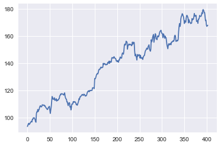
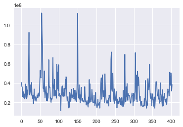
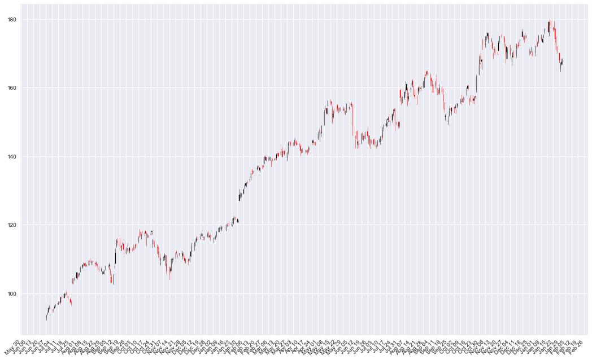

# STOCK DATA ANALYSIS FOR AAPL


```python
import pandas as pd
import numpy as np
import matplotlib.pyplot as plt
import seaborn as sns
%matplotlib inline
from datetime import datetime
```


```python
data = pd.read_csv('stockdata\\stock_AAPL.csv')
print(data.describe())
print(data.info())
```

                 open        high         low       close        volume  \
    count  403.000000  403.000000  403.000000  403.000000  4.030000e+02   
    mean   138.379504  139.315261  137.496452  138.493945  2.936934e+07   
    std     24.205132   24.293410   23.970691   24.121304  1.286572e+07   
    min     92.900000   93.660000   92.140000   93.590000  1.147592e+07   
    25%    114.330000  115.715000  113.500000  114.550000  2.143903e+07   
    50%    143.500000  144.160000  142.510000  143.640000  2.615330e+07   
    75%    157.145000  158.130000  156.115000  157.065000  3.337260e+07   
    max    179.370000  180.100000  178.250000  179.260000  1.123403e+08   
    
                 macd         mfi         rsi   william_r  stochastic_fast  \
    count  370.000000  383.000000  383.000000  383.000000       383.000000   
    mean     1.408784   57.529060   60.610966   -0.342219         0.657807   
    std      1.554942   14.327854   13.415921    0.281421         0.281452   
    min     -1.800000   10.220000   28.960000   -1.000000         0.000000   
    25%      0.535000   48.530000   50.695000   -0.560000         0.440000   
    50%      1.540000   59.470000   60.750000   -0.250000         0.750000   
    75%      2.397500   66.980000   69.390000   -0.105000         0.895000   
    max      4.950000   88.050000   90.400000    0.000000         1.000000   
    
           stochastic_slow  bollinger_bands  chaikin_money_flow           obv  
    count       383.000000       379.000000          383.000000  3.830000e+02  
    mean         65.775274       140.759683           -0.008695  7.094327e+08  
    std          26.329497        22.633862            0.239891  3.542151e+08  
    min           7.950000       103.540000           -0.930000  3.801469e+07  
    25%          46.880000       116.865000           -0.140000  3.660193e+08  
    50%          74.540000       144.100000           -0.010000  8.608985e+08  
    75%          88.385000       158.590000            0.130000  1.013172e+09  
    max          99.150000       178.310000            0.800000  1.268303e+09  
    <class 'pandas.core.frame.DataFrame'>
    RangeIndex: 403 entries, 0 to 402
    Data columns (total 18 columns):
    date_txn              403 non-null object
    symbol                403 non-null object
    open                  403 non-null float64
    high                  403 non-null float64
    low                   403 non-null float64
    close                 403 non-null float64
    volume                403 non-null int64
    macd                  370 non-null float64
    mfi                   383 non-null float64
    rsi                   383 non-null float64
    william_r             383 non-null float64
    stochastic_fast       383 non-null float64
    stochastic_slow       383 non-null float64
    bollinger_bands       379 non-null float64
    chaikin_money_flow    383 non-null float64
    obv                   383 non-null float64
    log_timestamp         403 non-null object
    datasource            16 non-null object
    dtypes: float64(13), int64(1), object(4)
    memory usage: 56.8+ KB
    None
    


```python
#William %R - The oscillator is on a negative scale, from −100 (lowest) up to 0 (highest),
#obverse of the more common 0 to 100 scale found in many Technical Analysis oscillators.
#A value of −100 means the close today was the lowest low of the past N days,
#and 0 means today's close was the highest high of the past N days.
#Williams used a 10 trading day period and considered values below -80 as oversold and above -20 as overbought.
```


```python
data.head()
```


<div>
<style>
    .dataframe thead tr:only-child th {
        text-align: right;
    }

    .dataframe thead th {
        text-align: left;
    }

    .dataframe tbody tr th {
        vertical-align: top;
    }
</style>
<table border="1" class="dataframe">
  <thead>
    <tr style="text-align: right;">
      <th></th>
      <th>date_txn</th>
      <th>symbol</th>
      <th>open</th>
      <th>high</th>
      <th>low</th>
      <th>close</th>
      <th>volume</th>
      <th>macd</th>
      <th>mfi</th>
      <th>rsi</th>
      <th>william_r</th>
      <th>stochastic_fast</th>
      <th>stochastic_slow</th>
      <th>bollinger_bands</th>
      <th>chaikin_money_flow</th>
      <th>obv</th>
      <th>log_timestamp</th>
      <th>datasource</th>
    </tr>
  </thead>
  <tbody>
    <tr>
      <th>0</th>
      <td>2016-06-28</td>
      <td>AAPL</td>
      <td>92.90</td>
      <td>93.66</td>
      <td>92.14</td>
      <td>93.59</td>
      <td>40444914</td>
      <td>NaN</td>
      <td>NaN</td>
      <td>NaN</td>
      <td>NaN</td>
      <td>NaN</td>
      <td>NaN</td>
      <td>NaN</td>
      <td>NaN</td>
      <td>NaN</td>
      <td>2017-12-28 06:09:09.664752</td>
      <td>NaN</td>
    </tr>
    <tr>
      <th>1</th>
      <td>2016-06-29</td>
      <td>AAPL</td>
      <td>93.97</td>
      <td>94.55</td>
      <td>93.63</td>
      <td>94.40</td>
      <td>36531006</td>
      <td>NaN</td>
      <td>NaN</td>
      <td>NaN</td>
      <td>NaN</td>
      <td>NaN</td>
      <td>NaN</td>
      <td>NaN</td>
      <td>NaN</td>
      <td>NaN</td>
      <td>2017-12-28 06:09:09.664752</td>
      <td>NaN</td>
    </tr>
    <tr>
      <th>2</th>
      <td>2016-06-30</td>
      <td>AAPL</td>
      <td>94.44</td>
      <td>95.77</td>
      <td>94.30</td>
      <td>95.60</td>
      <td>35836356</td>
      <td>NaN</td>
      <td>NaN</td>
      <td>NaN</td>
      <td>NaN</td>
      <td>NaN</td>
      <td>NaN</td>
      <td>NaN</td>
      <td>NaN</td>
      <td>NaN</td>
      <td>2017-12-28 06:09:09.664752</td>
      <td>NaN</td>
    </tr>
    <tr>
      <th>3</th>
      <td>2016-07-01</td>
      <td>AAPL</td>
      <td>95.49</td>
      <td>96.46</td>
      <td>95.33</td>
      <td>95.89</td>
      <td>26026540</td>
      <td>NaN</td>
      <td>NaN</td>
      <td>NaN</td>
      <td>NaN</td>
      <td>NaN</td>
      <td>NaN</td>
      <td>NaN</td>
      <td>NaN</td>
      <td>NaN</td>
      <td>2017-12-28 06:09:09.664752</td>
      <td>NaN</td>
    </tr>
    <tr>
      <th>4</th>
      <td>2016-07-05</td>
      <td>AAPL</td>
      <td>95.39</td>
      <td>95.40</td>
      <td>94.46</td>
      <td>94.99</td>
      <td>27705210</td>
      <td>NaN</td>
      <td>NaN</td>
      <td>NaN</td>
      <td>NaN</td>
      <td>NaN</td>
      <td>NaN</td>
      <td>NaN</td>
      <td>NaN</td>
      <td>NaN</td>
      <td>2017-12-28 06:09:09.664752</td>
      <td>NaN</td>
    </tr>
  </tbody>
</table>
</div>


## Looking at the basic trend of the stock


```python
plt.plot(data['close'] )
```


    [<matplotlib.lines.Line2D at 0x1bc30676400>]





```python
plt.plot(data['open'])
```


    [<matplotlib.lines.Line2D at 0x1bc30753d30>]


```python
plt.plot(data['volume'])
```


    [<matplotlib.lines.Line2D at 0x1bc3087c5c0>]





```python
data.index = data['date_txn']
```


```python
data.head()
```


<div>
<style>
    .dataframe thead tr:only-child th {
        text-align: right;
    }

    .dataframe thead th {
        text-align: left;
    }

    .dataframe tbody tr th {
        vertical-align: top;
    }
</style>
<table border="1" class="dataframe">
  <thead>
    <tr style="text-align: right;">
      <th></th>
      <th>date_txn</th>
      <th>symbol</th>
      <th>open</th>
      <th>high</th>
      <th>low</th>
      <th>close</th>
      <th>volume</th>
      <th>macd</th>
      <th>mfi</th>
      <th>rsi</th>
      <th>william_r</th>
      <th>stochastic_fast</th>
      <th>stochastic_slow</th>
      <th>bollinger_bands</th>
      <th>chaikin_money_flow</th>
      <th>obv</th>
      <th>log_timestamp</th>
      <th>datasource</th>
    </tr>
    <tr>
      <th>date_txn</th>
      <th></th>
      <th></th>
      <th></th>
      <th></th>
      <th></th>
      <th></th>
      <th></th>
      <th></th>
      <th></th>
      <th></th>
      <th></th>
      <th></th>
      <th></th>
      <th></th>
      <th></th>
      <th></th>
      <th></th>
      <th></th>
    </tr>
  </thead>
  <tbody>
    <tr>
      <th>2016-06-28</th>
      <td>2016-06-28</td>
      <td>AAPL</td>
      <td>92.90</td>
      <td>93.66</td>
      <td>92.14</td>
      <td>93.59</td>
      <td>40444914</td>
      <td>NaN</td>
      <td>NaN</td>
      <td>NaN</td>
      <td>NaN</td>
      <td>NaN</td>
      <td>NaN</td>
      <td>NaN</td>
      <td>NaN</td>
      <td>NaN</td>
      <td>2017-12-28 06:09:09.664752</td>
      <td>NaN</td>
    </tr>
    <tr>
      <th>2016-06-29</th>
      <td>2016-06-29</td>
      <td>AAPL</td>
      <td>93.97</td>
      <td>94.55</td>
      <td>93.63</td>
      <td>94.40</td>
      <td>36531006</td>
      <td>NaN</td>
      <td>NaN</td>
      <td>NaN</td>
      <td>NaN</td>
      <td>NaN</td>
      <td>NaN</td>
      <td>NaN</td>
      <td>NaN</td>
      <td>NaN</td>
      <td>2017-12-28 06:09:09.664752</td>
      <td>NaN</td>
    </tr>
    <tr>
      <th>2016-06-30</th>
      <td>2016-06-30</td>
      <td>AAPL</td>
      <td>94.44</td>
      <td>95.77</td>
      <td>94.30</td>
      <td>95.60</td>
      <td>35836356</td>
      <td>NaN</td>
      <td>NaN</td>
      <td>NaN</td>
      <td>NaN</td>
      <td>NaN</td>
      <td>NaN</td>
      <td>NaN</td>
      <td>NaN</td>
      <td>NaN</td>
      <td>2017-12-28 06:09:09.664752</td>
      <td>NaN</td>
    </tr>
    <tr>
      <th>2016-07-01</th>
      <td>2016-07-01</td>
      <td>AAPL</td>
      <td>95.49</td>
      <td>96.46</td>
      <td>95.33</td>
      <td>95.89</td>
      <td>26026540</td>
      <td>NaN</td>
      <td>NaN</td>
      <td>NaN</td>
      <td>NaN</td>
      <td>NaN</td>
      <td>NaN</td>
      <td>NaN</td>
      <td>NaN</td>
      <td>NaN</td>
      <td>2017-12-28 06:09:09.664752</td>
      <td>NaN</td>
    </tr>
    <tr>
      <th>2016-07-05</th>
      <td>2016-07-05</td>
      <td>AAPL</td>
      <td>95.39</td>
      <td>95.40</td>
      <td>94.46</td>
      <td>94.99</td>
      <td>27705210</td>
      <td>NaN</td>
      <td>NaN</td>
      <td>NaN</td>
      <td>NaN</td>
      <td>NaN</td>
      <td>NaN</td>
      <td>NaN</td>
      <td>NaN</td>
      <td>NaN</td>
      <td>2017-12-28 06:09:09.664752</td>
      <td>NaN</td>
    </tr>
  </tbody>
</table>
</div>


```python
data.drop('date_txn', axis = 1, inplace=True)
```

Linecharts are fine, but there are at least four variables involved for each date (open, high, low, and close), and we would like to have some visual way to see all four variables that does not require plotting four separate lines. Financial data is often plotted with a Japanese candlestick plot, so named because it was first created by 18th century Japanese rice traders.


```python
from matplotlib.dates import DateFormatter, WeekdayLocator,\
    DayLocator, MONDAY
from matplotlib.finance import candlestick_ohlc, date2num
 
def pandas_candlestick_ohlc(dat, stick = "day", otherseries = None):
    """
    :param dat: pandas DataFrame object with datetime64 index, and float columns "Open", "High", "Low", and "Close", likely created via DataReader from "yahoo"
    :param stick: A string or number indicating the period of time covered by a single candlestick. Valid string inputs include "day", "week", "month", and "year", ("day" default), and any numeric input indicates the number of trading days included in a period
    :param otherseries: An iterable that will be coerced into a list, containing the columns of dat that hold other series to be plotted as lines
 
    This will show a Japanese candlestick plot for stock data stored in dat, also plotting other series if passed.
    """
    mondays = WeekdayLocator(MONDAY)        # major ticks on the mondays
    alldays = DayLocator()              # minor ticks on the days
    dayFormatter = DateFormatter('%d')      # e.g., 12
 
    # Create a new DataFrame which includes OHLC data for each period specified by stick input
    transdat = dat.loc[:,["open", "high", "low", "close"]]
    if (type(stick) == str):
        if stick == "day":
            plotdat = transdat
            stick = 1 # Used for plotting
        elif stick in ["week", "month", "year"]:
            if stick == "week":
                transdat["week"] = pd.to_datetime(transdat.index).map(lambda x: x.isocalendar()[1]) # Identify weeks
            elif stick == "month":
                transdat["month"] = pd.to_datetime(transdat.index).map(lambda x: x.month) # Identify months
            transdat["year"] = pd.to_datetime(transdat.index).map(lambda x: x.isocalendar()[0]) # Identify years
            grouped = transdat.groupby(list(set(["year",stick]))) # Group by year and other appropriate variable
            plotdat = pd.DataFrame({"open": [], "high": [], "low": [], "close": []}) # Create empty data frame containing what will be plotted
            for name, group in grouped:
                plotdat = plotdat.append(pd.DataFrame({"open": group.iloc[0,0],
                                            "high": max(group.high),
                                            "how": min(group.low),
                                            "close": group.iloc[-1,3]},
                                           index = [group.index[0]]))
            if stick == "week": stick = 5
            elif stick == "month": stick = 30
            elif stick == "year": stick = 365
 
    elif (type(stick) == int and stick >= 1):
        transdat["stick"] = [np.floor(i / stick) for i in range(len(transdat.index))]
        grouped = transdat.groupby("stick")
        plotdat = pd.DataFrame({"Open": [], "High": [], "Low": [], "Close": []}) # Create empty data frame containing what will be plotted
        for name, group in grouped:
            plotdat = plotdat.append(pd.DataFrame({"Open": group.iloc[0,0],
                                        "High": max(group.high),
                                        "Low": min(group.low),
                                        "Close": group.iloc[-1,3]},
                                       index = [group.index[0]]))
 
    else:
        raise ValueError('Valid inputs to argument "stick" include the strings "day", "week", "month", "year", or a positive integer')
 
 
    # Set plot parameters, including the axis object ax used for plotting
    fig, ax = plt.subplots(figsize=(18, 12))
    fig.subplots_adjust(bottom=0.2)
    if pd.to_datetime(plotdat.index[-1]) - pd.to_datetime(plotdat.index[0]) < pd.Timedelta('730 days'):
        weekFormatter = DateFormatter('%b %d')  # e.g., Jan 12
        ax.xaxis.set_major_locator(mondays)
        ax.xaxis.set_minor_locator(alldays)
    else:
        weekFormatter = DateFormatter('%b %d, %Y')
    ax.xaxis.set_major_formatter(weekFormatter)
 
    ax.grid(True)
 
    # Create the candelstick chart
    time_format = '%Y-%m-%d'
    time = [datetime.strptime(i, time_format) for i in plotdat.index.tolist()]
    candlestick_ohlc(ax, list(zip(list(date2num(time)), plotdat["open"].tolist(), plotdat["high"].tolist(),
                      plotdat["low"].tolist(), plotdat["close"].tolist())))
 
    # Plot other series (such as moving averages) as lines
    if otherseries != None:
        if type(otherseries) != list:
            otherseries = [otherseries]
        dat.loc[:,otherseries].plot(ax = ax, lw = 1.3, grid = True)
 
    ax.xaxis_date()
    ax.autoscale_view()
    plt.setp(plt.gca().get_xticklabels(), rotation=45, horizontalalignment='right')
    plt.show()
```

    C:\ProgramData\Anaconda3\lib\site-packages\matplotlib\cbook.py:136: MatplotlibDeprecationWarning: The finance module has been deprecated in mpl 2.0 and will be removed in mpl 2.2. Please use the module mpl_finance instead.
      warnings.warn(message, mplDeprecation, stacklevel=1)
    


```python
pandas_candlestick_ohlc(data)
```





We see that we have been able to successfully obtain our Candlestick plot which makes it easy to read and interpret the stock behaviour.
But, the figure obtained above is not very smooth to study because of it's gigantic size and large number of data points(every Monday on a macroscopic level). 
Now, we try to use plot the same details of the stock in an interactive graph using plotly and cufflinks.


```python
from plotly import __version__
from plotly.offline import init_notebook_mode, iplot, download_plotlyjs, plot
import plotly.plotly as py
```


```python
import plotly.graph_objs as go
```


```python
init_notebook_mode(connected=True)
```


<script>requirejs.config({paths: { 'plotly': ['https://cdn.plot.ly/plotly-latest.min']},});if(!window.Plotly) {{require(['plotly'],function(plotly) {window.Plotly=plotly;});}}</script>


```python
import cufflinks as cf
cf.go_offline()
```

    IOPub data rate exceeded.
    The notebook server will temporarily stop sending output
    to the client in order to avoid crashing it.
    To change this limit, set the config variable
    `--NotebookApp.iopub_data_rate_limit`.
    


```python
trace = go.Candlestick(x = data.index,
                      open = data.open,
                      high = data.high,
                      low = data.low,
                      close = data.close)
```


```python
datayy = [trace]
```


```python
iplot(datayy)
#Using this, one can zoom in to the required snippet of time.
```


<div id="18eff4f0-f779-4a65-a516-a12581166634" style="height: 525px; width: 100%;" class="plotly-graph-div"></div><script type="text/javascript">require(["plotly"], function(Plotly) { window.PLOTLYENV=window.PLOTLYENV || {};window.PLOTLYENV.BASE_URL="https://plot.ly";Plotly.newPlot("18eff4f0-f779-4a65-a516-a12581166634", [{"type": "candlestick", "x": ["2016-06-28", "2016-06-29", "2016-06-30", "2016-07-01", "2016-07-05", "2016-07-06", "2016-07-07", "2016-07-08", "2016-07-11", "2016-07-12", "2016-07-13", "2016-07-14", "2016-07-15", "2016-07-18", "2016-07-19", "2016-07-20", "2016-07-21", "2016-07-22", "2016-07-25", "2016-07-26", "2016-07-27", "2016-07-28", "2016-07-29", "2016-08-01", "2016-08-02", "2016-08-03", "2016-08-04", "2016-08-05", "2016-08-08", "2016-08-09", "2016-08-10", "2016-08-11", "2016-08-12", "2016-08-15", "2016-08-16", "2016-08-17", "2016-08-18", "2016-08-19", "2016-08-22", "2016-08-23", "2016-08-24", "2016-08-25", "2016-08-26", "2016-08-29", "2016-08-30", "2016-08-31", "2016-09-01", "2016-09-02", "2016-09-06", "2016-09-07", "2016-09-08", "2016-09-09", "2016-09-12", "2016-09-13", "2016-09-14", "2016-09-15", "2016-09-16", "2016-09-19", "2016-09-20", "2016-09-21", "2016-09-22", "2016-09-23", "2016-09-26", "2016-09-27", "2016-09-28", "2016-09-29", "2016-09-30", "2016-10-03", "2016-10-04", "2016-10-05", "2016-10-06", "2016-10-07", "2016-10-10", "2016-10-11", "2016-10-12", "2016-10-13", "2016-10-14", "2016-10-17", "2016-10-18", "2016-10-19", "2016-10-20", "2016-10-21", "2016-10-24", "2016-10-25", "2016-10-26", "2016-10-27", "2016-10-28", "2016-10-31", "2016-11-01", "2016-11-02", "2016-11-03", "2016-11-04", "2016-11-07", "2016-11-08", "2016-11-09", "2016-11-10", "2016-11-11", "2016-11-14", "2016-11-15", "2016-11-16", "2016-11-17", "2016-11-18", "2016-11-21", "2016-11-22", "2016-11-23", "2016-11-25", "2016-11-28", "2016-11-29", "2016-11-30", "2016-12-01", "2016-12-02", "2016-12-05", "2016-12-06", "2016-12-07", "2016-12-08", "2016-12-09", "2016-12-12", "2016-12-13", "2016-12-14", "2016-12-15", "2016-12-16", "2016-12-19", "2016-12-20", "2016-12-21", "2016-12-22", "2016-12-23", "2016-12-27", "2016-12-28", "2016-12-29", "2016-12-30", "2017-01-03", "2017-01-04", "2017-01-05", "2017-01-06", "2017-01-09", "2017-01-10", "2017-01-11", "2017-01-12", "2017-01-13", "2017-01-17", "2017-01-18", "2017-01-19", "2017-01-20", "2017-01-23", "2017-01-24", "2017-01-25", "2017-01-26", "2017-01-27", "2017-01-30", "2017-01-31", "2017-02-01", "2017-02-02", "2017-02-03", "2017-02-06", "2017-02-07", "2017-02-08", "2017-02-09", "2017-02-10", "2017-02-13", "2017-02-14", "2017-02-15", "2017-02-16", "2017-02-17", "2017-02-21", "2017-02-22", "2017-02-23", "2017-02-24", "2017-02-27", "2017-02-28", "2017-03-01", "2017-03-02", "2017-03-03", "2017-03-06", "2017-03-07", "2017-03-08", "2017-03-09", "2017-03-10", "2017-03-13", "2017-03-14", "2017-03-15", "2017-03-16", "2017-03-17", "2017-03-20", "2017-03-21", "2017-03-22", "2017-03-23", "2017-03-24", "2017-03-27", "2017-03-28", "2017-03-29", "2017-03-30", "2017-03-31", "2017-04-03", "2017-04-04", "2017-04-05", "2017-04-06", "2017-04-07", "2017-04-10", "2017-04-11", "2017-04-12", "2017-04-13", "2017-04-17", "2017-04-18", "2017-04-19", "2017-04-20", "2017-04-21", "2017-04-24", "2017-04-25", "2017-04-26", "2017-04-27", "2017-04-28", "2017-05-01", "2017-05-02", "2017-05-03", "2017-05-04", "2017-05-05", "2017-05-08", "2017-05-09", "2017-05-10", "2017-05-11", "2017-05-12", "2017-05-15", "2017-05-16", "2017-05-17", "2017-05-18", "2017-05-19", "2017-05-22", "2017-05-23", "2017-05-24", "2017-05-25", "2017-05-26", "2017-05-30", "2017-05-31", "2017-06-01", "2017-06-02", "2017-06-05", "2017-06-06", "2017-06-07", "2017-06-08", "2017-06-09", "2017-06-12", "2017-06-13", "2017-06-14", "2017-06-15", "2017-06-16", "2017-06-19", "2017-06-20", "2017-06-21", "2017-06-22", "2017-06-23", "2017-06-26", "2017-06-27", "2017-06-28", "2017-06-29", "2017-06-30", "2017-07-03", "2017-07-05", "2017-07-06", "2017-07-07", "2017-07-10", "2017-07-11", "2017-07-12", "2017-07-13", "2017-07-14", "2017-07-17", "2017-07-18", "2017-07-19", "2017-07-20", "2017-07-21", "2017-07-24", "2017-07-25", "2017-07-26", "2017-07-27", "2017-07-28", "2017-07-31", "2017-08-01", "2017-08-02", "2017-08-03", "2017-08-04", "2017-08-07", "2017-08-08", "2017-08-09", "2017-08-10", "2017-08-11", "2017-08-14", "2017-08-15", "2017-08-16", "2017-08-17", "2017-08-18", "2017-08-21", "2017-08-22", "2017-08-23", "2017-08-24", "2017-08-25", "2017-08-28", "2017-08-29", "2017-08-30", "2017-08-31", "2017-09-01", "2017-09-05", "2017-09-06", "2017-09-07", "2017-09-08", "2017-09-11", "2017-09-12", "2017-09-13", "2017-09-14", "2017-09-15", "2017-09-18", "2017-09-19", "2017-09-20", "2017-09-21", "2017-09-22", "2017-09-25", "2017-09-26", "2017-09-27", "2017-09-28", "2017-09-29", "2017-10-02", "2017-10-03", "2017-10-04", "2017-10-05", "2017-10-06", "2017-10-09", "2017-10-10", "2017-10-11", "2017-10-12", "2017-10-13", "2017-10-16", "2017-10-17", "2017-10-18", "2017-10-19", "2017-10-20", "2017-10-23", "2017-10-24", "2017-10-25", "2017-10-26", "2017-10-27", "2017-10-30", "2017-10-31", "2017-11-01", "2017-11-02", "2017-11-03", "2017-11-06", "2017-11-07", "2017-11-08", "2017-11-09", "2017-11-10", "2017-11-13", "2017-11-14", "2017-11-15", "2017-11-16", "2017-11-17", "2017-11-20", "2017-11-21", "2017-11-22", "2017-11-24", "2017-11-27", "2017-11-28", "2017-11-29", "2017-11-30", "2017-12-01", "2017-12-04", "2017-12-05", "2017-12-06", "2017-12-07", "2017-12-08", "2017-12-11", "2017-12-12", "2017-12-13", "2017-12-14", "2017-12-15", "2017-12-18", "2017-12-19", "2017-12-20", "2017-12-21", "2017-12-22", "2017-12-26", "2017-12-27", "2017-12-28", "2017-12-29", "2018-01-02", "2018-01-03", "2018-01-04", "2018-01-05", "2018-01-08", "2018-01-09", "2018-01-10", "2018-01-11", "2018-01-12", "2018-01-16", "2018-01-17", "2018-01-18", "2018-01-19", "2018-01-22", "2018-01-23", "2018-01-24", "2018-01-25", "2018-01-26", "2018-01-29", "2018-01-30", "2018-01-31", "2018-02-01"], "open": [92.9, 93.97, 94.44, 95.49, 95.39, 94.6, 95.7, 96.49, 96.75, 97.17, 97.41, 97.39, 98.92, 98.7, 99.56, 100.0, 99.83, 99.26, 98.25, 96.82, 104.26, 102.83, 104.19, 104.41, 106.05, 104.81, 105.58, 106.27, 107.52, 108.23, 108.71, 108.52, 107.78, 108.14, 109.63, 109.1, 109.23, 108.77, 108.86, 108.59, 108.56, 107.39, 107.41, 106.62, 105.8, 105.66, 106.14, 107.7, 107.9, 107.83, 107.25, 104.64, 102.65, 107.51, 108.73, 113.86, 115.12, 115.19, 113.05, 113.85, 114.35, 114.42, 111.64, 113.0, 113.69, 113.16, 112.46, 112.71, 113.06, 113.4, 113.7, 114.31, 115.02, 117.7, 117.35, 116.79, 117.88, 117.33, 118.18, 117.25, 116.86, 116.81, 117.1, 117.95, 114.31, 115.39, 113.87, 113.65, 113.46, 111.4, 110.98, 108.53, 110.08, 110.31, 109.88, 111.09, 107.12, 107.71, 106.57, 106.7, 109.81, 109.72, 110.12, 111.95, 111.36, 111.47, 111.43, 110.78, 111.6, 110.36, 109.17, 110.0, 109.5, 109.26, 110.86, 112.31, 113.29, 113.84, 115.04, 115.38, 116.47, 115.8, 116.74, 116.8, 116.35, 115.59, 116.52, 117.52, 116.45, 116.65, 115.8, 115.85, 115.92, 116.78, 117.95, 118.77, 118.74, 118.9, 119.11, 118.34, 120.0, 119.4, 120.45, 120.0, 119.55, 120.42, 121.67, 122.14, 120.93, 121.15, 127.03, 127.98, 128.31, 129.13, 130.54, 131.35, 131.65, 132.46, 133.08, 133.47, 135.52, 135.67, 135.1, 136.23, 136.43, 137.38, 135.91, 137.14, 137.08, 137.89, 140.0, 138.78, 139.37, 139.06, 138.95, 138.74, 139.25, 138.85, 139.3, 139.41, 140.72, 141.0, 140.4, 142.11, 139.85, 141.26, 141.5, 139.39, 140.91, 143.68, 144.19, 143.72, 143.71, 143.25, 144.22, 144.29, 143.73, 143.6, 142.94, 141.6, 141.91, 141.48, 141.41, 141.88, 141.22, 142.44, 143.5, 143.91, 144.47, 143.92, 144.09, 145.1, 147.54, 145.59, 146.52, 146.76, 149.03, 153.87, 153.63, 152.45, 154.7, 156.01, 155.94, 153.6, 151.27, 153.38, 154.0, 154.9, 153.84, 153.73, 154.0, 153.42, 153.97, 153.17, 153.58, 154.34, 153.9, 155.02, 155.25, 155.19, 145.74, 147.16, 147.5, 143.32, 143.78, 143.66, 146.87, 145.52, 145.77, 145.13, 147.17, 145.01, 144.49, 144.71, 144.45, 144.88, 143.69, 143.02, 142.9, 144.11, 144.73, 145.87, 145.5, 147.97, 148.82, 149.2, 150.48, 151.5, 149.99, 150.58, 151.8, 153.35, 153.75, 149.89, 149.9, 149.1, 159.28, 157.05, 156.07, 157.06, 158.6, 159.26, 159.9, 156.6, 159.32, 160.66, 161.94, 160.52, 157.86, 157.5, 158.23, 159.07, 160.43, 159.65, 160.14, 160.1, 163.8, 163.64, 164.8, 163.75, 162.71, 162.09, 160.86, 160.5, 162.61, 159.87, 158.99, 158.47, 160.11, 159.51, 157.9, 155.8, 151.54, 149.99, 151.78, 153.8, 153.89, 153.21, 154.26, 154.01, 153.63, 154.18, 154.97, 155.81, 156.06, 155.97, 156.35, 156.73, 157.9, 159.78, 160.42, 156.75, 156.61, 156.89, 156.29, 156.91, 157.23, 159.28, 163.89, 167.9, 169.87, 167.64, 174.0, 172.37, 173.91, 174.66, 175.11, 175.11, 173.5, 173.04, 169.97, 171.18, 171.04, 170.29, 170.78, 173.36, 175.1, 175.05, 174.3, 172.63, 170.43, 169.95, 172.48, 169.06, 167.5, 169.03, 170.49, 169.2, 172.15, 172.5, 172.4, 173.63, 174.88, 174.99, 174.87, 174.17, 174.68, 170.8, 170.1, 171.0, 170.52, 170.16, 172.53, 172.54, 173.44, 174.35, 174.55, 173.16, 174.59, 176.18, 177.9, 176.15, 179.37, 178.61, 177.3, 177.3, 177.25, 174.5, 172.0, 170.16, 165.52, 166.87, 167.16], "high": [93.66, 94.55, 95.77, 96.46, 95.4, 95.66, 96.5, 96.89, 97.65, 97.7, 97.67, 98.99, 99.3, 100.13, 100.0, 100.46, 101.0, 99.3, 98.84, 97.97, 104.35, 104.45, 104.55, 106.15, 106.07, 105.84, 106.0, 107.65, 108.37, 108.94, 108.9, 108.93, 108.44, 109.54, 110.23, 109.37, 109.6, 109.69, 109.1, 109.32, 108.75, 107.88, 107.95, 107.44, 106.5, 106.57, 106.8, 108.0, 108.3, 108.76, 107.27, 105.72, 105.72, 108.79, 113.03, 115.73, 116.13, 116.18, 114.12, 113.99, 114.94, 114.79, 113.39, 113.18, 114.64, 113.8, 113.37, 113.05, 114.31, 113.66, 114.34, 114.56, 116.75, 118.69, 117.98, 117.44, 118.17, 117.84, 118.21, 117.76, 117.38, 116.91, 117.74, 118.36, 115.7, 115.86, 115.21, 114.23, 113.77, 112.35, 111.46, 110.25, 110.51, 111.72, 111.32, 111.09, 108.87, 107.81, 107.68, 110.23, 110.35, 110.54, 111.99, 112.42, 111.51, 111.87, 112.46, 112.03, 112.2, 110.94, 110.09, 110.03, 110.36, 111.19, 112.43, 114.7, 115.0, 115.92, 116.2, 116.73, 116.5, 117.38, 117.5, 117.4, 116.51, 116.52, 117.8, 118.02, 117.11, 117.2, 116.33, 116.51, 116.86, 118.16, 119.43, 119.38, 119.93, 119.3, 119.62, 120.24, 120.5, 120.09, 120.45, 120.81, 120.1, 122.1, 122.44, 122.35, 121.63, 121.39, 130.49, 129.39, 129.19, 130.5, 132.09, 132.22, 132.45, 132.94, 133.82, 135.09, 136.27, 135.9, 135.83, 136.75, 137.12, 137.48, 136.66, 137.44, 137.44, 140.15, 140.28, 139.83, 139.77, 139.98, 139.8, 138.79, 139.36, 139.43, 139.65, 140.75, 141.02, 141.0, 141.5, 142.8, 141.6, 141.58, 141.74, 141.22, 144.04, 144.49, 144.5, 144.27, 144.12, 144.89, 145.46, 144.52, 144.18, 143.88, 143.35, 142.15, 142.38, 141.88, 142.04, 142.0, 142.92, 142.68, 143.95, 144.9, 144.6, 144.16, 144.3, 147.2, 148.09, 147.49, 147.14, 148.98, 153.7, 154.88, 153.94, 154.07, 156.42, 156.65, 156.06, 154.57, 153.34, 153.98, 154.58, 154.9, 154.17, 154.35, 154.24, 154.43, 154.17, 153.33, 155.45, 154.45, 155.81, 155.98, 155.54, 155.19, 146.09, 147.45, 147.5, 144.48, 144.5, 146.74, 146.87, 146.07, 146.7, 147.16, 148.28, 146.16, 146.11, 145.13, 144.96, 145.3, 144.79, 143.5, 144.75, 145.95, 145.85, 146.18, 148.49, 149.33, 150.9, 150.13, 151.42, 151.74, 150.44, 152.44, 153.84, 153.93, 153.99, 150.23, 150.33, 150.22, 159.75, 157.21, 157.4, 158.92, 161.83, 161.27, 160.0, 158.57, 160.21, 162.2, 162.51, 160.71, 159.5, 157.89, 160.0, 160.47, 160.74, 160.56, 162.0, 163.12, 163.89, 164.52, 164.94, 164.25, 162.99, 162.24, 161.15, 162.05, 163.96, 159.96, 159.4, 160.97, 160.5, 159.77, 158.26, 155.8, 152.27, 151.83, 153.92, 154.72, 154.28, 154.13, 154.45, 155.09, 153.86, 155.44, 155.49, 156.73, 158.0, 156.98, 157.37, 157.28, 160.0, 160.87, 160.71, 157.08, 157.75, 157.69, 157.42, 157.55, 157.83, 163.6, 168.07, 169.65, 169.94, 168.5, 174.26, 174.99, 175.25, 176.24, 176.1, 175.38, 174.5, 173.48, 170.32, 171.87, 171.39, 170.56, 173.7, 175.0, 175.5, 175.08, 174.87, 172.92, 172.14, 171.67, 172.62, 171.52, 170.2, 170.44, 171.0, 172.89, 172.39, 173.54, 173.13, 174.17, 177.2, 175.39, 175.42, 176.02, 175.42, 171.47, 170.78, 171.85, 170.59, 172.3, 174.55, 173.47, 175.37, 175.61, 175.06, 174.3, 175.49, 177.36, 179.39, 179.25, 180.1, 179.58, 177.78, 179.44, 177.3, 174.95, 172.0, 170.16, 167.37, 168.44, 168.62], "low": [92.14, 93.63, 94.3, 95.33, 94.46, 94.37, 95.62, 96.05, 96.73, 97.12, 96.84, 97.32, 98.5, 98.6, 99.34, 99.74, 99.13, 98.31, 96.92, 96.42, 102.75, 102.82, 103.68, 104.41, 104.0, 104.77, 105.28, 106.18, 107.16, 108.01, 107.76, 107.85, 107.78, 108.08, 109.21, 108.34, 109.02, 108.36, 107.85, 108.53, 107.68, 106.68, 106.31, 106.29, 105.5, 105.64, 105.62, 106.82, 107.51, 107.07, 105.24, 103.13, 102.53, 107.24, 108.6, 113.49, 114.04, 113.25, 112.51, 112.44, 114.0, 111.55, 111.55, 112.34, 113.43, 111.8, 111.8, 112.28, 112.63, 112.69, 113.13, 113.51, 114.72, 116.2, 116.75, 115.72, 117.13, 116.78, 117.45, 113.8, 116.33, 116.28, 117.0, 117.31, 113.31, 114.1, 113.45, 113.2, 110.53, 111.23, 109.55, 108.11, 109.46, 109.7, 108.05, 105.83, 106.55, 104.08, 106.16, 106.6, 108.83, 109.66, 110.01, 111.4, 110.33, 110.95, 111.39, 110.07, 110.27, 109.03, 108.85, 108.25, 109.19, 109.16, 110.6, 112.31, 112.49, 113.75, 114.98, 115.23, 115.64, 115.75, 116.68, 116.78, 115.64, 115.59, 116.49, 116.2, 116.4, 115.43, 114.76, 115.75, 115.81, 116.47, 117.94, 118.3, 118.6, 118.21, 118.81, 118.22, 119.71, 119.37, 119.73, 119.77, 119.5, 120.28, 121.6, 121.6, 120.66, 120.62, 127.01, 127.78, 128.16, 128.9, 130.45, 131.22, 131.12, 132.05, 132.75, 133.25, 134.62, 134.84, 135.1, 135.98, 136.11, 136.3, 135.28, 136.28, 136.7, 137.6, 138.76, 138.59, 138.6, 138.79, 138.82, 137.05, 138.64, 138.82, 138.84, 139.03, 140.26, 139.89, 140.23, 139.73, 139.76, 140.61, 140.35, 138.62, 140.62, 143.19, 143.5, 143.01, 143.05, 143.17, 143.81, 143.45, 143.27, 142.9, 140.06, 141.01, 141.05, 140.87, 141.11, 140.45, 141.16, 141.85, 143.18, 143.87, 143.38, 143.31, 143.27, 144.96, 146.84, 144.27, 145.81, 146.76, 149.03, 153.45, 152.11, 152.31, 154.67, 155.05, 154.72, 149.71, 151.13, 152.63, 152.91, 153.31, 152.67, 153.03, 153.31, 153.33, 152.38, 152.22, 152.89, 153.46, 153.78, 154.48, 154.4, 146.02, 142.51, 145.15, 143.84, 142.21, 142.2, 143.66, 144.94, 144.61, 145.12, 145.11, 145.38, 143.62, 143.16, 142.28, 143.78, 143.1, 142.72, 142.41, 142.9, 143.37, 144.38, 144.82, 145.44, 147.33, 148.57, 148.67, 149.95, 150.19, 148.88, 149.9, 151.8, 153.06, 147.3, 149.19, 148.13, 148.41, 156.16, 155.02, 155.69, 156.67, 158.27, 159.11, 154.63, 156.07, 158.75, 160.14, 160.15, 157.84, 156.72, 155.11, 158.02, 158.88, 158.55, 159.27, 159.93, 160.0, 162.61, 163.48, 163.63, 160.56, 160.52, 160.36, 158.53, 159.89, 158.77, 157.91, 158.09, 158.0, 158.0, 158.44, 153.83, 152.75, 150.56, 149.16, 151.69, 153.54, 152.7, 152.0, 152.72, 153.91, 152.46, 154.05, 154.56, 155.48, 155.1, 155.75, 155.73, 156.41, 157.65, 159.23, 159.6, 155.02, 155.96, 155.5, 156.2, 155.27, 156.78, 158.7, 163.72, 166.94, 165.61, 165.28, 171.12, 171.72, 173.6, 174.33, 173.14, 174.27, 173.4, 171.18, 168.38, 170.3, 169.64, 169.56, 170.78, 173.05, 174.65, 173.34, 171.86, 167.16, 168.44, 168.5, 169.63, 168.4, 166.46, 168.91, 168.82, 168.79, 171.46, 172.0, 171.65, 172.46, 174.86, 174.09, 173.25, 174.1, 174.5, 169.68, 169.71, 170.48, 169.22, 169.26, 171.96, 172.08, 173.05, 173.93, 173.41, 173.0, 174.49, 175.65, 176.14, 175.07, 178.25, 177.41, 176.6, 176.82, 173.2, 170.53, 170.06, 167.07, 164.7, 166.5, 166.76], "close": [93.59, 94.4, 95.6, 95.89, 94.99, 95.53, 95.94, 96.68, 96.98, 97.42, 96.87, 98.79, 98.78, 99.83, 99.87, 99.96, 99.43, 98.66, 97.34, 96.67, 102.95, 104.34, 104.21, 106.05, 104.48, 105.79, 105.87, 107.48, 108.37, 108.81, 108.0, 107.93, 108.18, 109.48, 109.38, 109.22, 109.08, 109.36, 108.51, 108.85, 108.03, 107.57, 106.94, 106.82, 106.0, 106.1, 106.73, 107.73, 107.7, 108.36, 105.52, 103.13, 105.44, 107.95, 111.77, 115.57, 114.92, 113.58, 113.57, 113.55, 114.62, 112.71, 112.88, 113.09, 113.95, 112.18, 113.05, 112.52, 113.0, 113.05, 113.89, 114.06, 116.05, 116.3, 117.34, 116.98, 117.63, 117.55, 117.47, 117.12, 117.06, 116.6, 117.65, 118.25, 115.59, 114.48, 113.72, 113.54, 111.49, 111.59, 109.83, 108.84, 110.41, 111.06, 110.88, 107.79, 108.43, 105.71, 107.11, 109.99, 109.95, 110.06, 111.73, 111.8, 111.23, 111.79, 111.57, 111.46, 110.52, 109.49, 109.9, 109.11, 109.95, 111.03, 112.12, 113.95, 113.3, 115.19, 115.19, 115.82, 115.97, 116.64, 116.95, 117.06, 116.29, 116.52, 117.26, 116.76, 116.73, 115.82, 116.15, 116.02, 116.61, 117.91, 118.99, 119.11, 119.75, 119.25, 119.04, 120.0, 119.99, 119.78, 120.0, 120.08, 119.97, 121.88, 121.94, 121.95, 121.63, 121.35, 128.75, 128.53, 129.08, 130.29, 131.53, 132.04, 132.42, 132.12, 133.29, 135.02, 135.51, 135.35, 135.72, 136.7, 137.11, 136.53, 136.66, 136.93, 136.99, 139.79, 138.96, 139.78, 139.34, 139.52, 139.0, 138.68, 139.14, 139.2, 138.99, 140.46, 140.69, 139.99, 141.46, 139.84, 141.42, 140.92, 140.64, 140.88, 143.8, 144.12, 143.93, 143.66, 143.7, 144.77, 144.02, 143.66, 143.34, 143.17, 141.63, 141.8, 141.05, 141.83, 141.2, 140.68, 142.44, 142.27, 143.64, 144.53, 143.68, 143.79, 143.65, 146.58, 147.51, 147.06, 146.53, 148.96, 153.01, 153.99, 153.26, 153.95, 156.1, 155.7, 155.47, 150.25, 152.54, 153.06, 153.99, 153.8, 153.34, 153.87, 153.61, 153.67, 152.76, 153.18, 155.45, 153.93, 154.45, 155.37, 154.99, 148.98, 145.42, 146.59, 145.16, 144.29, 142.27, 146.34, 145.01, 145.87, 145.63, 146.28, 145.82, 143.73, 145.83, 143.68, 144.02, 143.5, 144.09, 142.73, 144.18, 145.06, 145.53, 145.74, 147.77, 149.04, 149.56, 150.08, 151.02, 150.34, 150.27, 152.09, 152.74, 153.46, 150.56, 149.5, 148.73, 150.05, 157.14, 155.57, 156.39, 158.81, 160.08, 161.06, 155.32, 157.48, 159.85, 161.6, 160.95, 157.86, 157.5, 157.21, 159.78, 159.98, 159.27, 159.86, 161.47, 162.91, 163.35, 164.0, 164.05, 162.08, 161.91, 161.26, 158.63, 161.5, 160.86, 159.65, 158.28, 159.88, 158.67, 158.73, 156.07, 153.39, 151.89, 150.55, 153.14, 154.23, 153.28, 154.12, 153.81, 154.48, 153.48, 155.39, 155.3, 155.84, 155.9, 156.55, 156.0, 156.99, 159.88, 160.47, 159.76, 155.98, 156.25, 156.17, 156.79, 156.41, 157.41, 163.05, 166.72, 169.04, 166.89, 168.11, 172.5, 174.25, 174.81, 176.24, 175.88, 174.67, 173.97, 171.34, 169.08, 171.1, 170.15, 169.98, 173.14, 174.96, 174.97, 174.09, 173.07, 169.48, 171.85, 171.05, 169.8, 169.64, 169.01, 169.32, 169.37, 172.67, 171.7, 172.27, 172.22, 173.97, 176.42, 174.54, 174.35, 175.01, 175.01, 170.57, 170.6, 171.08, 169.23, 172.26, 172.23, 173.03, 175.0, 174.35, 174.33, 174.29, 175.28, 177.09, 176.19, 179.1, 179.26, 178.46, 177.0, 177.04, 174.22, 171.11, 171.51, 167.96, 166.97, 167.43, 167.78]}], {}, {"showLink": true, "linkText": "Export to plot.ly"})});</script>


We try to plot the moving averages column alongwith ohlc for better Technical Analysis:


```python
new = pd.DataFrame(datayy[0])
new.head()
```


<div>
<style>
    .dataframe thead tr:only-child th {
        text-align: right;
    }

    .dataframe thead th {
        text-align: left;
    }

    .dataframe tbody tr th {
        vertical-align: top;
    }
</style>
<table border="1" class="dataframe">
  <thead>
    <tr style="text-align: right;">
      <th></th>
      <th>close</th>
      <th>high</th>
      <th>low</th>
      <th>open</th>
      <th>type</th>
      <th>x</th>
    </tr>
    <tr>
      <th>date_txn</th>
      <th></th>
      <th></th>
      <th></th>
      <th></th>
      <th></th>
      <th></th>
    </tr>
  </thead>
  <tbody>
    <tr>
      <th>2016-06-28</th>
      <td>93.59</td>
      <td>93.66</td>
      <td>92.14</td>
      <td>92.90</td>
      <td>candlestick</td>
      <td>2016-06-28</td>
    </tr>
    <tr>
      <th>2016-06-29</th>
      <td>94.40</td>
      <td>94.55</td>
      <td>93.63</td>
      <td>93.97</td>
      <td>candlestick</td>
      <td>2016-06-29</td>
    </tr>
    <tr>
      <th>2016-06-30</th>
      <td>95.60</td>
      <td>95.77</td>
      <td>94.30</td>
      <td>94.44</td>
      <td>candlestick</td>
      <td>2016-06-30</td>
    </tr>
    <tr>
      <th>2016-07-01</th>
      <td>95.89</td>
      <td>96.46</td>
      <td>95.33</td>
      <td>95.49</td>
      <td>candlestick</td>
      <td>2016-07-01</td>
    </tr>
    <tr>
      <th>2016-07-05</th>
      <td>94.99</td>
      <td>95.40</td>
      <td>94.46</td>
      <td>95.39</td>
      <td>candlestick</td>
      <td>2016-07-05</td>
    </tr>
  </tbody>
</table>
</div>


```python
new.drop(['type', 'x'], axis=1, inplace=True)
new = pd.concat([new, data['macd']], axis=1)
new.head()
```


<div>
<style>
    .dataframe thead tr:only-child th {
        text-align: right;
    }

    .dataframe thead th {
        text-align: left;
    }

    .dataframe tbody tr th {
        vertical-align: top;
    }
</style>
<table border="1" class="dataframe">
  <thead>
    <tr style="text-align: right;">
      <th></th>
      <th>close</th>
      <th>high</th>
      <th>low</th>
      <th>open</th>
      <th>macd</th>
    </tr>
    <tr>
      <th>date_txn</th>
      <th></th>
      <th></th>
      <th></th>
      <th></th>
      <th></th>
    </tr>
  </thead>
  <tbody>
    <tr>
      <th>2016-06-28</th>
      <td>93.59</td>
      <td>93.66</td>
      <td>92.14</td>
      <td>92.90</td>
      <td>NaN</td>
    </tr>
    <tr>
      <th>2016-06-29</th>
      <td>94.40</td>
      <td>94.55</td>
      <td>93.63</td>
      <td>93.97</td>
      <td>NaN</td>
    </tr>
    <tr>
      <th>2016-06-30</th>
      <td>95.60</td>
      <td>95.77</td>
      <td>94.30</td>
      <td>94.44</td>
      <td>NaN</td>
    </tr>
    <tr>
      <th>2016-07-01</th>
      <td>95.89</td>
      <td>96.46</td>
      <td>95.33</td>
      <td>95.49</td>
      <td>NaN</td>
    </tr>
    <tr>
      <th>2016-07-05</th>
      <td>94.99</td>
      <td>95.40</td>
      <td>94.46</td>
      <td>95.39</td>
      <td>NaN</td>
    </tr>
  </tbody>
</table>
</div>


```python
new.iplot()
```


<div id="8dc668ae-0ffd-4419-94b6-244bd0ee5f21" style="height: 525px; width: 100%;" class="plotly-graph-div"></div><script type="text/javascript">require(["plotly"], function(Plotly) { window.PLOTLYENV=window.PLOTLYENV || {};window.PLOTLYENV.BASE_URL="https://plot.ly";Plotly.newPlot("8dc668ae-0ffd-4419-94b6-244bd0ee5f21", [{"type": "scatter", "x": ["2016-06-28", "2016-06-29", "2016-06-30", "2016-07-01", "2016-07-05", "2016-07-06", "2016-07-07", "2016-07-08", "2016-07-11", "2016-07-12", "2016-07-13", "2016-07-14", "2016-07-15", "2016-07-18", "2016-07-19", "2016-07-20", "2016-07-21", "2016-07-22", "2016-07-25", "2016-07-26", "2016-07-27", "2016-07-28", "2016-07-29", "2016-08-01", "2016-08-02", "2016-08-03", "2016-08-04", "2016-08-05", "2016-08-08", "2016-08-09", "2016-08-10", "2016-08-11", "2016-08-12", "2016-08-15", "2016-08-16", "2016-08-17", "2016-08-18", "2016-08-19", "2016-08-22", "2016-08-23", "2016-08-24", "2016-08-25", "2016-08-26", "2016-08-29", "2016-08-30", "2016-08-31", "2016-09-01", "2016-09-02", "2016-09-06", "2016-09-07", "2016-09-08", "2016-09-09", "2016-09-12", "2016-09-13", "2016-09-14", "2016-09-15", "2016-09-16", "2016-09-19", "2016-09-20", "2016-09-21", "2016-09-22", "2016-09-23", "2016-09-26", "2016-09-27", "2016-09-28", "2016-09-29", "2016-09-30", "2016-10-03", "2016-10-04", "2016-10-05", "2016-10-06", "2016-10-07", "2016-10-10", "2016-10-11", "2016-10-12", "2016-10-13", "2016-10-14", "2016-10-17", "2016-10-18", "2016-10-19", "2016-10-20", "2016-10-21", "2016-10-24", "2016-10-25", "2016-10-26", "2016-10-27", "2016-10-28", "2016-10-31", "2016-11-01", "2016-11-02", "2016-11-03", "2016-11-04", "2016-11-07", "2016-11-08", "2016-11-09", "2016-11-10", "2016-11-11", "2016-11-14", "2016-11-15", "2016-11-16", "2016-11-17", "2016-11-18", "2016-11-21", "2016-11-22", "2016-11-23", "2016-11-25", "2016-11-28", "2016-11-29", "2016-11-30", "2016-12-01", "2016-12-02", "2016-12-05", "2016-12-06", "2016-12-07", "2016-12-08", "2016-12-09", "2016-12-12", "2016-12-13", "2016-12-14", "2016-12-15", "2016-12-16", "2016-12-19", "2016-12-20", "2016-12-21", "2016-12-22", "2016-12-23", "2016-12-27", "2016-12-28", "2016-12-29", "2016-12-30", "2017-01-03", "2017-01-04", "2017-01-05", "2017-01-06", "2017-01-09", "2017-01-10", "2017-01-11", "2017-01-12", "2017-01-13", "2017-01-17", "2017-01-18", "2017-01-19", "2017-01-20", "2017-01-23", "2017-01-24", "2017-01-25", "2017-01-26", "2017-01-27", "2017-01-30", "2017-01-31", "2017-02-01", "2017-02-02", "2017-02-03", "2017-02-06", "2017-02-07", "2017-02-08", "2017-02-09", "2017-02-10", "2017-02-13", "2017-02-14", "2017-02-15", "2017-02-16", "2017-02-17", "2017-02-21", "2017-02-22", "2017-02-23", "2017-02-24", "2017-02-27", "2017-02-28", "2017-03-01", "2017-03-02", "2017-03-03", "2017-03-06", "2017-03-07", "2017-03-08", "2017-03-09", "2017-03-10", "2017-03-13", "2017-03-14", "2017-03-15", "2017-03-16", "2017-03-17", "2017-03-20", "2017-03-21", "2017-03-22", "2017-03-23", "2017-03-24", "2017-03-27", "2017-03-28", "2017-03-29", "2017-03-30", "2017-03-31", "2017-04-03", "2017-04-04", "2017-04-05", "2017-04-06", "2017-04-07", "2017-04-10", "2017-04-11", "2017-04-12", "2017-04-13", "2017-04-17", "2017-04-18", "2017-04-19", "2017-04-20", "2017-04-21", "2017-04-24", "2017-04-25", "2017-04-26", "2017-04-27", "2017-04-28", "2017-05-01", "2017-05-02", "2017-05-03", "2017-05-04", "2017-05-05", "2017-05-08", "2017-05-09", "2017-05-10", "2017-05-11", "2017-05-12", "2017-05-15", "2017-05-16", "2017-05-17", "2017-05-18", "2017-05-19", "2017-05-22", "2017-05-23", "2017-05-24", "2017-05-25", "2017-05-26", "2017-05-30", "2017-05-31", "2017-06-01", "2017-06-02", "2017-06-05", "2017-06-06", "2017-06-07", "2017-06-08", "2017-06-09", "2017-06-12", "2017-06-13", "2017-06-14", "2017-06-15", "2017-06-16", "2017-06-19", "2017-06-20", "2017-06-21", "2017-06-22", "2017-06-23", "2017-06-26", "2017-06-27", "2017-06-28", "2017-06-29", "2017-06-30", "2017-07-03", "2017-07-05", "2017-07-06", "2017-07-07", "2017-07-10", "2017-07-11", "2017-07-12", "2017-07-13", "2017-07-14", "2017-07-17", "2017-07-18", "2017-07-19", "2017-07-20", "2017-07-21", "2017-07-24", "2017-07-25", "2017-07-26", "2017-07-27", "2017-07-28", "2017-07-31", "2017-08-01", "2017-08-02", "2017-08-03", "2017-08-04", "2017-08-07", "2017-08-08", "2017-08-09", "2017-08-10", "2017-08-11", "2017-08-14", "2017-08-15", "2017-08-16", "2017-08-17", "2017-08-18", "2017-08-21", "2017-08-22", "2017-08-23", "2017-08-24", "2017-08-25", "2017-08-28", "2017-08-29", "2017-08-30", "2017-08-31", "2017-09-01", "2017-09-05", "2017-09-06", "2017-09-07", "2017-09-08", "2017-09-11", "2017-09-12", "2017-09-13", "2017-09-14", "2017-09-15", "2017-09-18", "2017-09-19", "2017-09-20", "2017-09-21", "2017-09-22", "2017-09-25", "2017-09-26", "2017-09-27", "2017-09-28", "2017-09-29", "2017-10-02", "2017-10-03", "2017-10-04", "2017-10-05", "2017-10-06", "2017-10-09", "2017-10-10", "2017-10-11", "2017-10-12", "2017-10-13", "2017-10-16", "2017-10-17", "2017-10-18", "2017-10-19", "2017-10-20", "2017-10-23", "2017-10-24", "2017-10-25", "2017-10-26", "2017-10-27", "2017-10-30", "2017-10-31", "2017-11-01", "2017-11-02", "2017-11-03", "2017-11-06", "2017-11-07", "2017-11-08", "2017-11-09", "2017-11-10", "2017-11-13", "2017-11-14", "2017-11-15", "2017-11-16", "2017-11-17", "2017-11-20", "2017-11-21", "2017-11-22", "2017-11-24", "2017-11-27", "2017-11-28", "2017-11-29", "2017-11-30", "2017-12-01", "2017-12-04", "2017-12-05", "2017-12-06", "2017-12-07", "2017-12-08", "2017-12-11", "2017-12-12", "2017-12-13", "2017-12-14", "2017-12-15", "2017-12-18", "2017-12-19", "2017-12-20", "2017-12-21", "2017-12-22", "2017-12-26", "2017-12-27", "2017-12-28", "2017-12-29", "2018-01-02", "2018-01-03", "2018-01-04", "2018-01-05", "2018-01-08", "2018-01-09", "2018-01-10", "2018-01-11", "2018-01-12", "2018-01-16", "2018-01-17", "2018-01-18", "2018-01-19", "2018-01-22", "2018-01-23", "2018-01-24", "2018-01-25", "2018-01-26", "2018-01-29", "2018-01-30", "2018-01-31", "2018-02-01"], "y": [93.59, 94.4, 95.6, 95.89, 94.99, 95.53, 95.94, 96.68, 96.98, 97.42, 96.87, 98.79, 98.78, 99.83, 99.87, 99.96, 99.43, 98.66, 97.34, 96.67, 102.95, 104.34, 104.21, 106.05, 104.48, 105.79, 105.87, 107.48, 108.37, 108.81, 108.0, 107.93, 108.18, 109.48, 109.38, 109.22, 109.08, 109.36, 108.51, 108.85, 108.03, 107.57, 106.94, 106.82, 106.0, 106.1, 106.73, 107.73, 107.7, 108.36, 105.52, 103.13, 105.44, 107.95, 111.77, 115.57, 114.92, 113.58, 113.57, 113.55, 114.62, 112.71, 112.88, 113.09, 113.95, 112.18, 113.05, 112.52, 113.0, 113.05, 113.89, 114.06, 116.05, 116.3, 117.34, 116.98, 117.63, 117.55, 117.47, 117.12, 117.06, 116.6, 117.65, 118.25, 115.59, 114.48, 113.72, 113.54, 111.49, 111.59, 109.83, 108.84, 110.41, 111.06, 110.88, 107.79, 108.43, 105.71, 107.11, 109.99, 109.95, 110.06, 111.73, 111.8, 111.23, 111.79, 111.57, 111.46, 110.52, 109.49, 109.9, 109.11, 109.95, 111.03, 112.12, 113.95, 113.3, 115.19, 115.19, 115.82, 115.97, 116.64, 116.95, 117.06, 116.29, 116.52, 117.26, 116.76, 116.73, 115.82, 116.15, 116.02, 116.61, 117.91, 118.99, 119.11, 119.75, 119.25, 119.04, 120.0, 119.99, 119.78, 120.0, 120.08, 119.97, 121.88, 121.94, 121.95, 121.63, 121.35, 128.75, 128.53, 129.08, 130.29, 131.53, 132.04, 132.42, 132.12, 133.29, 135.02, 135.51, 135.35, 135.72, 136.7, 137.11, 136.53, 136.66, 136.93, 136.99, 139.79, 138.96, 139.78, 139.34, 139.52, 139.0, 138.68, 139.14, 139.2, 138.99, 140.46, 140.69, 139.99, 141.46, 139.84, 141.42, 140.92, 140.64, 140.88, 143.8, 144.12, 143.93, 143.66, 143.7, 144.77, 144.02, 143.66, 143.34, 143.17, 141.63, 141.8, 141.05, 141.83, 141.2, 140.68, 142.44, 142.27, 143.64, 144.53, 143.68, 143.79, 143.65, 146.58, 147.51, 147.06, 146.53, 148.96, 153.01, 153.99, 153.26, 153.95, 156.1, 155.7, 155.47, 150.25, 152.54, 153.06, 153.99, 153.8, 153.34, 153.87, 153.61, 153.67, 152.76, 153.18, 155.45, 153.93, 154.45, 155.37, 154.99, 148.98, 145.42, 146.59, 145.16, 144.29, 142.27, 146.34, 145.01, 145.87, 145.63, 146.28, 145.82, 143.73, 145.83, 143.68, 144.02, 143.5, 144.09, 142.73, 144.18, 145.06, 145.53, 145.74, 147.77, 149.04, 149.56, 150.08, 151.02, 150.34, 150.27, 152.09, 152.74, 153.46, 150.56, 149.5, 148.73, 150.05, 157.14, 155.57, 156.39, 158.81, 160.08, 161.06, 155.32, 157.48, 159.85, 161.6, 160.95, 157.86, 157.5, 157.21, 159.78, 159.98, 159.27, 159.86, 161.47, 162.91, 163.35, 164.0, 164.05, 162.08, 161.91, 161.26, 158.63, 161.5, 160.86, 159.65, 158.28, 159.88, 158.67, 158.73, 156.07, 153.39, 151.89, 150.55, 153.14, 154.23, 153.28, 154.12, 153.81, 154.48, 153.48, 155.39, 155.3, 155.84, 155.9, 156.55, 156.0, 156.99, 159.88, 160.47, 159.76, 155.98, 156.25, 156.17, 156.79, 156.41, 157.41, 163.05, 166.72, 169.04, 166.89, 168.11, 172.5, 174.25, 174.81, 176.24, 175.88, 174.67, 173.97, 171.34, 169.08, 171.1, 170.15, 169.98, 173.14, 174.96, 174.97, 174.09, 173.07, 169.48, 171.85, 171.05, 169.8, 169.64, 169.01, 169.32, 169.37, 172.67, 171.7, 172.27, 172.22, 173.97, 176.42, 174.54, 174.35, 175.01, 175.01, 170.57, 170.6, 171.08, 169.23, 172.26, 172.23, 173.03, 175.0, 174.35, 174.33, 174.29, 175.28, 177.09, 176.19, 179.1, 179.26, 178.46, 177.0, 177.04, 174.22, 171.11, 171.51, 167.96, 166.97, 167.43, 167.78], "name": "close", "text": "", "line": {"color": "rgba(255, 153, 51, 1.0)", "width": 1.3, "dash": "solid"}, "mode": "lines"}, {"type": "scatter", "x": ["2016-06-28", "2016-06-29", "2016-06-30", "2016-07-01", "2016-07-05", "2016-07-06", "2016-07-07", "2016-07-08", "2016-07-11", "2016-07-12", "2016-07-13", "2016-07-14", "2016-07-15", "2016-07-18", "2016-07-19", "2016-07-20", "2016-07-21", "2016-07-22", "2016-07-25", "2016-07-26", "2016-07-27", "2016-07-28", "2016-07-29", "2016-08-01", "2016-08-02", "2016-08-03", "2016-08-04", "2016-08-05", "2016-08-08", "2016-08-09", "2016-08-10", "2016-08-11", "2016-08-12", "2016-08-15", "2016-08-16", "2016-08-17", "2016-08-18", "2016-08-19", "2016-08-22", "2016-08-23", "2016-08-24", "2016-08-25", "2016-08-26", "2016-08-29", "2016-08-30", "2016-08-31", "2016-09-01", "2016-09-02", "2016-09-06", "2016-09-07", "2016-09-08", "2016-09-09", "2016-09-12", "2016-09-13", "2016-09-14", "2016-09-15", "2016-09-16", "2016-09-19", "2016-09-20", "2016-09-21", "2016-09-22", "2016-09-23", "2016-09-26", "2016-09-27", "2016-09-28", "2016-09-29", "2016-09-30", "2016-10-03", "2016-10-04", "2016-10-05", "2016-10-06", "2016-10-07", "2016-10-10", "2016-10-11", "2016-10-12", "2016-10-13", "2016-10-14", "2016-10-17", "2016-10-18", "2016-10-19", "2016-10-20", "2016-10-21", "2016-10-24", "2016-10-25", "2016-10-26", "2016-10-27", "2016-10-28", "2016-10-31", "2016-11-01", "2016-11-02", "2016-11-03", "2016-11-04", "2016-11-07", "2016-11-08", "2016-11-09", "2016-11-10", "2016-11-11", "2016-11-14", "2016-11-15", "2016-11-16", "2016-11-17", "2016-11-18", "2016-11-21", "2016-11-22", "2016-11-23", "2016-11-25", "2016-11-28", "2016-11-29", "2016-11-30", "2016-12-01", "2016-12-02", "2016-12-05", "2016-12-06", "2016-12-07", "2016-12-08", "2016-12-09", "2016-12-12", "2016-12-13", "2016-12-14", "2016-12-15", "2016-12-16", "2016-12-19", "2016-12-20", "2016-12-21", "2016-12-22", "2016-12-23", "2016-12-27", "2016-12-28", "2016-12-29", "2016-12-30", "2017-01-03", "2017-01-04", "2017-01-05", "2017-01-06", "2017-01-09", "2017-01-10", "2017-01-11", "2017-01-12", "2017-01-13", "2017-01-17", "2017-01-18", "2017-01-19", "2017-01-20", "2017-01-23", "2017-01-24", "2017-01-25", "2017-01-26", "2017-01-27", "2017-01-30", "2017-01-31", "2017-02-01", "2017-02-02", "2017-02-03", "2017-02-06", "2017-02-07", "2017-02-08", "2017-02-09", "2017-02-10", "2017-02-13", "2017-02-14", "2017-02-15", "2017-02-16", "2017-02-17", "2017-02-21", "2017-02-22", "2017-02-23", "2017-02-24", "2017-02-27", "2017-02-28", "2017-03-01", "2017-03-02", "2017-03-03", "2017-03-06", "2017-03-07", "2017-03-08", "2017-03-09", "2017-03-10", "2017-03-13", "2017-03-14", "2017-03-15", "2017-03-16", "2017-03-17", "2017-03-20", "2017-03-21", "2017-03-22", "2017-03-23", "2017-03-24", "2017-03-27", "2017-03-28", "2017-03-29", "2017-03-30", "2017-03-31", "2017-04-03", "2017-04-04", "2017-04-05", "2017-04-06", "2017-04-07", "2017-04-10", "2017-04-11", "2017-04-12", "2017-04-13", "2017-04-17", "2017-04-18", "2017-04-19", "2017-04-20", "2017-04-21", "2017-04-24", "2017-04-25", "2017-04-26", "2017-04-27", "2017-04-28", "2017-05-01", "2017-05-02", "2017-05-03", "2017-05-04", "2017-05-05", "2017-05-08", "2017-05-09", "2017-05-10", "2017-05-11", "2017-05-12", "2017-05-15", "2017-05-16", "2017-05-17", "2017-05-18", "2017-05-19", "2017-05-22", "2017-05-23", "2017-05-24", "2017-05-25", "2017-05-26", "2017-05-30", "2017-05-31", "2017-06-01", "2017-06-02", "2017-06-05", "2017-06-06", "2017-06-07", "2017-06-08", "2017-06-09", "2017-06-12", "2017-06-13", "2017-06-14", "2017-06-15", "2017-06-16", "2017-06-19", "2017-06-20", "2017-06-21", "2017-06-22", "2017-06-23", "2017-06-26", "2017-06-27", "2017-06-28", "2017-06-29", "2017-06-30", "2017-07-03", "2017-07-05", "2017-07-06", "2017-07-07", "2017-07-10", "2017-07-11", "2017-07-12", "2017-07-13", "2017-07-14", "2017-07-17", "2017-07-18", "2017-07-19", "2017-07-20", "2017-07-21", "2017-07-24", "2017-07-25", "2017-07-26", "2017-07-27", "2017-07-28", "2017-07-31", "2017-08-01", "2017-08-02", "2017-08-03", "2017-08-04", "2017-08-07", "2017-08-08", "2017-08-09", "2017-08-10", "2017-08-11", "2017-08-14", "2017-08-15", "2017-08-16", "2017-08-17", "2017-08-18", "2017-08-21", "2017-08-22", "2017-08-23", "2017-08-24", "2017-08-25", "2017-08-28", "2017-08-29", "2017-08-30", "2017-08-31", "2017-09-01", "2017-09-05", "2017-09-06", "2017-09-07", "2017-09-08", "2017-09-11", "2017-09-12", "2017-09-13", "2017-09-14", "2017-09-15", "2017-09-18", "2017-09-19", "2017-09-20", "2017-09-21", "2017-09-22", "2017-09-25", "2017-09-26", "2017-09-27", "2017-09-28", "2017-09-29", "2017-10-02", "2017-10-03", "2017-10-04", "2017-10-05", "2017-10-06", "2017-10-09", "2017-10-10", "2017-10-11", "2017-10-12", "2017-10-13", "2017-10-16", "2017-10-17", "2017-10-18", "2017-10-19", "2017-10-20", "2017-10-23", "2017-10-24", "2017-10-25", "2017-10-26", "2017-10-27", "2017-10-30", "2017-10-31", "2017-11-01", "2017-11-02", "2017-11-03", "2017-11-06", "2017-11-07", "2017-11-08", "2017-11-09", "2017-11-10", "2017-11-13", "2017-11-14", "2017-11-15", "2017-11-16", "2017-11-17", "2017-11-20", "2017-11-21", "2017-11-22", "2017-11-24", "2017-11-27", "2017-11-28", "2017-11-29", "2017-11-30", "2017-12-01", "2017-12-04", "2017-12-05", "2017-12-06", "2017-12-07", "2017-12-08", "2017-12-11", "2017-12-12", "2017-12-13", "2017-12-14", "2017-12-15", "2017-12-18", "2017-12-19", "2017-12-20", "2017-12-21", "2017-12-22", "2017-12-26", "2017-12-27", "2017-12-28", "2017-12-29", "2018-01-02", "2018-01-03", "2018-01-04", "2018-01-05", "2018-01-08", "2018-01-09", "2018-01-10", "2018-01-11", "2018-01-12", "2018-01-16", "2018-01-17", "2018-01-18", "2018-01-19", "2018-01-22", "2018-01-23", "2018-01-24", "2018-01-25", "2018-01-26", "2018-01-29", "2018-01-30", "2018-01-31", "2018-02-01"], "y": [93.66, 94.55, 95.77, 96.46, 95.4, 95.66, 96.5, 96.89, 97.65, 97.7, 97.67, 98.99, 99.3, 100.13, 100.0, 100.46, 101.0, 99.3, 98.84, 97.97, 104.35, 104.45, 104.55, 106.15, 106.07, 105.84, 106.0, 107.65, 108.37, 108.94, 108.9, 108.93, 108.44, 109.54, 110.23, 109.37, 109.6, 109.69, 109.1, 109.32, 108.75, 107.88, 107.95, 107.44, 106.5, 106.57, 106.8, 108.0, 108.3, 108.76, 107.27, 105.72, 105.72, 108.79, 113.03, 115.73, 116.13, 116.18, 114.12, 113.99, 114.94, 114.79, 113.39, 113.18, 114.64, 113.8, 113.37, 113.05, 114.31, 113.66, 114.34, 114.56, 116.75, 118.69, 117.98, 117.44, 118.17, 117.84, 118.21, 117.76, 117.38, 116.91, 117.74, 118.36, 115.7, 115.86, 115.21, 114.23, 113.77, 112.35, 111.46, 110.25, 110.51, 111.72, 111.32, 111.09, 108.87, 107.81, 107.68, 110.23, 110.35, 110.54, 111.99, 112.42, 111.51, 111.87, 112.46, 112.03, 112.2, 110.94, 110.09, 110.03, 110.36, 111.19, 112.43, 114.7, 115.0, 115.92, 116.2, 116.73, 116.5, 117.38, 117.5, 117.4, 116.51, 116.52, 117.8, 118.02, 117.11, 117.2, 116.33, 116.51, 116.86, 118.16, 119.43, 119.38, 119.93, 119.3, 119.62, 120.24, 120.5, 120.09, 120.45, 120.81, 120.1, 122.1, 122.44, 122.35, 121.63, 121.39, 130.49, 129.39, 129.19, 130.5, 132.09, 132.22, 132.45, 132.94, 133.82, 135.09, 136.27, 135.9, 135.83, 136.75, 137.12, 137.48, 136.66, 137.44, 137.44, 140.15, 140.28, 139.83, 139.77, 139.98, 139.8, 138.79, 139.36, 139.43, 139.65, 140.75, 141.02, 141.0, 141.5, 142.8, 141.6, 141.58, 141.74, 141.22, 144.04, 144.49, 144.5, 144.27, 144.12, 144.89, 145.46, 144.52, 144.18, 143.88, 143.35, 142.15, 142.38, 141.88, 142.04, 142.0, 142.92, 142.68, 143.95, 144.9, 144.6, 144.16, 144.3, 147.2, 148.09, 147.49, 147.14, 148.98, 153.7, 154.88, 153.94, 154.07, 156.42, 156.65, 156.06, 154.57, 153.34, 153.98, 154.58, 154.9, 154.17, 154.35, 154.24, 154.43, 154.17, 153.33, 155.45, 154.45, 155.81, 155.98, 155.54, 155.19, 146.09, 147.45, 147.5, 144.48, 144.5, 146.74, 146.87, 146.07, 146.7, 147.16, 148.28, 146.16, 146.11, 145.13, 144.96, 145.3, 144.79, 143.5, 144.75, 145.95, 145.85, 146.18, 148.49, 149.33, 150.9, 150.13, 151.42, 151.74, 150.44, 152.44, 153.84, 153.93, 153.99, 150.23, 150.33, 150.22, 159.75, 157.21, 157.4, 158.92, 161.83, 161.27, 160.0, 158.57, 160.21, 162.2, 162.51, 160.71, 159.5, 157.89, 160.0, 160.47, 160.74, 160.56, 162.0, 163.12, 163.89, 164.52, 164.94, 164.25, 162.99, 162.24, 161.15, 162.05, 163.96, 159.96, 159.4, 160.97, 160.5, 159.77, 158.26, 155.8, 152.27, 151.83, 153.92, 154.72, 154.28, 154.13, 154.45, 155.09, 153.86, 155.44, 155.49, 156.73, 158.0, 156.98, 157.37, 157.28, 160.0, 160.87, 160.71, 157.08, 157.75, 157.69, 157.42, 157.55, 157.83, 163.6, 168.07, 169.65, 169.94, 168.5, 174.26, 174.99, 175.25, 176.24, 176.1, 175.38, 174.5, 173.48, 170.32, 171.87, 171.39, 170.56, 173.7, 175.0, 175.5, 175.08, 174.87, 172.92, 172.14, 171.67, 172.62, 171.52, 170.2, 170.44, 171.0, 172.89, 172.39, 173.54, 173.13, 174.17, 177.2, 175.39, 175.42, 176.02, 175.42, 171.47, 170.78, 171.85, 170.59, 172.3, 174.55, 173.47, 175.37, 175.61, 175.06, 174.3, 175.49, 177.36, 179.39, 179.25, 180.1, 179.58, 177.78, 179.44, 177.3, 174.95, 172.0, 170.16, 167.37, 168.44, 168.62], "name": "high", "text": "", "line": {"color": "rgba(55, 128, 191, 1.0)", "width": 1.3, "dash": "solid"}, "mode": "lines"}, {"type": "scatter", "x": ["2016-06-28", "2016-06-29", "2016-06-30", "2016-07-01", "2016-07-05", "2016-07-06", "2016-07-07", "2016-07-08", "2016-07-11", "2016-07-12", "2016-07-13", "2016-07-14", "2016-07-15", "2016-07-18", "2016-07-19", "2016-07-20", "2016-07-21", "2016-07-22", "2016-07-25", "2016-07-26", "2016-07-27", "2016-07-28", "2016-07-29", "2016-08-01", "2016-08-02", "2016-08-03", "2016-08-04", "2016-08-05", "2016-08-08", "2016-08-09", "2016-08-10", "2016-08-11", "2016-08-12", "2016-08-15", "2016-08-16", "2016-08-17", "2016-08-18", "2016-08-19", "2016-08-22", "2016-08-23", "2016-08-24", "2016-08-25", "2016-08-26", "2016-08-29", "2016-08-30", "2016-08-31", "2016-09-01", "2016-09-02", "2016-09-06", "2016-09-07", "2016-09-08", "2016-09-09", "2016-09-12", "2016-09-13", "2016-09-14", "2016-09-15", "2016-09-16", "2016-09-19", "2016-09-20", "2016-09-21", "2016-09-22", "2016-09-23", "2016-09-26", "2016-09-27", "2016-09-28", "2016-09-29", "2016-09-30", "2016-10-03", "2016-10-04", "2016-10-05", "2016-10-06", "2016-10-07", "2016-10-10", "2016-10-11", "2016-10-12", "2016-10-13", "2016-10-14", "2016-10-17", "2016-10-18", "2016-10-19", "2016-10-20", "2016-10-21", "2016-10-24", "2016-10-25", "2016-10-26", "2016-10-27", "2016-10-28", "2016-10-31", "2016-11-01", "2016-11-02", "2016-11-03", "2016-11-04", "2016-11-07", "2016-11-08", "2016-11-09", "2016-11-10", "2016-11-11", "2016-11-14", "2016-11-15", "2016-11-16", "2016-11-17", "2016-11-18", "2016-11-21", "2016-11-22", "2016-11-23", "2016-11-25", "2016-11-28", "2016-11-29", "2016-11-30", "2016-12-01", "2016-12-02", "2016-12-05", "2016-12-06", "2016-12-07", "2016-12-08", "2016-12-09", "2016-12-12", "2016-12-13", "2016-12-14", "2016-12-15", "2016-12-16", "2016-12-19", "2016-12-20", "2016-12-21", "2016-12-22", "2016-12-23", "2016-12-27", "2016-12-28", "2016-12-29", "2016-12-30", "2017-01-03", "2017-01-04", "2017-01-05", "2017-01-06", "2017-01-09", "2017-01-10", "2017-01-11", "2017-01-12", "2017-01-13", "2017-01-17", "2017-01-18", "2017-01-19", "2017-01-20", "2017-01-23", "2017-01-24", "2017-01-25", "2017-01-26", "2017-01-27", "2017-01-30", "2017-01-31", "2017-02-01", "2017-02-02", "2017-02-03", "2017-02-06", "2017-02-07", "2017-02-08", "2017-02-09", "2017-02-10", "2017-02-13", "2017-02-14", "2017-02-15", "2017-02-16", "2017-02-17", "2017-02-21", "2017-02-22", "2017-02-23", "2017-02-24", "2017-02-27", "2017-02-28", "2017-03-01", "2017-03-02", "2017-03-03", "2017-03-06", "2017-03-07", "2017-03-08", "2017-03-09", "2017-03-10", "2017-03-13", "2017-03-14", "2017-03-15", "2017-03-16", "2017-03-17", "2017-03-20", "2017-03-21", "2017-03-22", "2017-03-23", "2017-03-24", "2017-03-27", "2017-03-28", "2017-03-29", "2017-03-30", "2017-03-31", "2017-04-03", "2017-04-04", "2017-04-05", "2017-04-06", "2017-04-07", "2017-04-10", "2017-04-11", "2017-04-12", "2017-04-13", "2017-04-17", "2017-04-18", "2017-04-19", "2017-04-20", "2017-04-21", "2017-04-24", "2017-04-25", "2017-04-26", "2017-04-27", "2017-04-28", "2017-05-01", "2017-05-02", "2017-05-03", "2017-05-04", "2017-05-05", "2017-05-08", "2017-05-09", "2017-05-10", "2017-05-11", "2017-05-12", "2017-05-15", "2017-05-16", "2017-05-17", "2017-05-18", "2017-05-19", "2017-05-22", "2017-05-23", "2017-05-24", "2017-05-25", "2017-05-26", "2017-05-30", "2017-05-31", "2017-06-01", "2017-06-02", "2017-06-05", "2017-06-06", "2017-06-07", "2017-06-08", "2017-06-09", "2017-06-12", "2017-06-13", "2017-06-14", "2017-06-15", "2017-06-16", "2017-06-19", "2017-06-20", "2017-06-21", "2017-06-22", "2017-06-23", "2017-06-26", "2017-06-27", "2017-06-28", "2017-06-29", "2017-06-30", "2017-07-03", "2017-07-05", "2017-07-06", "2017-07-07", "2017-07-10", "2017-07-11", "2017-07-12", "2017-07-13", "2017-07-14", "2017-07-17", "2017-07-18", "2017-07-19", "2017-07-20", "2017-07-21", "2017-07-24", "2017-07-25", "2017-07-26", "2017-07-27", "2017-07-28", "2017-07-31", "2017-08-01", "2017-08-02", "2017-08-03", "2017-08-04", "2017-08-07", "2017-08-08", "2017-08-09", "2017-08-10", "2017-08-11", "2017-08-14", "2017-08-15", "2017-08-16", "2017-08-17", "2017-08-18", "2017-08-21", "2017-08-22", "2017-08-23", "2017-08-24", "2017-08-25", "2017-08-28", "2017-08-29", "2017-08-30", "2017-08-31", "2017-09-01", "2017-09-05", "2017-09-06", "2017-09-07", "2017-09-08", "2017-09-11", "2017-09-12", "2017-09-13", "2017-09-14", "2017-09-15", "2017-09-18", "2017-09-19", "2017-09-20", "2017-09-21", "2017-09-22", "2017-09-25", "2017-09-26", "2017-09-27", "2017-09-28", "2017-09-29", "2017-10-02", "2017-10-03", "2017-10-04", "2017-10-05", "2017-10-06", "2017-10-09", "2017-10-10", "2017-10-11", "2017-10-12", "2017-10-13", "2017-10-16", "2017-10-17", "2017-10-18", "2017-10-19", "2017-10-20", "2017-10-23", "2017-10-24", "2017-10-25", "2017-10-26", "2017-10-27", "2017-10-30", "2017-10-31", "2017-11-01", "2017-11-02", "2017-11-03", "2017-11-06", "2017-11-07", "2017-11-08", "2017-11-09", "2017-11-10", "2017-11-13", "2017-11-14", "2017-11-15", "2017-11-16", "2017-11-17", "2017-11-20", "2017-11-21", "2017-11-22", "2017-11-24", "2017-11-27", "2017-11-28", "2017-11-29", "2017-11-30", "2017-12-01", "2017-12-04", "2017-12-05", "2017-12-06", "2017-12-07", "2017-12-08", "2017-12-11", "2017-12-12", "2017-12-13", "2017-12-14", "2017-12-15", "2017-12-18", "2017-12-19", "2017-12-20", "2017-12-21", "2017-12-22", "2017-12-26", "2017-12-27", "2017-12-28", "2017-12-29", "2018-01-02", "2018-01-03", "2018-01-04", "2018-01-05", "2018-01-08", "2018-01-09", "2018-01-10", "2018-01-11", "2018-01-12", "2018-01-16", "2018-01-17", "2018-01-18", "2018-01-19", "2018-01-22", "2018-01-23", "2018-01-24", "2018-01-25", "2018-01-26", "2018-01-29", "2018-01-30", "2018-01-31", "2018-02-01"], "y": [92.14, 93.63, 94.3, 95.33, 94.46, 94.37, 95.62, 96.05, 96.73, 97.12, 96.84, 97.32, 98.5, 98.6, 99.34, 99.74, 99.13, 98.31, 96.92, 96.42, 102.75, 102.82, 103.68, 104.41, 104.0, 104.77, 105.28, 106.18, 107.16, 108.01, 107.76, 107.85, 107.78, 108.08, 109.21, 108.34, 109.02, 108.36, 107.85, 108.53, 107.68, 106.68, 106.31, 106.29, 105.5, 105.64, 105.62, 106.82, 107.51, 107.07, 105.24, 103.13, 102.53, 107.24, 108.6, 113.49, 114.04, 113.25, 112.51, 112.44, 114.0, 111.55, 111.55, 112.34, 113.43, 111.8, 111.8, 112.28, 112.63, 112.69, 113.13, 113.51, 114.72, 116.2, 116.75, 115.72, 117.13, 116.78, 117.45, 113.8, 116.33, 116.28, 117.0, 117.31, 113.31, 114.1, 113.45, 113.2, 110.53, 111.23, 109.55, 108.11, 109.46, 109.7, 108.05, 105.83, 106.55, 104.08, 106.16, 106.6, 108.83, 109.66, 110.01, 111.4, 110.33, 110.95, 111.39, 110.07, 110.27, 109.03, 108.85, 108.25, 109.19, 109.16, 110.6, 112.31, 112.49, 113.75, 114.98, 115.23, 115.64, 115.75, 116.68, 116.78, 115.64, 115.59, 116.49, 116.2, 116.4, 115.43, 114.76, 115.75, 115.81, 116.47, 117.94, 118.3, 118.6, 118.21, 118.81, 118.22, 119.71, 119.37, 119.73, 119.77, 119.5, 120.28, 121.6, 121.6, 120.66, 120.62, 127.01, 127.78, 128.16, 128.9, 130.45, 131.22, 131.12, 132.05, 132.75, 133.25, 134.62, 134.84, 135.1, 135.98, 136.11, 136.3, 135.28, 136.28, 136.7, 137.6, 138.76, 138.59, 138.6, 138.79, 138.82, 137.05, 138.64, 138.82, 138.84, 139.03, 140.26, 139.89, 140.23, 139.73, 139.76, 140.61, 140.35, 138.62, 140.62, 143.19, 143.5, 143.01, 143.05, 143.17, 143.81, 143.45, 143.27, 142.9, 140.06, 141.01, 141.05, 140.87, 141.11, 140.45, 141.16, 141.85, 143.18, 143.87, 143.38, 143.31, 143.27, 144.96, 146.84, 144.27, 145.81, 146.76, 149.03, 153.45, 152.11, 152.31, 154.67, 155.05, 154.72, 149.71, 151.13, 152.63, 152.91, 153.31, 152.67, 153.03, 153.31, 153.33, 152.38, 152.22, 152.89, 153.46, 153.78, 154.48, 154.4, 146.02, 142.51, 145.15, 143.84, 142.21, 142.2, 143.66, 144.94, 144.61, 145.12, 145.11, 145.38, 143.62, 143.16, 142.28, 143.78, 143.1, 142.72, 142.41, 142.9, 143.37, 144.38, 144.82, 145.44, 147.33, 148.57, 148.67, 149.95, 150.19, 148.88, 149.9, 151.8, 153.06, 147.3, 149.19, 148.13, 148.41, 156.16, 155.02, 155.69, 156.67, 158.27, 159.11, 154.63, 156.07, 158.75, 160.14, 160.15, 157.84, 156.72, 155.11, 158.02, 158.88, 158.55, 159.27, 159.93, 160.0, 162.61, 163.48, 163.63, 160.56, 160.52, 160.36, 158.53, 159.89, 158.77, 157.91, 158.09, 158.0, 158.0, 158.44, 153.83, 152.75, 150.56, 149.16, 151.69, 153.54, 152.7, 152.0, 152.72, 153.91, 152.46, 154.05, 154.56, 155.48, 155.1, 155.75, 155.73, 156.41, 157.65, 159.23, 159.6, 155.02, 155.96, 155.5, 156.2, 155.27, 156.78, 158.7, 163.72, 166.94, 165.61, 165.28, 171.12, 171.72, 173.6, 174.33, 173.14, 174.27, 173.4, 171.18, 168.38, 170.3, 169.64, 169.56, 170.78, 173.05, 174.65, 173.34, 171.86, 167.16, 168.44, 168.5, 169.63, 168.4, 166.46, 168.91, 168.82, 168.79, 171.46, 172.0, 171.65, 172.46, 174.86, 174.09, 173.25, 174.1, 174.5, 169.68, 169.71, 170.48, 169.22, 169.26, 171.96, 172.08, 173.05, 173.93, 173.41, 173.0, 174.49, 175.65, 176.14, 175.07, 178.25, 177.41, 176.6, 176.82, 173.2, 170.53, 170.06, 167.07, 164.7, 166.5, 166.76], "name": "low", "text": "", "line": {"color": "rgba(50, 171, 96, 1.0)", "width": 1.3, "dash": "solid"}, "mode": "lines"}, {"type": "scatter", "x": ["2016-06-28", "2016-06-29", "2016-06-30", "2016-07-01", "2016-07-05", "2016-07-06", "2016-07-07", "2016-07-08", "2016-07-11", "2016-07-12", "2016-07-13", "2016-07-14", "2016-07-15", "2016-07-18", "2016-07-19", "2016-07-20", "2016-07-21", "2016-07-22", "2016-07-25", "2016-07-26", "2016-07-27", "2016-07-28", "2016-07-29", "2016-08-01", "2016-08-02", "2016-08-03", "2016-08-04", "2016-08-05", "2016-08-08", "2016-08-09", "2016-08-10", "2016-08-11", "2016-08-12", "2016-08-15", "2016-08-16", "2016-08-17", "2016-08-18", "2016-08-19", "2016-08-22", "2016-08-23", "2016-08-24", "2016-08-25", "2016-08-26", "2016-08-29", "2016-08-30", "2016-08-31", "2016-09-01", "2016-09-02", "2016-09-06", "2016-09-07", "2016-09-08", "2016-09-09", "2016-09-12", "2016-09-13", "2016-09-14", "2016-09-15", "2016-09-16", "2016-09-19", "2016-09-20", "2016-09-21", "2016-09-22", "2016-09-23", "2016-09-26", "2016-09-27", "2016-09-28", "2016-09-29", "2016-09-30", "2016-10-03", "2016-10-04", "2016-10-05", "2016-10-06", "2016-10-07", "2016-10-10", "2016-10-11", "2016-10-12", "2016-10-13", "2016-10-14", "2016-10-17", "2016-10-18", "2016-10-19", "2016-10-20", "2016-10-21", "2016-10-24", "2016-10-25", "2016-10-26", "2016-10-27", "2016-10-28", "2016-10-31", "2016-11-01", "2016-11-02", "2016-11-03", "2016-11-04", "2016-11-07", "2016-11-08", "2016-11-09", "2016-11-10", "2016-11-11", "2016-11-14", "2016-11-15", "2016-11-16", "2016-11-17", "2016-11-18", "2016-11-21", "2016-11-22", "2016-11-23", "2016-11-25", "2016-11-28", "2016-11-29", "2016-11-30", "2016-12-01", "2016-12-02", "2016-12-05", "2016-12-06", "2016-12-07", "2016-12-08", "2016-12-09", "2016-12-12", "2016-12-13", "2016-12-14", "2016-12-15", "2016-12-16", "2016-12-19", "2016-12-20", "2016-12-21", "2016-12-22", "2016-12-23", "2016-12-27", "2016-12-28", "2016-12-29", "2016-12-30", "2017-01-03", "2017-01-04", "2017-01-05", "2017-01-06", "2017-01-09", "2017-01-10", "2017-01-11", "2017-01-12", "2017-01-13", "2017-01-17", "2017-01-18", "2017-01-19", "2017-01-20", "2017-01-23", "2017-01-24", "2017-01-25", "2017-01-26", "2017-01-27", "2017-01-30", "2017-01-31", "2017-02-01", "2017-02-02", "2017-02-03", "2017-02-06", "2017-02-07", "2017-02-08", "2017-02-09", "2017-02-10", "2017-02-13", "2017-02-14", "2017-02-15", "2017-02-16", "2017-02-17", "2017-02-21", "2017-02-22", "2017-02-23", "2017-02-24", "2017-02-27", "2017-02-28", "2017-03-01", "2017-03-02", "2017-03-03", "2017-03-06", "2017-03-07", "2017-03-08", "2017-03-09", "2017-03-10", "2017-03-13", "2017-03-14", "2017-03-15", "2017-03-16", "2017-03-17", "2017-03-20", "2017-03-21", "2017-03-22", "2017-03-23", "2017-03-24", "2017-03-27", "2017-03-28", "2017-03-29", "2017-03-30", "2017-03-31", "2017-04-03", "2017-04-04", "2017-04-05", "2017-04-06", "2017-04-07", "2017-04-10", "2017-04-11", "2017-04-12", "2017-04-13", "2017-04-17", "2017-04-18", "2017-04-19", "2017-04-20", "2017-04-21", "2017-04-24", "2017-04-25", "2017-04-26", "2017-04-27", "2017-04-28", "2017-05-01", "2017-05-02", "2017-05-03", "2017-05-04", "2017-05-05", "2017-05-08", "2017-05-09", "2017-05-10", "2017-05-11", "2017-05-12", "2017-05-15", "2017-05-16", "2017-05-17", "2017-05-18", "2017-05-19", "2017-05-22", "2017-05-23", "2017-05-24", "2017-05-25", "2017-05-26", "2017-05-30", "2017-05-31", "2017-06-01", "2017-06-02", "2017-06-05", "2017-06-06", "2017-06-07", "2017-06-08", "2017-06-09", "2017-06-12", "2017-06-13", "2017-06-14", "2017-06-15", "2017-06-16", "2017-06-19", "2017-06-20", "2017-06-21", "2017-06-22", "2017-06-23", "2017-06-26", "2017-06-27", "2017-06-28", "2017-06-29", "2017-06-30", "2017-07-03", "2017-07-05", "2017-07-06", "2017-07-07", "2017-07-10", "2017-07-11", "2017-07-12", "2017-07-13", "2017-07-14", "2017-07-17", "2017-07-18", "2017-07-19", "2017-07-20", "2017-07-21", "2017-07-24", "2017-07-25", "2017-07-26", "2017-07-27", "2017-07-28", "2017-07-31", "2017-08-01", "2017-08-02", "2017-08-03", "2017-08-04", "2017-08-07", "2017-08-08", "2017-08-09", "2017-08-10", "2017-08-11", "2017-08-14", "2017-08-15", "2017-08-16", "2017-08-17", "2017-08-18", "2017-08-21", "2017-08-22", "2017-08-23", "2017-08-24", "2017-08-25", "2017-08-28", "2017-08-29", "2017-08-30", "2017-08-31", "2017-09-01", "2017-09-05", "2017-09-06", "2017-09-07", "2017-09-08", "2017-09-11", "2017-09-12", "2017-09-13", "2017-09-14", "2017-09-15", "2017-09-18", "2017-09-19", "2017-09-20", "2017-09-21", "2017-09-22", "2017-09-25", "2017-09-26", "2017-09-27", "2017-09-28", "2017-09-29", "2017-10-02", "2017-10-03", "2017-10-04", "2017-10-05", "2017-10-06", "2017-10-09", "2017-10-10", "2017-10-11", "2017-10-12", "2017-10-13", "2017-10-16", "2017-10-17", "2017-10-18", "2017-10-19", "2017-10-20", "2017-10-23", "2017-10-24", "2017-10-25", "2017-10-26", "2017-10-27", "2017-10-30", "2017-10-31", "2017-11-01", "2017-11-02", "2017-11-03", "2017-11-06", "2017-11-07", "2017-11-08", "2017-11-09", "2017-11-10", "2017-11-13", "2017-11-14", "2017-11-15", "2017-11-16", "2017-11-17", "2017-11-20", "2017-11-21", "2017-11-22", "2017-11-24", "2017-11-27", "2017-11-28", "2017-11-29", "2017-11-30", "2017-12-01", "2017-12-04", "2017-12-05", "2017-12-06", "2017-12-07", "2017-12-08", "2017-12-11", "2017-12-12", "2017-12-13", "2017-12-14", "2017-12-15", "2017-12-18", "2017-12-19", "2017-12-20", "2017-12-21", "2017-12-22", "2017-12-26", "2017-12-27", "2017-12-28", "2017-12-29", "2018-01-02", "2018-01-03", "2018-01-04", "2018-01-05", "2018-01-08", "2018-01-09", "2018-01-10", "2018-01-11", "2018-01-12", "2018-01-16", "2018-01-17", "2018-01-18", "2018-01-19", "2018-01-22", "2018-01-23", "2018-01-24", "2018-01-25", "2018-01-26", "2018-01-29", "2018-01-30", "2018-01-31", "2018-02-01"], "y": [92.9, 93.97, 94.44, 95.49, 95.39, 94.6, 95.7, 96.49, 96.75, 97.17, 97.41, 97.39, 98.92, 98.7, 99.56, 100.0, 99.83, 99.26, 98.25, 96.82, 104.26, 102.83, 104.19, 104.41, 106.05, 104.81, 105.58, 106.27, 107.52, 108.23, 108.71, 108.52, 107.78, 108.14, 109.63, 109.1, 109.23, 108.77, 108.86, 108.59, 108.56, 107.39, 107.41, 106.62, 105.8, 105.66, 106.14, 107.7, 107.9, 107.83, 107.25, 104.64, 102.65, 107.51, 108.73, 113.86, 115.12, 115.19, 113.05, 113.85, 114.35, 114.42, 111.64, 113.0, 113.69, 113.16, 112.46, 112.71, 113.06, 113.4, 113.7, 114.31, 115.02, 117.7, 117.35, 116.79, 117.88, 117.33, 118.18, 117.25, 116.86, 116.81, 117.1, 117.95, 114.31, 115.39, 113.87, 113.65, 113.46, 111.4, 110.98, 108.53, 110.08, 110.31, 109.88, 111.09, 107.12, 107.71, 106.57, 106.7, 109.81, 109.72, 110.12, 111.95, 111.36, 111.47, 111.43, 110.78, 111.6, 110.36, 109.17, 110.0, 109.5, 109.26, 110.86, 112.31, 113.29, 113.84, 115.04, 115.38, 116.47, 115.8, 116.74, 116.8, 116.35, 115.59, 116.52, 117.52, 116.45, 116.65, 115.8, 115.85, 115.92, 116.78, 117.95, 118.77, 118.74, 118.9, 119.11, 118.34, 120.0, 119.4, 120.45, 120.0, 119.55, 120.42, 121.67, 122.14, 120.93, 121.15, 127.03, 127.98, 128.31, 129.13, 130.54, 131.35, 131.65, 132.46, 133.08, 133.47, 135.52, 135.67, 135.1, 136.23, 136.43, 137.38, 135.91, 137.14, 137.08, 137.89, 140.0, 138.78, 139.37, 139.06, 138.95, 138.74, 139.25, 138.85, 139.3, 139.41, 140.72, 141.0, 140.4, 142.11, 139.85, 141.26, 141.5, 139.39, 140.91, 143.68, 144.19, 143.72, 143.71, 143.25, 144.22, 144.29, 143.73, 143.6, 142.94, 141.6, 141.91, 141.48, 141.41, 141.88, 141.22, 142.44, 143.5, 143.91, 144.47, 143.92, 144.09, 145.1, 147.54, 145.59, 146.52, 146.76, 149.03, 153.87, 153.63, 152.45, 154.7, 156.01, 155.94, 153.6, 151.27, 153.38, 154.0, 154.9, 153.84, 153.73, 154.0, 153.42, 153.97, 153.17, 153.58, 154.34, 153.9, 155.02, 155.25, 155.19, 145.74, 147.16, 147.5, 143.32, 143.78, 143.66, 146.87, 145.52, 145.77, 145.13, 147.17, 145.01, 144.49, 144.71, 144.45, 144.88, 143.69, 143.02, 142.9, 144.11, 144.73, 145.87, 145.5, 147.97, 148.82, 149.2, 150.48, 151.5, 149.99, 150.58, 151.8, 153.35, 153.75, 149.89, 149.9, 149.1, 159.28, 157.05, 156.07, 157.06, 158.6, 159.26, 159.9, 156.6, 159.32, 160.66, 161.94, 160.52, 157.86, 157.5, 158.23, 159.07, 160.43, 159.65, 160.14, 160.1, 163.8, 163.64, 164.8, 163.75, 162.71, 162.09, 160.86, 160.5, 162.61, 159.87, 158.99, 158.47, 160.11, 159.51, 157.9, 155.8, 151.54, 149.99, 151.78, 153.8, 153.89, 153.21, 154.26, 154.01, 153.63, 154.18, 154.97, 155.81, 156.06, 155.97, 156.35, 156.73, 157.9, 159.78, 160.42, 156.75, 156.61, 156.89, 156.29, 156.91, 157.23, 159.28, 163.89, 167.9, 169.87, 167.64, 174.0, 172.37, 173.91, 174.66, 175.11, 175.11, 173.5, 173.04, 169.97, 171.18, 171.04, 170.29, 170.78, 173.36, 175.1, 175.05, 174.3, 172.63, 170.43, 169.95, 172.48, 169.06, 167.5, 169.03, 170.49, 169.2, 172.15, 172.5, 172.4, 173.63, 174.88, 174.99, 174.87, 174.17, 174.68, 170.8, 170.1, 171.0, 170.52, 170.16, 172.53, 172.54, 173.44, 174.35, 174.55, 173.16, 174.59, 176.18, 177.9, 176.15, 179.37, 178.61, 177.3, 177.3, 177.25, 174.5, 172.0, 170.16, 165.52, 166.87, 167.16], "name": "open", "text": "", "line": {"color": "rgba(128, 0, 128, 1.0)", "width": 1.3, "dash": "solid"}, "mode": "lines"}, {"type": "scatter", "x": ["2016-06-28", "2016-06-29", "2016-06-30", "2016-07-01", "2016-07-05", "2016-07-06", "2016-07-07", "2016-07-08", "2016-07-11", "2016-07-12", "2016-07-13", "2016-07-14", "2016-07-15", "2016-07-18", "2016-07-19", "2016-07-20", "2016-07-21", "2016-07-22", "2016-07-25", "2016-07-26", "2016-07-27", "2016-07-28", "2016-07-29", "2016-08-01", "2016-08-02", "2016-08-03", "2016-08-04", "2016-08-05", "2016-08-08", "2016-08-09", "2016-08-10", "2016-08-11", "2016-08-12", "2016-08-15", "2016-08-16", "2016-08-17", "2016-08-18", "2016-08-19", "2016-08-22", "2016-08-23", "2016-08-24", "2016-08-25", "2016-08-26", "2016-08-29", "2016-08-30", "2016-08-31", "2016-09-01", "2016-09-02", "2016-09-06", "2016-09-07", "2016-09-08", "2016-09-09", "2016-09-12", "2016-09-13", "2016-09-14", "2016-09-15", "2016-09-16", "2016-09-19", "2016-09-20", "2016-09-21", "2016-09-22", "2016-09-23", "2016-09-26", "2016-09-27", "2016-09-28", "2016-09-29", "2016-09-30", "2016-10-03", "2016-10-04", "2016-10-05", "2016-10-06", "2016-10-07", "2016-10-10", "2016-10-11", "2016-10-12", "2016-10-13", "2016-10-14", "2016-10-17", "2016-10-18", "2016-10-19", "2016-10-20", "2016-10-21", "2016-10-24", "2016-10-25", "2016-10-26", "2016-10-27", "2016-10-28", "2016-10-31", "2016-11-01", "2016-11-02", "2016-11-03", "2016-11-04", "2016-11-07", "2016-11-08", "2016-11-09", "2016-11-10", "2016-11-11", "2016-11-14", "2016-11-15", "2016-11-16", "2016-11-17", "2016-11-18", "2016-11-21", "2016-11-22", "2016-11-23", "2016-11-25", "2016-11-28", "2016-11-29", "2016-11-30", "2016-12-01", "2016-12-02", "2016-12-05", "2016-12-06", "2016-12-07", "2016-12-08", "2016-12-09", "2016-12-12", "2016-12-13", "2016-12-14", "2016-12-15", "2016-12-16", "2016-12-19", "2016-12-20", "2016-12-21", "2016-12-22", "2016-12-23", "2016-12-27", "2016-12-28", "2016-12-29", "2016-12-30", "2017-01-03", "2017-01-04", "2017-01-05", "2017-01-06", "2017-01-09", "2017-01-10", "2017-01-11", "2017-01-12", "2017-01-13", "2017-01-17", "2017-01-18", "2017-01-19", "2017-01-20", "2017-01-23", "2017-01-24", "2017-01-25", "2017-01-26", "2017-01-27", "2017-01-30", "2017-01-31", "2017-02-01", "2017-02-02", "2017-02-03", "2017-02-06", "2017-02-07", "2017-02-08", "2017-02-09", "2017-02-10", "2017-02-13", "2017-02-14", "2017-02-15", "2017-02-16", "2017-02-17", "2017-02-21", "2017-02-22", "2017-02-23", "2017-02-24", "2017-02-27", "2017-02-28", "2017-03-01", "2017-03-02", "2017-03-03", "2017-03-06", "2017-03-07", "2017-03-08", "2017-03-09", "2017-03-10", "2017-03-13", "2017-03-14", "2017-03-15", "2017-03-16", "2017-03-17", "2017-03-20", "2017-03-21", "2017-03-22", "2017-03-23", "2017-03-24", "2017-03-27", "2017-03-28", "2017-03-29", "2017-03-30", "2017-03-31", "2017-04-03", "2017-04-04", "2017-04-05", "2017-04-06", "2017-04-07", "2017-04-10", "2017-04-11", "2017-04-12", "2017-04-13", "2017-04-17", "2017-04-18", "2017-04-19", "2017-04-20", "2017-04-21", "2017-04-24", "2017-04-25", "2017-04-26", "2017-04-27", "2017-04-28", "2017-05-01", "2017-05-02", "2017-05-03", "2017-05-04", "2017-05-05", "2017-05-08", "2017-05-09", "2017-05-10", "2017-05-11", "2017-05-12", "2017-05-15", "2017-05-16", "2017-05-17", "2017-05-18", "2017-05-19", "2017-05-22", "2017-05-23", "2017-05-24", "2017-05-25", "2017-05-26", "2017-05-30", "2017-05-31", "2017-06-01", "2017-06-02", "2017-06-05", "2017-06-06", "2017-06-07", "2017-06-08", "2017-06-09", "2017-06-12", "2017-06-13", "2017-06-14", "2017-06-15", "2017-06-16", "2017-06-19", "2017-06-20", "2017-06-21", "2017-06-22", "2017-06-23", "2017-06-26", "2017-06-27", "2017-06-28", "2017-06-29", "2017-06-30", "2017-07-03", "2017-07-05", "2017-07-06", "2017-07-07", "2017-07-10", "2017-07-11", "2017-07-12", "2017-07-13", "2017-07-14", "2017-07-17", "2017-07-18", "2017-07-19", "2017-07-20", "2017-07-21", "2017-07-24", "2017-07-25", "2017-07-26", "2017-07-27", "2017-07-28", "2017-07-31", "2017-08-01", "2017-08-02", "2017-08-03", "2017-08-04", "2017-08-07", "2017-08-08", "2017-08-09", "2017-08-10", "2017-08-11", "2017-08-14", "2017-08-15", "2017-08-16", "2017-08-17", "2017-08-18", "2017-08-21", "2017-08-22", "2017-08-23", "2017-08-24", "2017-08-25", "2017-08-28", "2017-08-29", "2017-08-30", "2017-08-31", "2017-09-01", "2017-09-05", "2017-09-06", "2017-09-07", "2017-09-08", "2017-09-11", "2017-09-12", "2017-09-13", "2017-09-14", "2017-09-15", "2017-09-18", "2017-09-19", "2017-09-20", "2017-09-21", "2017-09-22", "2017-09-25", "2017-09-26", "2017-09-27", "2017-09-28", "2017-09-29", "2017-10-02", "2017-10-03", "2017-10-04", "2017-10-05", "2017-10-06", "2017-10-09", "2017-10-10", "2017-10-11", "2017-10-12", "2017-10-13", "2017-10-16", "2017-10-17", "2017-10-18", "2017-10-19", "2017-10-20", "2017-10-23", "2017-10-24", "2017-10-25", "2017-10-26", "2017-10-27", "2017-10-30", "2017-10-31", "2017-11-01", "2017-11-02", "2017-11-03", "2017-11-06", "2017-11-07", "2017-11-08", "2017-11-09", "2017-11-10", "2017-11-13", "2017-11-14", "2017-11-15", "2017-11-16", "2017-11-17", "2017-11-20", "2017-11-21", "2017-11-22", "2017-11-24", "2017-11-27", "2017-11-28", "2017-11-29", "2017-11-30", "2017-12-01", "2017-12-04", "2017-12-05", "2017-12-06", "2017-12-07", "2017-12-08", "2017-12-11", "2017-12-12", "2017-12-13", "2017-12-14", "2017-12-15", "2017-12-18", "2017-12-19", "2017-12-20", "2017-12-21", "2017-12-22", "2017-12-26", "2017-12-27", "2017-12-28", "2017-12-29", "2018-01-02", "2018-01-03", "2018-01-04", "2018-01-05", "2018-01-08", "2018-01-09", "2018-01-10", "2018-01-11", "2018-01-12", "2018-01-16", "2018-01-17", "2018-01-18", "2018-01-19", "2018-01-22", "2018-01-23", "2018-01-24", "2018-01-25", "2018-01-26", "2018-01-29", "2018-01-30", "2018-01-31", "2018-02-01"], "y": ["", "", "", "", "", "", "", "", "", "", "", "", "", "", "", "", "", "", "", "", "", "", "", "", "", "", "", "", "", "", "", "", "", 3.39, 3.37, 3.3, 3.19, 3.1, 2.92, 2.78, 2.56, 2.33, 2.08, 1.84, 1.57, 1.35, 1.21, 1.17, 1.12, 1.12, 0.88, 0.49, 0.37, 0.47, 0.84, 1.43, 1.82, 2.0, 2.12, 2.19, 2.3, 2.21, 2.13, 2.05, 2.04, 1.87, 1.78, 1.65, 1.57, 1.49, 1.48, 1.46, 1.6, 1.7, 1.85, 1.91, 1.99, 2.03, 2.02, 1.97, 1.9, 1.79, 1.76, 1.77, 1.55, 1.26, 0.97, 0.71, 0.34, 0.05, -0.32, -0.68, -0.83, -0.89, -0.94, -1.21, -1.36, -1.68, -1.8, -1.65, -1.51, -1.37, -1.12, -0.9, -0.76, -0.61, -0.49, -0.41, -0.41, -0.49, -0.51, -0.59, -0.57, -0.47, -0.3, -0.01, 0.16, 0.44, 0.66, 0.87, 1.04, 1.22, 1.36, 1.47, 1.48, 1.49, 1.53, 1.51, 1.48, 1.36, 1.28, 1.19, 1.15, 1.22, 1.34, 1.43, 1.53, 1.56, 1.54, 1.59, 1.61, 1.59, 1.57, 1.54, 1.5, 1.6, 1.66, 1.7, 1.68, 1.62, 2.15, 2.52, 2.82, 3.13, 3.43, 3.67, 3.84, 3.91, 4.01, 4.19, 4.31, 4.35, 4.36, 4.4, 4.41, 4.32, 4.21, 4.1, 3.97, 4.05, 4.0, 3.98, 3.88, 3.77, 3.61, 3.41, 3.25, 3.1, 2.92, 2.87, 2.82, 2.68, 2.67, 2.5, 2.46, 2.36, 2.24, 2.13, 2.26, 2.36, 2.39, 2.37, 2.33, 2.36, 2.29, 2.19, 2.05, 1.91, 1.66, 1.45, 1.21, 1.08, 0.91, 0.72, 0.71, 0.68, 0.75, 0.87, 0.89, 0.91, 0.89, 1.11, 1.34, 1.47, 1.51, 1.72, 2.19, 2.61, 2.85, 3.06, 3.36, 3.53, 3.6, 3.2, 3.03, 2.91, 2.85, 2.76, 2.62, 2.52, 2.39, 2.27, 2.08, 1.94, 1.99, 1.88, 1.82, 1.82, 1.77, 1.23, 0.51, 0.04, -0.45, -0.9, -1.4, -1.45, -1.58, -1.59, -1.61, -1.55, -1.52, -1.65, -1.56, -1.65, -1.67, -1.71, -1.67, -1.73, -1.64, -1.49, -1.31, -1.14, -0.83, -0.48, -0.15, 0.14, 0.45, 0.63, 0.76, 0.99, 1.22, 1.44, 1.37, 1.21, 1.01, 0.95, 1.45, 1.71, 1.95, 2.31, 2.67, 3.0, 2.77, 2.73, 2.85, 3.06, 3.13, 2.9, 2.67, 2.43, 2.42, 2.4, 2.3, 2.24, 2.3, 2.43, 2.55, 2.66, 2.72, 2.58, 2.42, 2.22, 1.83, 1.73, 1.59, 1.36, 1.05, 0.93, 0.72, 0.56, 0.21, -0.27, -0.77, -1.26, -1.42, -1.45, -1.53, -1.5, -1.49, -1.41, -1.41, -1.25, -1.11, -0.95, -0.8, -0.63, -0.53, -0.37, 0.0, 0.33, 0.53, 0.37, 0.27, 0.18, 0.16, 0.11, 0.15, 0.63, 1.29, 1.98, 2.32, 2.67, 3.25, 3.82, 4.26, 4.67, 4.91, 4.95, 4.86, 4.53, 4.04, 3.77, 3.44, 3.13, 3.1, 3.19, 3.22, 3.14, 3.08, 2.62, 2.44, 2.22, 1.91, 1.64, 1.36, 1.16, 0.99, 1.12, 1.14, 1.21, 1.25, 1.41, 1.71, 1.76, 1.75, 1.78, 1.79, 1.42, 1.11, 0.9, 0.57, 0.55, 0.53, 0.57, 0.75, 0.83, 0.88, 0.91, 1.0, 1.21, 1.28, 1.56, 1.77, 1.85, 1.78, 1.7, 1.4, 0.9, 0.53, -0.05, -0.59, -0.96, -1.22], "name": "macd", "text": "", "line": {"color": "rgba(219, 64, 82, 1.0)", "width": 1.3, "dash": "solid"}, "mode": "lines"}], {"legend": {"bgcolor": "#F5F6F9", "font": {"color": "#4D5663"}}, "paper_bgcolor": "#F5F6F9", "plot_bgcolor": "#F5F6F9", "yaxis1": {"tickfont": {"color": "#4D5663"}, "gridcolor": "#E1E5ED", "titlefont": {"color": "#4D5663"}, "zerolinecolor": "#E1E5ED", "showgrid": true, "title": ""}, "xaxis1": {"tickfont": {"color": "#4D5663"}, "gridcolor": "#E1E5ED", "titlefont": {"color": "#4D5663"}, "zerolinecolor": "#E1E5ED", "showgrid": true, "title": ""}, "titlefont": {"color": "#4D5663"}}, {"showLink": true, "linkText": "Export to plot.ly"})});</script>


***MFI*** - is used to measure the ***enthusiasm*** of the market.
In other words, the money flow index shows how much a stock was traded.
A value of **80 or more is generally considered overbought**, a value of **20 or less oversold**.
The values of MFI can be studied very easily through the below interactive graph:


```python
data['mfi'].iplot()
```


<div id="00ecdd2e-8860-4213-a342-dc1f26da28b8" style="height: 525px; width: 100%;" class="plotly-graph-div"></div><script type="text/javascript">require(["plotly"], function(Plotly) { window.PLOTLYENV=window.PLOTLYENV || {};window.PLOTLYENV.BASE_URL="https://plot.ly";Plotly.newPlot("00ecdd2e-8860-4213-a342-dc1f26da28b8", [{"type": "scatter", "x": ["2016-06-28", "2016-06-29", "2016-06-30", "2016-07-01", "2016-07-05", "2016-07-06", "2016-07-07", "2016-07-08", "2016-07-11", "2016-07-12", "2016-07-13", "2016-07-14", "2016-07-15", "2016-07-18", "2016-07-19", "2016-07-20", "2016-07-21", "2016-07-22", "2016-07-25", "2016-07-26", "2016-07-27", "2016-07-28", "2016-07-29", "2016-08-01", "2016-08-02", "2016-08-03", "2016-08-04", "2016-08-05", "2016-08-08", "2016-08-09", "2016-08-10", "2016-08-11", "2016-08-12", "2016-08-15", "2016-08-16", "2016-08-17", "2016-08-18", "2016-08-19", "2016-08-22", "2016-08-23", "2016-08-24", "2016-08-25", "2016-08-26", "2016-08-29", "2016-08-30", "2016-08-31", "2016-09-01", "2016-09-02", "2016-09-06", "2016-09-07", "2016-09-08", "2016-09-09", "2016-09-12", "2016-09-13", "2016-09-14", "2016-09-15", "2016-09-16", "2016-09-19", "2016-09-20", "2016-09-21", "2016-09-22", "2016-09-23", "2016-09-26", "2016-09-27", "2016-09-28", "2016-09-29", "2016-09-30", "2016-10-03", "2016-10-04", "2016-10-05", "2016-10-06", "2016-10-07", "2016-10-10", "2016-10-11", "2016-10-12", "2016-10-13", "2016-10-14", "2016-10-17", "2016-10-18", "2016-10-19", "2016-10-20", "2016-10-21", "2016-10-24", "2016-10-25", "2016-10-26", "2016-10-27", "2016-10-28", "2016-10-31", "2016-11-01", "2016-11-02", "2016-11-03", "2016-11-04", "2016-11-07", "2016-11-08", "2016-11-09", "2016-11-10", "2016-11-11", "2016-11-14", "2016-11-15", "2016-11-16", "2016-11-17", "2016-11-18", "2016-11-21", "2016-11-22", "2016-11-23", "2016-11-25", "2016-11-28", "2016-11-29", "2016-11-30", "2016-12-01", "2016-12-02", "2016-12-05", "2016-12-06", "2016-12-07", "2016-12-08", "2016-12-09", "2016-12-12", "2016-12-13", "2016-12-14", "2016-12-15", "2016-12-16", "2016-12-19", "2016-12-20", "2016-12-21", "2016-12-22", "2016-12-23", "2016-12-27", "2016-12-28", "2016-12-29", "2016-12-30", "2017-01-03", "2017-01-04", "2017-01-05", "2017-01-06", "2017-01-09", "2017-01-10", "2017-01-11", "2017-01-12", "2017-01-13", "2017-01-17", "2017-01-18", "2017-01-19", "2017-01-20", "2017-01-23", "2017-01-24", "2017-01-25", "2017-01-26", "2017-01-27", "2017-01-30", "2017-01-31", "2017-02-01", "2017-02-02", "2017-02-03", "2017-02-06", "2017-02-07", "2017-02-08", "2017-02-09", "2017-02-10", "2017-02-13", "2017-02-14", "2017-02-15", "2017-02-16", "2017-02-17", "2017-02-21", "2017-02-22", "2017-02-23", "2017-02-24", "2017-02-27", "2017-02-28", "2017-03-01", "2017-03-02", "2017-03-03", "2017-03-06", "2017-03-07", "2017-03-08", "2017-03-09", "2017-03-10", "2017-03-13", "2017-03-14", "2017-03-15", "2017-03-16", "2017-03-17", "2017-03-20", "2017-03-21", "2017-03-22", "2017-03-23", "2017-03-24", "2017-03-27", "2017-03-28", "2017-03-29", "2017-03-30", "2017-03-31", "2017-04-03", "2017-04-04", "2017-04-05", "2017-04-06", "2017-04-07", "2017-04-10", "2017-04-11", "2017-04-12", "2017-04-13", "2017-04-17", "2017-04-18", "2017-04-19", "2017-04-20", "2017-04-21", "2017-04-24", "2017-04-25", "2017-04-26", "2017-04-27", "2017-04-28", "2017-05-01", "2017-05-02", "2017-05-03", "2017-05-04", "2017-05-05", "2017-05-08", "2017-05-09", "2017-05-10", "2017-05-11", "2017-05-12", "2017-05-15", "2017-05-16", "2017-05-17", "2017-05-18", "2017-05-19", "2017-05-22", "2017-05-23", "2017-05-24", "2017-05-25", "2017-05-26", "2017-05-30", "2017-05-31", "2017-06-01", "2017-06-02", "2017-06-05", "2017-06-06", "2017-06-07", "2017-06-08", "2017-06-09", "2017-06-12", "2017-06-13", "2017-06-14", "2017-06-15", "2017-06-16", "2017-06-19", "2017-06-20", "2017-06-21", "2017-06-22", "2017-06-23", "2017-06-26", "2017-06-27", "2017-06-28", "2017-06-29", "2017-06-30", "2017-07-03", "2017-07-05", "2017-07-06", "2017-07-07", "2017-07-10", "2017-07-11", "2017-07-12", "2017-07-13", "2017-07-14", "2017-07-17", "2017-07-18", "2017-07-19", "2017-07-20", "2017-07-21", "2017-07-24", "2017-07-25", "2017-07-26", "2017-07-27", "2017-07-28", "2017-07-31", "2017-08-01", "2017-08-02", "2017-08-03", "2017-08-04", "2017-08-07", "2017-08-08", "2017-08-09", "2017-08-10", "2017-08-11", "2017-08-14", "2017-08-15", "2017-08-16", "2017-08-17", "2017-08-18", "2017-08-21", "2017-08-22", "2017-08-23", "2017-08-24", "2017-08-25", "2017-08-28", "2017-08-29", "2017-08-30", "2017-08-31", "2017-09-01", "2017-09-05", "2017-09-06", "2017-09-07", "2017-09-08", "2017-09-11", "2017-09-12", "2017-09-13", "2017-09-14", "2017-09-15", "2017-09-18", "2017-09-19", "2017-09-20", "2017-09-21", "2017-09-22", "2017-09-25", "2017-09-26", "2017-09-27", "2017-09-28", "2017-09-29", "2017-10-02", "2017-10-03", "2017-10-04", "2017-10-05", "2017-10-06", "2017-10-09", "2017-10-10", "2017-10-11", "2017-10-12", "2017-10-13", "2017-10-16", "2017-10-17", "2017-10-18", "2017-10-19", "2017-10-20", "2017-10-23", "2017-10-24", "2017-10-25", "2017-10-26", "2017-10-27", "2017-10-30", "2017-10-31", "2017-11-01", "2017-11-02", "2017-11-03", "2017-11-06", "2017-11-07", "2017-11-08", "2017-11-09", "2017-11-10", "2017-11-13", "2017-11-14", "2017-11-15", "2017-11-16", "2017-11-17", "2017-11-20", "2017-11-21", "2017-11-22", "2017-11-24", "2017-11-27", "2017-11-28", "2017-11-29", "2017-11-30", "2017-12-01", "2017-12-04", "2017-12-05", "2017-12-06", "2017-12-07", "2017-12-08", "2017-12-11", "2017-12-12", "2017-12-13", "2017-12-14", "2017-12-15", "2017-12-18", "2017-12-19", "2017-12-20", "2017-12-21", "2017-12-22", "2017-12-26", "2017-12-27", "2017-12-28", "2017-12-29", "2018-01-02", "2018-01-03", "2018-01-04", "2018-01-05", "2018-01-08", "2018-01-09", "2018-01-10", "2018-01-11", "2018-01-12", "2018-01-16", "2018-01-17", "2018-01-18", "2018-01-19", "2018-01-22", "2018-01-23", "2018-01-24", "2018-01-25", "2018-01-26", "2018-01-29", "2018-01-30", "2018-01-31", "2018-02-01"], "y": ["", "", "", "", "", "", "", "", "", "", "", "", "", "", "", "", "", "", "", "", 64.34, 65.27, 65.66, 66.72, 65.47, 65.06, 65.01, 65.46, 65.87, 66.01, 66.8, 71.96, 74.55, 83.96, 81.87, 74.97, 74.69, 67.32, 68.54, 67.86, 61.18, 52.48, 44.64, 37.35, 37.31, 37.6, 44.07, 44.09, 42.91, 52.38, 42.95, 40.99, 49.32, 53.63, 65.25, 72.99, 79.15, 76.41, 75.18, 70.4, 70.66, 64.71, 60.94, 60.09, 65.94, 66.6, 66.33, 61.16, 55.79, 45.51, 39.32, 47.0, 55.18, 65.74, 66.28, 68.6, 75.44, 70.2, 69.92, 72.28, 71.56, 71.19, 70.83, 77.27, 65.62, 59.47, 52.12, 42.49, 33.94, 34.55, 27.28, 26.97, 27.93, 32.76, 25.72, 24.24, 19.39, 10.22, 17.0, 27.04, 32.75, 38.03, 44.87, 50.22, 50.15, 54.42, 53.96, 48.54, 50.88, 53.03, 53.87, 55.77, 55.23, 52.06, 52.13, 52.97, 45.93, 48.41, 55.81, 59.34, 60.94, 66.91, 73.66, 81.01, 80.81, 87.66, 87.47, 82.06, 77.75, 69.79, 69.28, 67.45, 66.41, 65.03, 63.99, 63.69, 64.41, 56.76, 64.39, 66.44, 66.99, 66.04, 71.44, 78.73, 79.7, 80.36, 80.62, 74.6, 66.29, 56.09, 64.3, 63.12, 63.15, 62.75, 64.04, 68.98, 68.87, 68.85, 73.47, 73.66, 74.31, 73.76, 79.23, 88.05, 85.27, 87.93, 81.73, 81.46, 80.73, 81.53, 81.51, 81.63, 75.42, 74.34, 67.05, 66.97, 66.75, 66.01, 65.42, 72.72, 79.57, 67.62, 67.36, 55.59, 55.58, 55.5, 55.31, 49.08, 56.68, 63.8, 64.05, 58.81, 53.82, 53.16, 54.31, 57.74, 52.39, 55.69, 47.02, 40.81, 41.35, 47.47, 39.14, 30.41, 30.85, 37.25, 43.84, 43.54, 34.45, 35.38, 34.82, 45.07, 57.52, 52.75, 59.06, 60.47, 68.27, 74.47, 67.89, 68.75, 70.05, 70.72, 70.42, 64.81, 70.07, 69.75, 68.65, 77.27, 72.47, 72.02, 64.39, 62.62, 62.85, 57.18, 56.58, 49.12, 55.82, 67.11, 59.04, 45.22, 34.27, 36.28, 35.34, 30.01, 28.35, 29.95, 35.08, 34.78, 33.38, 39.86, 39.56, 34.81, 39.34, 42.44, 53.21, 47.07, 48.39, 49.46, 59.56, 58.16, 57.35, 64.33, 65.02, 63.49, 63.33, 64.59, 64.56, 67.48, 59.04, 64.82, 71.69, 78.9, 69.08, 63.01, 56.64, 56.93, 62.94, 55.99, 55.7, 61.25, 63.06, 68.52, 65.76, 66.26, 66.61, 67.83, 68.3, 66.45, 65.06, 59.16, 54.0, 60.21, 54.88, 55.38, 54.1, 54.61, 64.16, 64.32, 63.81, 55.33, 56.35, 57.19, 56.97, 65.11, 69.56, 60.81, 60.26, 62.29, 56.28, 50.69, 42.21, 35.65, 30.33, 29.62, 35.43, 39.89, 40.44, 34.82, 27.14, 32.61, 32.91, 28.26, 33.27, 37.82, 46.09, 53.85, 58.91, 70.31, 69.14, 68.5, 69.81, 65.54, 66.25, 59.3, 65.47, 58.09, 58.18, 62.15, 65.66, 67.72, 64.32, 56.41, 60.37, 62.0, 66.29, 74.35, 67.9, 67.03, 63.46, 62.74, 57.59, 55.84, 48.4, 41.94, 49.11, 57.41, 51.68, 43.04, 35.26, 26.26, 37.18, 35.77, 42.85, 42.49, 42.55, 42.82, 48.66, 54.83, 54.14, 53.86, 49.45, 56.79, 63.33, 65.31, 57.74, 66.17, 60.11, 59.15, 60.27, 59.25, 52.28, 51.16, 52.6, 46.11, 52.34, 49.51, 41.57, 42.07, 48.52, 49.3, 56.27, 66.22, 73.29, 65.62, 65.29, 66.01, 54.89, 52.5, 45.32, 38.01, 36.26, 42.07, 44.27], "name": "mfi", "text": "", "line": {"color": "rgba(255, 153, 51, 1.0)", "width": 1.3, "dash": "solid"}, "mode": "lines"}], {"legend": {"bgcolor": "#F5F6F9", "font": {"color": "#4D5663"}}, "paper_bgcolor": "#F5F6F9", "plot_bgcolor": "#F5F6F9", "yaxis1": {"tickfont": {"color": "#4D5663"}, "gridcolor": "#E1E5ED", "titlefont": {"color": "#4D5663"}, "zerolinecolor": "#E1E5ED", "showgrid": true, "title": ""}, "xaxis1": {"tickfont": {"color": "#4D5663"}, "gridcolor": "#E1E5ED", "titlefont": {"color": "#4D5663"}, "zerolinecolor": "#E1E5ED", "showgrid": true, "title": ""}, "titlefont": {"color": "#4D5663"}}, {"showLink": true, "linkText": "Export to plot.ly"})});</script>


***RSI - Relative Strength Index (RSI)*** is a momentum oscillator that measures the speed and change of price movements.
RSI oscillates between zero and 100.
RSI is considered **overbought when above 70** and **oversold when below 30**.


```python
data['rsi'].iplot()
```


<div id="f854693f-c506-428a-ab78-6666d436c481" style="height: 525px; width: 100%;" class="plotly-graph-div"></div><script type="text/javascript">require(["plotly"], function(Plotly) { window.PLOTLYENV=window.PLOTLYENV || {};window.PLOTLYENV.BASE_URL="https://plot.ly";Plotly.newPlot("f854693f-c506-428a-ab78-6666d436c481", [{"type": "scatter", "x": ["2016-06-28", "2016-06-29", "2016-06-30", "2016-07-01", "2016-07-05", "2016-07-06", "2016-07-07", "2016-07-08", "2016-07-11", "2016-07-12", "2016-07-13", "2016-07-14", "2016-07-15", "2016-07-18", "2016-07-19", "2016-07-20", "2016-07-21", "2016-07-22", "2016-07-25", "2016-07-26", "2016-07-27", "2016-07-28", "2016-07-29", "2016-08-01", "2016-08-02", "2016-08-03", "2016-08-04", "2016-08-05", "2016-08-08", "2016-08-09", "2016-08-10", "2016-08-11", "2016-08-12", "2016-08-15", "2016-08-16", "2016-08-17", "2016-08-18", "2016-08-19", "2016-08-22", "2016-08-23", "2016-08-24", "2016-08-25", "2016-08-26", "2016-08-29", "2016-08-30", "2016-08-31", "2016-09-01", "2016-09-02", "2016-09-06", "2016-09-07", "2016-09-08", "2016-09-09", "2016-09-12", "2016-09-13", "2016-09-14", "2016-09-15", "2016-09-16", "2016-09-19", "2016-09-20", "2016-09-21", "2016-09-22", "2016-09-23", "2016-09-26", "2016-09-27", "2016-09-28", "2016-09-29", "2016-09-30", "2016-10-03", "2016-10-04", "2016-10-05", "2016-10-06", "2016-10-07", "2016-10-10", "2016-10-11", "2016-10-12", "2016-10-13", "2016-10-14", "2016-10-17", "2016-10-18", "2016-10-19", "2016-10-20", "2016-10-21", "2016-10-24", "2016-10-25", "2016-10-26", "2016-10-27", "2016-10-28", "2016-10-31", "2016-11-01", "2016-11-02", "2016-11-03", "2016-11-04", "2016-11-07", "2016-11-08", "2016-11-09", "2016-11-10", "2016-11-11", "2016-11-14", "2016-11-15", "2016-11-16", "2016-11-17", "2016-11-18", "2016-11-21", "2016-11-22", "2016-11-23", "2016-11-25", "2016-11-28", "2016-11-29", "2016-11-30", "2016-12-01", "2016-12-02", "2016-12-05", "2016-12-06", "2016-12-07", "2016-12-08", "2016-12-09", "2016-12-12", "2016-12-13", "2016-12-14", "2016-12-15", "2016-12-16", "2016-12-19", "2016-12-20", "2016-12-21", "2016-12-22", "2016-12-23", "2016-12-27", "2016-12-28", "2016-12-29", "2016-12-30", "2017-01-03", "2017-01-04", "2017-01-05", "2017-01-06", "2017-01-09", "2017-01-10", "2017-01-11", "2017-01-12", "2017-01-13", "2017-01-17", "2017-01-18", "2017-01-19", "2017-01-20", "2017-01-23", "2017-01-24", "2017-01-25", "2017-01-26", "2017-01-27", "2017-01-30", "2017-01-31", "2017-02-01", "2017-02-02", "2017-02-03", "2017-02-06", "2017-02-07", "2017-02-08", "2017-02-09", "2017-02-10", "2017-02-13", "2017-02-14", "2017-02-15", "2017-02-16", "2017-02-17", "2017-02-21", "2017-02-22", "2017-02-23", "2017-02-24", "2017-02-27", "2017-02-28", "2017-03-01", "2017-03-02", "2017-03-03", "2017-03-06", "2017-03-07", "2017-03-08", "2017-03-09", "2017-03-10", "2017-03-13", "2017-03-14", "2017-03-15", "2017-03-16", "2017-03-17", "2017-03-20", "2017-03-21", "2017-03-22", "2017-03-23", "2017-03-24", "2017-03-27", "2017-03-28", "2017-03-29", "2017-03-30", "2017-03-31", "2017-04-03", "2017-04-04", "2017-04-05", "2017-04-06", "2017-04-07", "2017-04-10", "2017-04-11", "2017-04-12", "2017-04-13", "2017-04-17", "2017-04-18", "2017-04-19", "2017-04-20", "2017-04-21", "2017-04-24", "2017-04-25", "2017-04-26", "2017-04-27", "2017-04-28", "2017-05-01", "2017-05-02", "2017-05-03", "2017-05-04", "2017-05-05", "2017-05-08", "2017-05-09", "2017-05-10", "2017-05-11", "2017-05-12", "2017-05-15", "2017-05-16", "2017-05-17", "2017-05-18", "2017-05-19", "2017-05-22", "2017-05-23", "2017-05-24", "2017-05-25", "2017-05-26", "2017-05-30", "2017-05-31", "2017-06-01", "2017-06-02", "2017-06-05", "2017-06-06", "2017-06-07", "2017-06-08", "2017-06-09", "2017-06-12", "2017-06-13", "2017-06-14", "2017-06-15", "2017-06-16", "2017-06-19", "2017-06-20", "2017-06-21", "2017-06-22", "2017-06-23", "2017-06-26", "2017-06-27", "2017-06-28", "2017-06-29", "2017-06-30", "2017-07-03", "2017-07-05", "2017-07-06", "2017-07-07", "2017-07-10", "2017-07-11", "2017-07-12", "2017-07-13", "2017-07-14", "2017-07-17", "2017-07-18", "2017-07-19", "2017-07-20", "2017-07-21", "2017-07-24", "2017-07-25", "2017-07-26", "2017-07-27", "2017-07-28", "2017-07-31", "2017-08-01", "2017-08-02", "2017-08-03", "2017-08-04", "2017-08-07", "2017-08-08", "2017-08-09", "2017-08-10", "2017-08-11", "2017-08-14", "2017-08-15", "2017-08-16", "2017-08-17", "2017-08-18", "2017-08-21", "2017-08-22", "2017-08-23", "2017-08-24", "2017-08-25", "2017-08-28", "2017-08-29", "2017-08-30", "2017-08-31", "2017-09-01", "2017-09-05", "2017-09-06", "2017-09-07", "2017-09-08", "2017-09-11", "2017-09-12", "2017-09-13", "2017-09-14", "2017-09-15", "2017-09-18", "2017-09-19", "2017-09-20", "2017-09-21", "2017-09-22", "2017-09-25", "2017-09-26", "2017-09-27", "2017-09-28", "2017-09-29", "2017-10-02", "2017-10-03", "2017-10-04", "2017-10-05", "2017-10-06", "2017-10-09", "2017-10-10", "2017-10-11", "2017-10-12", "2017-10-13", "2017-10-16", "2017-10-17", "2017-10-18", "2017-10-19", "2017-10-20", "2017-10-23", "2017-10-24", "2017-10-25", "2017-10-26", "2017-10-27", "2017-10-30", "2017-10-31", "2017-11-01", "2017-11-02", "2017-11-03", "2017-11-06", "2017-11-07", "2017-11-08", "2017-11-09", "2017-11-10", "2017-11-13", "2017-11-14", "2017-11-15", "2017-11-16", "2017-11-17", "2017-11-20", "2017-11-21", "2017-11-22", "2017-11-24", "2017-11-27", "2017-11-28", "2017-11-29", "2017-11-30", "2017-12-01", "2017-12-04", "2017-12-05", "2017-12-06", "2017-12-07", "2017-12-08", "2017-12-11", "2017-12-12", "2017-12-13", "2017-12-14", "2017-12-15", "2017-12-18", "2017-12-19", "2017-12-20", "2017-12-21", "2017-12-22", "2017-12-26", "2017-12-27", "2017-12-28", "2017-12-29", "2018-01-02", "2018-01-03", "2018-01-04", "2018-01-05", "2018-01-08", "2018-01-09", "2018-01-10", "2018-01-11", "2018-01-12", "2018-01-16", "2018-01-17", "2018-01-18", "2018-01-19", "2018-01-22", "2018-01-23", "2018-01-24", "2018-01-25", "2018-01-26", "2018-01-29", "2018-01-30", "2018-01-31", "2018-02-01"], "y": ["", "", "", "", "", "", "", "", "", "", "", "", "", "", "", "", "", "", "", "", 75.31, 77.54, 76.84, 79.65, 71.67, 74.01, 74.15, 76.86, 78.22, 78.88, 74.4, 74.01, 74.53, 77.07, 76.44, 75.37, 74.4, 75.09, 68.97, 70.02, 64.35, 61.35, 57.4, 56.65, 51.7, 52.24, 55.66, 60.5, 60.28, 63.33, 46.71, 37.74, 48.12, 56.58, 65.74, 72.06, 69.69, 64.96, 64.92, 64.84, 67.07, 59.79, 60.2, 60.74, 62.95, 55.97, 58.41, 56.36, 57.8, 57.96, 60.6, 61.13, 66.78, 67.42, 70.01, 67.99, 69.69, 69.2, 68.69, 66.36, 65.94, 62.72, 66.72, 68.78, 53.08, 48.14, 45.05, 44.33, 37.01, 37.55, 32.29, 29.77, 38.04, 41.14, 40.53, 31.89, 34.98, 28.96, 35.15, 45.64, 45.53, 45.91, 51.53, 51.76, 49.72, 51.73, 50.87, 50.42, 46.62, 42.8, 44.74, 41.8, 45.87, 50.65, 54.97, 61.13, 58.09, 63.73, 63.73, 65.53, 65.96, 67.89, 68.78, 69.1, 64.07, 64.9, 67.47, 64.05, 63.84, 57.68, 59.22, 58.32, 61.2, 66.66, 70.39, 70.78, 72.84, 68.76, 67.06, 70.63, 70.55, 68.66, 69.58, 69.92, 68.77, 76.14, 76.32, 76.36, 72.8, 69.73, 86.23, 84.75, 85.42, 86.8, 88.05, 88.53, 88.89, 86.59, 87.9, 89.54, 89.95, 88.72, 89.09, 90.03, 90.4, 85.53, 85.72, 86.12, 86.21, 89.66, 83.03, 84.27, 80.86, 81.2, 77.0, 74.46, 75.7, 75.87, 73.97, 78.1, 78.67, 72.49, 76.64, 65.0, 69.81, 66.69, 64.94, 65.77, 73.88, 74.59, 73.31, 71.44, 71.56, 74.53, 69.08, 66.57, 64.32, 63.11, 53.28, 54.13, 49.82, 53.93, 50.35, 47.54, 56.4, 55.42, 61.23, 64.47, 59.37, 59.81, 58.93, 69.17, 71.59, 68.77, 65.51, 72.06, 79.16, 80.46, 76.64, 77.71, 80.7, 78.59, 77.34, 55.67, 60.85, 61.94, 63.87, 63.17, 61.4, 62.69, 61.6, 61.77, 57.7, 59.04, 65.42, 58.81, 60.29, 62.83, 61.09, 41.53, 34.48, 38.19, 35.54, 34.0, 30.66, 42.83, 40.34, 42.66, 42.17, 44.05, 42.98, 38.42, 44.77, 40.2, 41.22, 40.09, 42.03, 38.91, 43.71, 46.46, 47.92, 48.6, 54.72, 58.08, 59.41, 60.75, 63.12, 60.29, 59.99, 64.86, 66.44, 68.14, 55.85, 52.15, 49.58, 53.79, 68.83, 63.87, 65.28, 69.1, 70.91, 72.26, 55.89, 59.6, 63.25, 65.72, 64.0, 56.45, 55.63, 54.93, 59.73, 60.09, 58.12, 59.32, 62.45, 65.05, 65.83, 67.0, 67.09, 59.91, 59.32, 57.01, 48.73, 56.2, 54.3, 50.81, 47.11, 51.54, 48.25, 48.42, 41.65, 36.17, 33.51, 31.29, 39.6, 42.74, 40.75, 43.26, 42.55, 44.68, 42.16, 48.17, 47.92, 49.62, 49.82, 52.01, 50.02, 53.47, 61.75, 63.19, 60.25, 47.56, 48.39, 48.15, 50.25, 48.94, 52.45, 66.46, 72.2, 75.1, 68.02, 69.76, 75.04, 76.77, 77.32, 78.69, 77.42, 73.14, 70.71, 62.32, 56.16, 59.97, 57.44, 56.98, 62.96, 65.9, 65.91, 63.1, 59.6, 49.79, 55.04, 53.38, 50.74, 50.61, 49.25, 49.73, 49.76, 58.65, 55.55, 57.02, 56.75, 61.31, 66.18, 59.65, 59.02, 60.59, 60.59, 46.68, 46.77, 48.26, 43.24, 52.03, 51.95, 54.12, 59.03, 56.87, 56.8, 56.65, 59.46, 64.06, 60.39, 66.97, 67.29, 63.94, 58.24, 58.35, 48.65, 40.63, 41.95, 34.58, 32.84, 34.49, 35.78], "name": "rsi", "text": "", "line": {"color": "rgba(255, 153, 51, 1.0)", "width": 1.3, "dash": "solid"}, "mode": "lines"}], {"legend": {"bgcolor": "#F5F6F9", "font": {"color": "#4D5663"}}, "paper_bgcolor": "#F5F6F9", "plot_bgcolor": "#F5F6F9", "yaxis1": {"tickfont": {"color": "#4D5663"}, "gridcolor": "#E1E5ED", "titlefont": {"color": "#4D5663"}, "zerolinecolor": "#E1E5ED", "showgrid": true, "title": ""}, "xaxis1": {"tickfont": {"color": "#4D5663"}, "gridcolor": "#E1E5ED", "titlefont": {"color": "#4D5663"}, "zerolinecolor": "#E1E5ED", "showgrid": true, "title": ""}, "titlefont": {"color": "#4D5663"}}, {"showLink": true, "linkText": "Export to plot.ly"})});</script>


***William %R*** - The oscillator is on a negative scale, from −100 (lowest) up to 0 (highest),
obverse of the more common 0 to 100 scale found in many Technical Analysis oscillators.
A value of **−100 means the close today was the lowest low of the past N days**,
and **0 means today's close was the highest high of the past N days**.
Williams used a 10 trading day period and considered **values below -80 as oversold** and **above -20 as overbought**.


```python
data['william_r'].iplot()
```


<div id="440ba10d-5fa0-40a9-9ea4-129c79d182d8" style="height: 525px; width: 100%;" class="plotly-graph-div"></div><script type="text/javascript">require(["plotly"], function(Plotly) { window.PLOTLYENV=window.PLOTLYENV || {};window.PLOTLYENV.BASE_URL="https://plot.ly";Plotly.newPlot("440ba10d-5fa0-40a9-9ea4-129c79d182d8", [{"type": "scatter", "x": ["2016-06-28", "2016-06-29", "2016-06-30", "2016-07-01", "2016-07-05", "2016-07-06", "2016-07-07", "2016-07-08", "2016-07-11", "2016-07-12", "2016-07-13", "2016-07-14", "2016-07-15", "2016-07-18", "2016-07-19", "2016-07-20", "2016-07-21", "2016-07-22", "2016-07-25", "2016-07-26", "2016-07-27", "2016-07-28", "2016-07-29", "2016-08-01", "2016-08-02", "2016-08-03", "2016-08-04", "2016-08-05", "2016-08-08", "2016-08-09", "2016-08-10", "2016-08-11", "2016-08-12", "2016-08-15", "2016-08-16", "2016-08-17", "2016-08-18", "2016-08-19", "2016-08-22", "2016-08-23", "2016-08-24", "2016-08-25", "2016-08-26", "2016-08-29", "2016-08-30", "2016-08-31", "2016-09-01", "2016-09-02", "2016-09-06", "2016-09-07", "2016-09-08", "2016-09-09", "2016-09-12", "2016-09-13", "2016-09-14", "2016-09-15", "2016-09-16", "2016-09-19", "2016-09-20", "2016-09-21", "2016-09-22", "2016-09-23", "2016-09-26", "2016-09-27", "2016-09-28", "2016-09-29", "2016-09-30", "2016-10-03", "2016-10-04", "2016-10-05", "2016-10-06", "2016-10-07", "2016-10-10", "2016-10-11", "2016-10-12", "2016-10-13", "2016-10-14", "2016-10-17", "2016-10-18", "2016-10-19", "2016-10-20", "2016-10-21", "2016-10-24", "2016-10-25", "2016-10-26", "2016-10-27", "2016-10-28", "2016-10-31", "2016-11-01", "2016-11-02", "2016-11-03", "2016-11-04", "2016-11-07", "2016-11-08", "2016-11-09", "2016-11-10", "2016-11-11", "2016-11-14", "2016-11-15", "2016-11-16", "2016-11-17", "2016-11-18", "2016-11-21", "2016-11-22", "2016-11-23", "2016-11-25", "2016-11-28", "2016-11-29", "2016-11-30", "2016-12-01", "2016-12-02", "2016-12-05", "2016-12-06", "2016-12-07", "2016-12-08", "2016-12-09", "2016-12-12", "2016-12-13", "2016-12-14", "2016-12-15", "2016-12-16", "2016-12-19", "2016-12-20", "2016-12-21", "2016-12-22", "2016-12-23", "2016-12-27", "2016-12-28", "2016-12-29", "2016-12-30", "2017-01-03", "2017-01-04", "2017-01-05", "2017-01-06", "2017-01-09", "2017-01-10", "2017-01-11", "2017-01-12", "2017-01-13", "2017-01-17", "2017-01-18", "2017-01-19", "2017-01-20", "2017-01-23", "2017-01-24", "2017-01-25", "2017-01-26", "2017-01-27", "2017-01-30", "2017-01-31", "2017-02-01", "2017-02-02", "2017-02-03", "2017-02-06", "2017-02-07", "2017-02-08", "2017-02-09", "2017-02-10", "2017-02-13", "2017-02-14", "2017-02-15", "2017-02-16", "2017-02-17", "2017-02-21", "2017-02-22", "2017-02-23", "2017-02-24", "2017-02-27", "2017-02-28", "2017-03-01", "2017-03-02", "2017-03-03", "2017-03-06", "2017-03-07", "2017-03-08", "2017-03-09", "2017-03-10", "2017-03-13", "2017-03-14", "2017-03-15", "2017-03-16", "2017-03-17", "2017-03-20", "2017-03-21", "2017-03-22", "2017-03-23", "2017-03-24", "2017-03-27", "2017-03-28", "2017-03-29", "2017-03-30", "2017-03-31", "2017-04-03", "2017-04-04", "2017-04-05", "2017-04-06", "2017-04-07", "2017-04-10", "2017-04-11", "2017-04-12", "2017-04-13", "2017-04-17", "2017-04-18", "2017-04-19", "2017-04-20", "2017-04-21", "2017-04-24", "2017-04-25", "2017-04-26", "2017-04-27", "2017-04-28", "2017-05-01", "2017-05-02", "2017-05-03", "2017-05-04", "2017-05-05", "2017-05-08", "2017-05-09", "2017-05-10", "2017-05-11", "2017-05-12", "2017-05-15", "2017-05-16", "2017-05-17", "2017-05-18", "2017-05-19", "2017-05-22", "2017-05-23", "2017-05-24", "2017-05-25", "2017-05-26", "2017-05-30", "2017-05-31", "2017-06-01", "2017-06-02", "2017-06-05", "2017-06-06", "2017-06-07", "2017-06-08", "2017-06-09", "2017-06-12", "2017-06-13", "2017-06-14", "2017-06-15", "2017-06-16", "2017-06-19", "2017-06-20", "2017-06-21", "2017-06-22", "2017-06-23", "2017-06-26", "2017-06-27", "2017-06-28", "2017-06-29", "2017-06-30", "2017-07-03", "2017-07-05", "2017-07-06", "2017-07-07", "2017-07-10", "2017-07-11", "2017-07-12", "2017-07-13", "2017-07-14", "2017-07-17", "2017-07-18", "2017-07-19", "2017-07-20", "2017-07-21", "2017-07-24", "2017-07-25", "2017-07-26", "2017-07-27", "2017-07-28", "2017-07-31", "2017-08-01", "2017-08-02", "2017-08-03", "2017-08-04", "2017-08-07", "2017-08-08", "2017-08-09", "2017-08-10", "2017-08-11", "2017-08-14", "2017-08-15", "2017-08-16", "2017-08-17", "2017-08-18", "2017-08-21", "2017-08-22", "2017-08-23", "2017-08-24", "2017-08-25", "2017-08-28", "2017-08-29", "2017-08-30", "2017-08-31", "2017-09-01", "2017-09-05", "2017-09-06", "2017-09-07", "2017-09-08", "2017-09-11", "2017-09-12", "2017-09-13", "2017-09-14", "2017-09-15", "2017-09-18", "2017-09-19", "2017-09-20", "2017-09-21", "2017-09-22", "2017-09-25", "2017-09-26", "2017-09-27", "2017-09-28", "2017-09-29", "2017-10-02", "2017-10-03", "2017-10-04", "2017-10-05", "2017-10-06", "2017-10-09", "2017-10-10", "2017-10-11", "2017-10-12", "2017-10-13", "2017-10-16", "2017-10-17", "2017-10-18", "2017-10-19", "2017-10-20", "2017-10-23", "2017-10-24", "2017-10-25", "2017-10-26", "2017-10-27", "2017-10-30", "2017-10-31", "2017-11-01", "2017-11-02", "2017-11-03", "2017-11-06", "2017-11-07", "2017-11-08", "2017-11-09", "2017-11-10", "2017-11-13", "2017-11-14", "2017-11-15", "2017-11-16", "2017-11-17", "2017-11-20", "2017-11-21", "2017-11-22", "2017-11-24", "2017-11-27", "2017-11-28", "2017-11-29", "2017-11-30", "2017-12-01", "2017-12-04", "2017-12-05", "2017-12-06", "2017-12-07", "2017-12-08", "2017-12-11", "2017-12-12", "2017-12-13", "2017-12-14", "2017-12-15", "2017-12-18", "2017-12-19", "2017-12-20", "2017-12-21", "2017-12-22", "2017-12-26", "2017-12-27", "2017-12-28", "2017-12-29", "2018-01-02", "2018-01-03", "2018-01-04", "2018-01-05", "2018-01-08", "2018-01-09", "2018-01-10", "2018-01-11", "2018-01-12", "2018-01-16", "2018-01-17", "2018-01-18", "2018-01-19", "2018-01-22", "2018-01-23", "2018-01-24", "2018-01-25", "2018-01-26", "2018-01-29", "2018-01-30", "2018-01-31", "2018-02-01"], "y": ["", "", "", "", "", "", "", "", "", "", "", "", "", "", "", "", "", "", "", "", -0.17, -0.01, -0.04, -0.01, -0.17, -0.04, -0.03, -0.02, 0.0, -0.01, -0.08, -0.08, -0.06, -0.01, -0.11, -0.15, -0.18, -0.14, -0.32, -0.28, -0.54, -0.75, -0.84, -0.87, -0.89, -0.87, -0.74, -0.53, -0.47, -0.32, -0.94, -1.0, -0.57, -0.13, -0.12, -0.01, -0.09, -0.19, -0.19, -0.19, -0.11, -0.25, -0.24, -0.23, -0.16, -0.29, -0.35, -0.48, -0.69, -0.68, -0.49, -0.26, -0.13, -0.33, -0.19, -0.24, -0.15, -0.17, -0.18, -0.23, -0.25, -0.34, -0.17, -0.08, -0.58, -0.78, -0.92, -0.93, -0.88, -0.86, -0.97, -0.93, -0.78, -0.71, -0.73, -0.84, -0.79, -0.86, -0.74, -0.47, -0.42, -0.38, -0.07, -0.07, -0.14, -0.08, -0.11, -0.12, -0.23, -0.35, -0.31, -0.53, -0.43, -0.34, -0.08, -0.12, -0.25, -0.1, -0.13, -0.11, -0.09, -0.08, -0.06, -0.05, -0.13, -0.12, -0.06, -0.17, -0.23, -0.4, -0.44, -0.61, -0.43, -0.07, -0.09, -0.07, -0.03, -0.13, -0.17, -0.04, -0.09, -0.13, -0.09, -0.12, -0.17, -0.03, -0.08, -0.11, -0.19, -0.26, -0.14, -0.16, -0.11, -0.02, -0.04, -0.01, 0.0, -0.06, -0.04, 0.0, -0.05, -0.06, -0.04, -0.01, 0.0, -0.1, -0.1, -0.08, -0.08, -0.04, -0.16, -0.07, -0.13, -0.13, -0.24, -0.31, -0.23, -0.22, -0.26, -0.05, -0.07, -0.24, -0.01, -0.51, -0.24, -0.33, -0.38, -0.33, -0.03, -0.06, -0.1, -0.14, -0.14, -0.02, -0.21, -0.26, -0.31, -0.33, -0.56, -0.54, -0.64, -0.67, -0.79, -0.89, -0.56, -0.59, -0.34, -0.17, -0.25, -0.23, -0.26, -0.09, -0.08, -0.13, -0.2, 0.0, -0.05, -0.06, -0.12, -0.08, -0.02, -0.07, -0.09, -0.48, -0.33, -0.29, -0.21, -0.26, -0.33, -0.36, -0.44, -0.43, -0.56, -0.5, -0.17, -0.34, -0.22, -0.13, -0.26, -0.7, -0.78, -0.7, -0.8, -0.85, -0.99, -0.7, -0.8, -0.73, -0.75, -0.7, -0.74, -0.89, -0.72, -0.76, -0.7, -0.79, -0.69, -0.91, -0.68, -0.54, -0.46, -0.42, -0.12, -0.04, -0.16, -0.1, -0.04, -0.15, -0.16, -0.03, -0.1, -0.04, -0.32, -0.47, -0.57, -0.46, -0.21, -0.34, -0.27, -0.08, -0.12, -0.05, -0.45, -0.3, -0.14, -0.04, -0.11, -0.32, -0.36, -0.67, -0.35, -0.32, -0.41, -0.34, -0.13, -0.02, -0.06, -0.06, -0.09, -0.29, -0.31, -0.37, -0.64, -0.5, -0.64, -0.75, -0.95, -0.72, -0.89, -0.88, -0.8, -0.95, -0.9, -0.91, -0.73, -0.66, -0.72, -0.66, -0.61, -0.55, -0.63, -0.45, -0.42, -0.27, -0.24, -0.16, -0.23, -0.16, -0.02, -0.05, -0.13, -0.58, -0.55, -0.56, -0.6, -0.71, -0.59, -0.06, -0.1, -0.04, -0.2, -0.12, -0.09, -0.04, -0.02, 0.0, -0.02, -0.07, -0.11, -0.25, -0.41, -0.41, -0.56, -0.57, -0.28, -0.16, -0.16, -0.27, -0.4, -0.74, -0.44, -0.53, -0.68, -0.7, -0.72, -0.68, -0.68, -0.31, -0.42, -0.36, -0.33, -0.11, -0.07, -0.25, -0.27, -0.2, -0.2, -0.62, -0.78, -0.73, -0.95, -0.62, -0.62, -0.52, -0.28, -0.36, -0.25, -0.25, -0.11, -0.03, -0.31, -0.03, -0.08, -0.15, -0.29, -0.38, -0.73, -0.94, -0.86, -0.93, -0.85, -0.82, -0.8], "name": "william_r", "text": "", "line": {"color": "rgba(255, 153, 51, 1.0)", "width": 1.3, "dash": "solid"}, "mode": "lines"}], {"legend": {"bgcolor": "#F5F6F9", "font": {"color": "#4D5663"}}, "paper_bgcolor": "#F5F6F9", "plot_bgcolor": "#F5F6F9", "yaxis1": {"tickfont": {"color": "#4D5663"}, "gridcolor": "#E1E5ED", "titlefont": {"color": "#4D5663"}, "zerolinecolor": "#E1E5ED", "showgrid": true, "title": ""}, "xaxis1": {"tickfont": {"color": "#4D5663"}, "gridcolor": "#E1E5ED", "titlefont": {"color": "#4D5663"}, "zerolinecolor": "#E1E5ED", "showgrid": true, "title": ""}, "titlefont": {"color": "#4D5663"}}, {"showLink": true, "linkText": "Export to plot.ly"})});</script>


### Stochastic oscillators are an important tool for Technical Analysis. One can easily study them from the graph below:


```python
data[['stochastic_fast', 'stochastic_slow']].iplot()
```


<div id="f8de7acb-6ac1-4b7e-a1dd-0c94aa69eccd" style="height: 525px; width: 100%;" class="plotly-graph-div"></div><script type="text/javascript">require(["plotly"], function(Plotly) { window.PLOTLYENV=window.PLOTLYENV || {};window.PLOTLYENV.BASE_URL="https://plot.ly";Plotly.newPlot("f8de7acb-6ac1-4b7e-a1dd-0c94aa69eccd", [{"type": "scatter", "x": ["2016-06-28", "2016-06-29", "2016-06-30", "2016-07-01", "2016-07-05", "2016-07-06", "2016-07-07", "2016-07-08", "2016-07-11", "2016-07-12", "2016-07-13", "2016-07-14", "2016-07-15", "2016-07-18", "2016-07-19", "2016-07-20", "2016-07-21", "2016-07-22", "2016-07-25", "2016-07-26", "2016-07-27", "2016-07-28", "2016-07-29", "2016-08-01", "2016-08-02", "2016-08-03", "2016-08-04", "2016-08-05", "2016-08-08", "2016-08-09", "2016-08-10", "2016-08-11", "2016-08-12", "2016-08-15", "2016-08-16", "2016-08-17", "2016-08-18", "2016-08-19", "2016-08-22", "2016-08-23", "2016-08-24", "2016-08-25", "2016-08-26", "2016-08-29", "2016-08-30", "2016-08-31", "2016-09-01", "2016-09-02", "2016-09-06", "2016-09-07", "2016-09-08", "2016-09-09", "2016-09-12", "2016-09-13", "2016-09-14", "2016-09-15", "2016-09-16", "2016-09-19", "2016-09-20", "2016-09-21", "2016-09-22", "2016-09-23", "2016-09-26", "2016-09-27", "2016-09-28", "2016-09-29", "2016-09-30", "2016-10-03", "2016-10-04", "2016-10-05", "2016-10-06", "2016-10-07", "2016-10-10", "2016-10-11", "2016-10-12", "2016-10-13", "2016-10-14", "2016-10-17", "2016-10-18", "2016-10-19", "2016-10-20", "2016-10-21", "2016-10-24", "2016-10-25", "2016-10-26", "2016-10-27", "2016-10-28", "2016-10-31", "2016-11-01", "2016-11-02", "2016-11-03", "2016-11-04", "2016-11-07", "2016-11-08", "2016-11-09", "2016-11-10", "2016-11-11", "2016-11-14", "2016-11-15", "2016-11-16", "2016-11-17", "2016-11-18", "2016-11-21", "2016-11-22", "2016-11-23", "2016-11-25", "2016-11-28", "2016-11-29", "2016-11-30", "2016-12-01", "2016-12-02", "2016-12-05", "2016-12-06", "2016-12-07", "2016-12-08", "2016-12-09", "2016-12-12", "2016-12-13", "2016-12-14", "2016-12-15", "2016-12-16", "2016-12-19", "2016-12-20", "2016-12-21", "2016-12-22", "2016-12-23", "2016-12-27", "2016-12-28", "2016-12-29", "2016-12-30", "2017-01-03", "2017-01-04", "2017-01-05", "2017-01-06", "2017-01-09", "2017-01-10", "2017-01-11", "2017-01-12", "2017-01-13", "2017-01-17", "2017-01-18", "2017-01-19", "2017-01-20", "2017-01-23", "2017-01-24", "2017-01-25", "2017-01-26", "2017-01-27", "2017-01-30", "2017-01-31", "2017-02-01", "2017-02-02", "2017-02-03", "2017-02-06", "2017-02-07", "2017-02-08", "2017-02-09", "2017-02-10", "2017-02-13", "2017-02-14", "2017-02-15", "2017-02-16", "2017-02-17", "2017-02-21", "2017-02-22", "2017-02-23", "2017-02-24", "2017-02-27", "2017-02-28", "2017-03-01", "2017-03-02", "2017-03-03", "2017-03-06", "2017-03-07", "2017-03-08", "2017-03-09", "2017-03-10", "2017-03-13", "2017-03-14", "2017-03-15", "2017-03-16", "2017-03-17", "2017-03-20", "2017-03-21", "2017-03-22", "2017-03-23", "2017-03-24", "2017-03-27", "2017-03-28", "2017-03-29", "2017-03-30", "2017-03-31", "2017-04-03", "2017-04-04", "2017-04-05", "2017-04-06", "2017-04-07", "2017-04-10", "2017-04-11", "2017-04-12", "2017-04-13", "2017-04-17", "2017-04-18", "2017-04-19", "2017-04-20", "2017-04-21", "2017-04-24", "2017-04-25", "2017-04-26", "2017-04-27", "2017-04-28", "2017-05-01", "2017-05-02", "2017-05-03", "2017-05-04", "2017-05-05", "2017-05-08", "2017-05-09", "2017-05-10", "2017-05-11", "2017-05-12", "2017-05-15", "2017-05-16", "2017-05-17", "2017-05-18", "2017-05-19", "2017-05-22", "2017-05-23", "2017-05-24", "2017-05-25", "2017-05-26", "2017-05-30", "2017-05-31", "2017-06-01", "2017-06-02", "2017-06-05", "2017-06-06", "2017-06-07", "2017-06-08", "2017-06-09", "2017-06-12", "2017-06-13", "2017-06-14", "2017-06-15", "2017-06-16", "2017-06-19", "2017-06-20", "2017-06-21", "2017-06-22", "2017-06-23", "2017-06-26", "2017-06-27", "2017-06-28", "2017-06-29", "2017-06-30", "2017-07-03", "2017-07-05", "2017-07-06", "2017-07-07", "2017-07-10", "2017-07-11", "2017-07-12", "2017-07-13", "2017-07-14", "2017-07-17", "2017-07-18", "2017-07-19", "2017-07-20", "2017-07-21", "2017-07-24", "2017-07-25", "2017-07-26", "2017-07-27", "2017-07-28", "2017-07-31", "2017-08-01", "2017-08-02", "2017-08-03", "2017-08-04", "2017-08-07", "2017-08-08", "2017-08-09", "2017-08-10", "2017-08-11", "2017-08-14", "2017-08-15", "2017-08-16", "2017-08-17", "2017-08-18", "2017-08-21", "2017-08-22", "2017-08-23", "2017-08-24", "2017-08-25", "2017-08-28", "2017-08-29", "2017-08-30", "2017-08-31", "2017-09-01", "2017-09-05", "2017-09-06", "2017-09-07", "2017-09-08", "2017-09-11", "2017-09-12", "2017-09-13", "2017-09-14", "2017-09-15", "2017-09-18", "2017-09-19", "2017-09-20", "2017-09-21", "2017-09-22", "2017-09-25", "2017-09-26", "2017-09-27", "2017-09-28", "2017-09-29", "2017-10-02", "2017-10-03", "2017-10-04", "2017-10-05", "2017-10-06", "2017-10-09", "2017-10-10", "2017-10-11", "2017-10-12", "2017-10-13", "2017-10-16", "2017-10-17", "2017-10-18", "2017-10-19", "2017-10-20", "2017-10-23", "2017-10-24", "2017-10-25", "2017-10-26", "2017-10-27", "2017-10-30", "2017-10-31", "2017-11-01", "2017-11-02", "2017-11-03", "2017-11-06", "2017-11-07", "2017-11-08", "2017-11-09", "2017-11-10", "2017-11-13", "2017-11-14", "2017-11-15", "2017-11-16", "2017-11-17", "2017-11-20", "2017-11-21", "2017-11-22", "2017-11-24", "2017-11-27", "2017-11-28", "2017-11-29", "2017-11-30", "2017-12-01", "2017-12-04", "2017-12-05", "2017-12-06", "2017-12-07", "2017-12-08", "2017-12-11", "2017-12-12", "2017-12-13", "2017-12-14", "2017-12-15", "2017-12-18", "2017-12-19", "2017-12-20", "2017-12-21", "2017-12-22", "2017-12-26", "2017-12-27", "2017-12-28", "2017-12-29", "2018-01-02", "2018-01-03", "2018-01-04", "2018-01-05", "2018-01-08", "2018-01-09", "2018-01-10", "2018-01-11", "2018-01-12", "2018-01-16", "2018-01-17", "2018-01-18", "2018-01-19", "2018-01-22", "2018-01-23", "2018-01-24", "2018-01-25", "2018-01-26", "2018-01-29", "2018-01-30", "2018-01-31", "2018-02-01"], "y": ["", "", "", "", "", "", "", "", "", "", "", "", "", "", "", "", "", "", "", "", 0.83, 0.99, 0.96, 0.99, 0.83, 0.96, 0.97, 0.98, 1.0, 0.99, 0.92, 0.92, 0.94, 0.99, 0.89, 0.85, 0.82, 0.86, 0.68, 0.72, 0.46, 0.25, 0.16, 0.13, 0.11, 0.13, 0.26, 0.47, 0.53, 0.68, 0.06, 0.0, 0.43, 0.87, 0.88, 0.99, 0.91, 0.81, 0.81, 0.81, 0.89, 0.75, 0.76, 0.77, 0.84, 0.71, 0.65, 0.52, 0.31, 0.32, 0.51, 0.74, 0.87, 0.67, 0.81, 0.76, 0.85, 0.83, 0.82, 0.77, 0.75, 0.66, 0.83, 0.92, 0.42, 0.22, 0.08, 0.07, 0.12, 0.14, 0.03, 0.07, 0.22, 0.29, 0.27, 0.16, 0.21, 0.14, 0.26, 0.53, 0.58, 0.62, 0.93, 0.93, 0.86, 0.92, 0.89, 0.88, 0.77, 0.65, 0.69, 0.47, 0.57, 0.66, 0.92, 0.88, 0.75, 0.9, 0.87, 0.89, 0.91, 0.92, 0.94, 0.95, 0.87, 0.88, 0.94, 0.83, 0.77, 0.6, 0.56, 0.39, 0.57, 0.93, 0.91, 0.93, 0.97, 0.87, 0.83, 0.96, 0.91, 0.87, 0.91, 0.88, 0.83, 0.97, 0.92, 0.89, 0.81, 0.74, 0.86, 0.84, 0.89, 0.98, 0.96, 0.99, 1.0, 0.94, 0.96, 1.0, 0.95, 0.94, 0.96, 0.99, 1.0, 0.9, 0.9, 0.92, 0.92, 0.96, 0.84, 0.93, 0.87, 0.87, 0.76, 0.69, 0.77, 0.78, 0.74, 0.95, 0.93, 0.76, 0.99, 0.49, 0.76, 0.67, 0.62, 0.67, 0.97, 0.94, 0.9, 0.86, 0.86, 0.98, 0.79, 0.74, 0.69, 0.67, 0.44, 0.46, 0.36, 0.33, 0.21, 0.11, 0.44, 0.41, 0.66, 0.83, 0.75, 0.77, 0.74, 0.91, 0.92, 0.87, 0.8, 1.0, 0.95, 0.94, 0.88, 0.92, 0.98, 0.93, 0.91, 0.52, 0.67, 0.71, 0.79, 0.74, 0.67, 0.64, 0.56, 0.57, 0.44, 0.5, 0.83, 0.66, 0.78, 0.87, 0.74, 0.3, 0.22, 0.3, 0.2, 0.15, 0.01, 0.3, 0.2, 0.27, 0.25, 0.3, 0.26, 0.11, 0.28, 0.24, 0.3, 0.21, 0.31, 0.09, 0.32, 0.46, 0.54, 0.58, 0.88, 0.96, 0.84, 0.9, 0.96, 0.85, 0.84, 0.97, 0.9, 0.96, 0.68, 0.53, 0.43, 0.54, 0.79, 0.66, 0.73, 0.92, 0.88, 0.95, 0.55, 0.7, 0.86, 0.96, 0.89, 0.68, 0.64, 0.33, 0.65, 0.68, 0.59, 0.66, 0.87, 0.98, 0.94, 0.94, 0.91, 0.71, 0.69, 0.63, 0.36, 0.5, 0.36, 0.25, 0.05, 0.28, 0.11, 0.12, 0.2, 0.05, 0.1, 0.09, 0.27, 0.34, 0.28, 0.34, 0.39, 0.45, 0.37, 0.55, 0.58, 0.73, 0.76, 0.84, 0.77, 0.84, 0.99, 0.95, 0.87, 0.42, 0.45, 0.44, 0.4, 0.29, 0.41, 0.94, 0.9, 0.96, 0.8, 0.88, 0.91, 0.96, 0.98, 1.0, 0.98, 0.93, 0.89, 0.75, 0.59, 0.59, 0.44, 0.43, 0.72, 0.84, 0.84, 0.73, 0.6, 0.26, 0.56, 0.47, 0.32, 0.3, 0.28, 0.32, 0.32, 0.69, 0.58, 0.64, 0.67, 0.89, 0.93, 0.75, 0.73, 0.8, 0.8, 0.38, 0.22, 0.27, 0.05, 0.38, 0.38, 0.48, 0.72, 0.64, 0.75, 0.75, 0.89, 0.97, 0.69, 0.97, 0.92, 0.85, 0.71, 0.62, 0.27, 0.06, 0.14, 0.07, 0.15, 0.18, 0.2], "name": "stochastic_fast", "text": "", "line": {"color": "rgba(255, 153, 51, 1.0)", "width": 1.3, "dash": "solid"}, "mode": "lines"}, {"type": "scatter", "x": ["2016-06-28", "2016-06-29", "2016-06-30", "2016-07-01", "2016-07-05", "2016-07-06", "2016-07-07", "2016-07-08", "2016-07-11", "2016-07-12", "2016-07-13", "2016-07-14", "2016-07-15", "2016-07-18", "2016-07-19", "2016-07-20", "2016-07-21", "2016-07-22", "2016-07-25", "2016-07-26", "2016-07-27", "2016-07-28", "2016-07-29", "2016-08-01", "2016-08-02", "2016-08-03", "2016-08-04", "2016-08-05", "2016-08-08", "2016-08-09", "2016-08-10", "2016-08-11", "2016-08-12", "2016-08-15", "2016-08-16", "2016-08-17", "2016-08-18", "2016-08-19", "2016-08-22", "2016-08-23", "2016-08-24", "2016-08-25", "2016-08-26", "2016-08-29", "2016-08-30", "2016-08-31", "2016-09-01", "2016-09-02", "2016-09-06", "2016-09-07", "2016-09-08", "2016-09-09", "2016-09-12", "2016-09-13", "2016-09-14", "2016-09-15", "2016-09-16", "2016-09-19", "2016-09-20", "2016-09-21", "2016-09-22", "2016-09-23", "2016-09-26", "2016-09-27", "2016-09-28", "2016-09-29", "2016-09-30", "2016-10-03", "2016-10-04", "2016-10-05", "2016-10-06", "2016-10-07", "2016-10-10", "2016-10-11", "2016-10-12", "2016-10-13", "2016-10-14", "2016-10-17", "2016-10-18", "2016-10-19", "2016-10-20", "2016-10-21", "2016-10-24", "2016-10-25", "2016-10-26", "2016-10-27", "2016-10-28", "2016-10-31", "2016-11-01", "2016-11-02", "2016-11-03", "2016-11-04", "2016-11-07", "2016-11-08", "2016-11-09", "2016-11-10", "2016-11-11", "2016-11-14", "2016-11-15", "2016-11-16", "2016-11-17", "2016-11-18", "2016-11-21", "2016-11-22", "2016-11-23", "2016-11-25", "2016-11-28", "2016-11-29", "2016-11-30", "2016-12-01", "2016-12-02", "2016-12-05", "2016-12-06", "2016-12-07", "2016-12-08", "2016-12-09", "2016-12-12", "2016-12-13", "2016-12-14", "2016-12-15", "2016-12-16", "2016-12-19", "2016-12-20", "2016-12-21", "2016-12-22", "2016-12-23", "2016-12-27", "2016-12-28", "2016-12-29", "2016-12-30", "2017-01-03", "2017-01-04", "2017-01-05", "2017-01-06", "2017-01-09", "2017-01-10", "2017-01-11", "2017-01-12", "2017-01-13", "2017-01-17", "2017-01-18", "2017-01-19", "2017-01-20", "2017-01-23", "2017-01-24", "2017-01-25", "2017-01-26", "2017-01-27", "2017-01-30", "2017-01-31", "2017-02-01", "2017-02-02", "2017-02-03", "2017-02-06", "2017-02-07", "2017-02-08", "2017-02-09", "2017-02-10", "2017-02-13", "2017-02-14", "2017-02-15", "2017-02-16", "2017-02-17", "2017-02-21", "2017-02-22", "2017-02-23", "2017-02-24", "2017-02-27", "2017-02-28", "2017-03-01", "2017-03-02", "2017-03-03", "2017-03-06", "2017-03-07", "2017-03-08", "2017-03-09", "2017-03-10", "2017-03-13", "2017-03-14", "2017-03-15", "2017-03-16", "2017-03-17", "2017-03-20", "2017-03-21", "2017-03-22", "2017-03-23", "2017-03-24", "2017-03-27", "2017-03-28", "2017-03-29", "2017-03-30", "2017-03-31", "2017-04-03", "2017-04-04", "2017-04-05", "2017-04-06", "2017-04-07", "2017-04-10", "2017-04-11", "2017-04-12", "2017-04-13", "2017-04-17", "2017-04-18", "2017-04-19", "2017-04-20", "2017-04-21", "2017-04-24", "2017-04-25", "2017-04-26", "2017-04-27", "2017-04-28", "2017-05-01", "2017-05-02", "2017-05-03", "2017-05-04", "2017-05-05", "2017-05-08", "2017-05-09", "2017-05-10", "2017-05-11", "2017-05-12", "2017-05-15", "2017-05-16", "2017-05-17", "2017-05-18", "2017-05-19", "2017-05-22", "2017-05-23", "2017-05-24", "2017-05-25", "2017-05-26", "2017-05-30", "2017-05-31", "2017-06-01", "2017-06-02", "2017-06-05", "2017-06-06", "2017-06-07", "2017-06-08", "2017-06-09", "2017-06-12", "2017-06-13", "2017-06-14", "2017-06-15", "2017-06-16", "2017-06-19", "2017-06-20", "2017-06-21", "2017-06-22", "2017-06-23", "2017-06-26", "2017-06-27", "2017-06-28", "2017-06-29", "2017-06-30", "2017-07-03", "2017-07-05", "2017-07-06", "2017-07-07", "2017-07-10", "2017-07-11", "2017-07-12", "2017-07-13", "2017-07-14", "2017-07-17", "2017-07-18", "2017-07-19", "2017-07-20", "2017-07-21", "2017-07-24", "2017-07-25", "2017-07-26", "2017-07-27", "2017-07-28", "2017-07-31", "2017-08-01", "2017-08-02", "2017-08-03", "2017-08-04", "2017-08-07", "2017-08-08", "2017-08-09", "2017-08-10", "2017-08-11", "2017-08-14", "2017-08-15", "2017-08-16", "2017-08-17", "2017-08-18", "2017-08-21", "2017-08-22", "2017-08-23", "2017-08-24", "2017-08-25", "2017-08-28", "2017-08-29", "2017-08-30", "2017-08-31", "2017-09-01", "2017-09-05", "2017-09-06", "2017-09-07", "2017-09-08", "2017-09-11", "2017-09-12", "2017-09-13", "2017-09-14", "2017-09-15", "2017-09-18", "2017-09-19", "2017-09-20", "2017-09-21", "2017-09-22", "2017-09-25", "2017-09-26", "2017-09-27", "2017-09-28", "2017-09-29", "2017-10-02", "2017-10-03", "2017-10-04", "2017-10-05", "2017-10-06", "2017-10-09", "2017-10-10", "2017-10-11", "2017-10-12", "2017-10-13", "2017-10-16", "2017-10-17", "2017-10-18", "2017-10-19", "2017-10-20", "2017-10-23", "2017-10-24", "2017-10-25", "2017-10-26", "2017-10-27", "2017-10-30", "2017-10-31", "2017-11-01", "2017-11-02", "2017-11-03", "2017-11-06", "2017-11-07", "2017-11-08", "2017-11-09", "2017-11-10", "2017-11-13", "2017-11-14", "2017-11-15", "2017-11-16", "2017-11-17", "2017-11-20", "2017-11-21", "2017-11-22", "2017-11-24", "2017-11-27", "2017-11-28", "2017-11-29", "2017-11-30", "2017-12-01", "2017-12-04", "2017-12-05", "2017-12-06", "2017-12-07", "2017-12-08", "2017-12-11", "2017-12-12", "2017-12-13", "2017-12-14", "2017-12-15", "2017-12-18", "2017-12-19", "2017-12-20", "2017-12-21", "2017-12-22", "2017-12-26", "2017-12-27", "2017-12-28", "2017-12-29", "2018-01-02", "2018-01-03", "2018-01-04", "2018-01-05", "2018-01-08", "2018-01-09", "2018-01-10", "2018-01-11", "2018-01-12", "2018-01-16", "2018-01-17", "2018-01-18", "2018-01-19", "2018-01-22", "2018-01-23", "2018-01-24", "2018-01-25", "2018-01-26", "2018-01-29", "2018-01-30", "2018-01-31", "2018-02-01"], "y": ["", "", "", "", "", "", "", "", "", "", "", "", "", "", "", "", "", "", "", "", 49.15, 67.09, 92.53, 97.81, 92.54, 92.7, 92.09, 97.3, 98.54, 99.15, 97.15, 94.46, 92.78, 94.99, 93.86, 90.74, 84.88, 84.05, 78.69, 75.55, 62.1, 47.62, 28.94, 18.2, 13.36, 12.24, 16.42, 28.61, 41.89, 55.97, 42.35, 24.85, 16.38, 43.15, 72.48, 91.12, 92.63, 90.28, 84.31, 80.85, 83.39, 81.29, 79.66, 75.92, 78.95, 77.24, 73.12, 62.47, 49.34, 38.48, 38.08, 52.33, 70.37, 75.7, 78.05, 74.56, 80.59, 81.37, 83.45, 80.99, 78.03, 72.43, 74.25, 80.09, 72.38, 52.07, 23.92, 11.99, 8.82, 10.8, 9.66, 7.95, 10.91, 19.45, 26.22, 23.96, 21.28, 16.74, 20.1, 30.89, 45.55, 57.55, 70.68, 82.26, 90.27, 90.25, 89.19, 89.96, 84.77, 76.49, 70.29, 60.28, 57.81, 56.68, 71.71, 82.11, 85.04, 84.56, 84.2, 89.02, 89.2, 90.73, 92.33, 93.73, 92.07, 90.14, 89.64, 88.34, 84.73, 73.55, 64.61, 51.69, 50.53, 62.68, 79.99, 92.12, 93.41, 92.17, 88.72, 88.42, 89.84, 91.4, 89.95, 88.89, 87.54, 89.28, 90.51, 92.41, 87.2, 81.4, 80.3, 81.36, 86.12, 90.22, 94.07, 97.43, 97.98, 97.42, 96.58, 96.5, 96.92, 96.26, 95.25, 96.7, 98.62, 96.4, 93.38, 90.81, 91.64, 93.5, 90.76, 91.11, 87.98, 88.85, 83.22, 77.38, 74.26, 74.9, 76.6, 82.43, 87.31, 87.96, 89.43, 74.59, 74.54, 63.94, 68.58, 65.45, 75.2, 85.62, 93.52, 89.91, 87.47, 90.06, 87.81, 83.57, 73.88, 69.74, 59.84, 52.34, 42.01, 38.27, 29.81, 21.79, 25.56, 32.16, 50.43, 63.33, 74.62, 78.21, 75.34, 80.85, 85.97, 90.08, 86.17, 88.62, 91.38, 96.02, 91.96, 91.04, 92.39, 94.17, 93.88, 78.75, 70.05, 63.32, 72.11, 74.41, 72.92, 67.92, 62.08, 58.92, 52.4, 50.34, 58.89, 66.39, 75.62, 77.19, 79.6, 63.6, 41.66, 27.2, 23.86, 21.69, 11.76, 15.22, 16.98, 25.69, 23.97, 27.04, 26.92, 22.45, 21.89, 21.25, 27.41, 25.22, 27.47, 20.39, 23.82, 28.91, 44.06, 52.72, 66.75, 80.65, 89.58, 90.28, 90.19, 90.37, 88.29, 88.58, 90.38, 94.21, 84.61, 72.24, 54.54, 49.95, 58.53, 66.46, 72.82, 77.3, 84.47, 91.7, 79.28, 73.32, 70.54, 84.14, 90.5, 84.26, 73.76, 54.96, 54.19, 55.33, 64.04, 64.38, 70.69, 83.57, 92.73, 95.28, 93.09, 85.44, 77.01, 67.55, 55.85, 49.55, 40.82, 37.13, 22.12, 19.35, 14.7, 16.83, 14.21, 12.36, 11.71, 8.12, 15.33, 23.51, 29.66, 31.87, 33.57, 39.31, 40.33, 45.52, 49.8, 62.07, 69.17, 77.75, 79.07, 81.66, 86.62, 92.66, 93.83, 74.94, 58.14, 43.68, 43.12, 37.87, 36.78, 54.59, 74.7, 93.03, 88.35, 87.71, 86.05, 91.63, 94.99, 98.04, 98.7, 96.93, 93.32, 85.5, 74.39, 64.31, 54.19, 48.75, 53.01, 66.1, 79.76, 80.07, 72.05, 52.76, 47.29, 42.94, 44.84, 36.01, 29.87, 29.86, 30.68, 44.17, 52.95, 63.64, 63.02, 73.46, 82.95, 85.76, 80.48, 76.1, 77.56, 65.83, 46.47, 29.01, 17.99, 23.52, 27.02, 41.19, 52.63, 61.49, 70.62, 71.33, 79.61, 86.79, 84.78, 87.46, 85.99, 91.45, 82.87, 72.91, 53.5, 31.72, 15.73, 9.11, 12.0, 13.1, 17.49], "name": "stochastic_slow", "text": "", "line": {"color": "rgba(55, 128, 191, 1.0)", "width": 1.3, "dash": "solid"}, "mode": "lines"}], {"legend": {"bgcolor": "#F5F6F9", "font": {"color": "#4D5663"}}, "paper_bgcolor": "#F5F6F9", "plot_bgcolor": "#F5F6F9", "yaxis1": {"tickfont": {"color": "#4D5663"}, "gridcolor": "#E1E5ED", "titlefont": {"color": "#4D5663"}, "zerolinecolor": "#E1E5ED", "showgrid": true, "title": ""}, "xaxis1": {"tickfont": {"color": "#4D5663"}, "gridcolor": "#E1E5ED", "titlefont": {"color": "#4D5663"}, "zerolinecolor": "#E1E5ED", "showgrid": true, "title": ""}, "titlefont": {"color": "#4D5663"}}, {"showLink": true, "linkText": "Export to plot.ly"})});</script>


***Chaikin Money Flow*** is an oscillator that measures buying and selling pressure over a set period of time.
At its most basic, money flow favors the bulls when CMF is positive and the bears when negative.
Chartists looking for quicker money flow shifts can look for bullish and bearish divergences.


```python
data['chaikin_money_flow'].iplot()
```


<div id="f1a082b6-681c-4f91-bb0e-3f204929073b" style="height: 525px; width: 100%;" class="plotly-graph-div"></div><script type="text/javascript">require(["plotly"], function(Plotly) { window.PLOTLYENV=window.PLOTLYENV || {};window.PLOTLYENV.BASE_URL="https://plot.ly";Plotly.newPlot("f1a082b6-681c-4f91-bb0e-3f204929073b", [{"type": "scatter", "x": ["2016-06-28", "2016-06-29", "2016-06-30", "2016-07-01", "2016-07-05", "2016-07-06", "2016-07-07", "2016-07-08", "2016-07-11", "2016-07-12", "2016-07-13", "2016-07-14", "2016-07-15", "2016-07-18", "2016-07-19", "2016-07-20", "2016-07-21", "2016-07-22", "2016-07-25", "2016-07-26", "2016-07-27", "2016-07-28", "2016-07-29", "2016-08-01", "2016-08-02", "2016-08-03", "2016-08-04", "2016-08-05", "2016-08-08", "2016-08-09", "2016-08-10", "2016-08-11", "2016-08-12", "2016-08-15", "2016-08-16", "2016-08-17", "2016-08-18", "2016-08-19", "2016-08-22", "2016-08-23", "2016-08-24", "2016-08-25", "2016-08-26", "2016-08-29", "2016-08-30", "2016-08-31", "2016-09-01", "2016-09-02", "2016-09-06", "2016-09-07", "2016-09-08", "2016-09-09", "2016-09-12", "2016-09-13", "2016-09-14", "2016-09-15", "2016-09-16", "2016-09-19", "2016-09-20", "2016-09-21", "2016-09-22", "2016-09-23", "2016-09-26", "2016-09-27", "2016-09-28", "2016-09-29", "2016-09-30", "2016-10-03", "2016-10-04", "2016-10-05", "2016-10-06", "2016-10-07", "2016-10-10", "2016-10-11", "2016-10-12", "2016-10-13", "2016-10-14", "2016-10-17", "2016-10-18", "2016-10-19", "2016-10-20", "2016-10-21", "2016-10-24", "2016-10-25", "2016-10-26", "2016-10-27", "2016-10-28", "2016-10-31", "2016-11-01", "2016-11-02", "2016-11-03", "2016-11-04", "2016-11-07", "2016-11-08", "2016-11-09", "2016-11-10", "2016-11-11", "2016-11-14", "2016-11-15", "2016-11-16", "2016-11-17", "2016-11-18", "2016-11-21", "2016-11-22", "2016-11-23", "2016-11-25", "2016-11-28", "2016-11-29", "2016-11-30", "2016-12-01", "2016-12-02", "2016-12-05", "2016-12-06", "2016-12-07", "2016-12-08", "2016-12-09", "2016-12-12", "2016-12-13", "2016-12-14", "2016-12-15", "2016-12-16", "2016-12-19", "2016-12-20", "2016-12-21", "2016-12-22", "2016-12-23", "2016-12-27", "2016-12-28", "2016-12-29", "2016-12-30", "2017-01-03", "2017-01-04", "2017-01-05", "2017-01-06", "2017-01-09", "2017-01-10", "2017-01-11", "2017-01-12", "2017-01-13", "2017-01-17", "2017-01-18", "2017-01-19", "2017-01-20", "2017-01-23", "2017-01-24", "2017-01-25", "2017-01-26", "2017-01-27", "2017-01-30", "2017-01-31", "2017-02-01", "2017-02-02", "2017-02-03", "2017-02-06", "2017-02-07", "2017-02-08", "2017-02-09", "2017-02-10", "2017-02-13", "2017-02-14", "2017-02-15", "2017-02-16", "2017-02-17", "2017-02-21", "2017-02-22", "2017-02-23", "2017-02-24", "2017-02-27", "2017-02-28", "2017-03-01", "2017-03-02", "2017-03-03", "2017-03-06", "2017-03-07", "2017-03-08", "2017-03-09", "2017-03-10", "2017-03-13", "2017-03-14", "2017-03-15", "2017-03-16", "2017-03-17", "2017-03-20", "2017-03-21", "2017-03-22", "2017-03-23", "2017-03-24", "2017-03-27", "2017-03-28", "2017-03-29", "2017-03-30", "2017-03-31", "2017-04-03", "2017-04-04", "2017-04-05", "2017-04-06", "2017-04-07", "2017-04-10", "2017-04-11", "2017-04-12", "2017-04-13", "2017-04-17", "2017-04-18", "2017-04-19", "2017-04-20", "2017-04-21", "2017-04-24", "2017-04-25", "2017-04-26", "2017-04-27", "2017-04-28", "2017-05-01", "2017-05-02", "2017-05-03", "2017-05-04", "2017-05-05", "2017-05-08", "2017-05-09", "2017-05-10", "2017-05-11", "2017-05-12", "2017-05-15", "2017-05-16", "2017-05-17", "2017-05-18", "2017-05-19", "2017-05-22", "2017-05-23", "2017-05-24", "2017-05-25", "2017-05-26", "2017-05-30", "2017-05-31", "2017-06-01", "2017-06-02", "2017-06-05", "2017-06-06", "2017-06-07", "2017-06-08", "2017-06-09", "2017-06-12", "2017-06-13", "2017-06-14", "2017-06-15", "2017-06-16", "2017-06-19", "2017-06-20", "2017-06-21", "2017-06-22", "2017-06-23", "2017-06-26", "2017-06-27", "2017-06-28", "2017-06-29", "2017-06-30", "2017-07-03", "2017-07-05", "2017-07-06", "2017-07-07", "2017-07-10", "2017-07-11", "2017-07-12", "2017-07-13", "2017-07-14", "2017-07-17", "2017-07-18", "2017-07-19", "2017-07-20", "2017-07-21", "2017-07-24", "2017-07-25", "2017-07-26", "2017-07-27", "2017-07-28", "2017-07-31", "2017-08-01", "2017-08-02", "2017-08-03", "2017-08-04", "2017-08-07", "2017-08-08", "2017-08-09", "2017-08-10", "2017-08-11", "2017-08-14", "2017-08-15", "2017-08-16", "2017-08-17", "2017-08-18", "2017-08-21", "2017-08-22", "2017-08-23", "2017-08-24", "2017-08-25", "2017-08-28", "2017-08-29", "2017-08-30", "2017-08-31", "2017-09-01", "2017-09-05", "2017-09-06", "2017-09-07", "2017-09-08", "2017-09-11", "2017-09-12", "2017-09-13", "2017-09-14", "2017-09-15", "2017-09-18", "2017-09-19", "2017-09-20", "2017-09-21", "2017-09-22", "2017-09-25", "2017-09-26", "2017-09-27", "2017-09-28", "2017-09-29", "2017-10-02", "2017-10-03", "2017-10-04", "2017-10-05", "2017-10-06", "2017-10-09", "2017-10-10", "2017-10-11", "2017-10-12", "2017-10-13", "2017-10-16", "2017-10-17", "2017-10-18", "2017-10-19", "2017-10-20", "2017-10-23", "2017-10-24", "2017-10-25", "2017-10-26", "2017-10-27", "2017-10-30", "2017-10-31", "2017-11-01", "2017-11-02", "2017-11-03", "2017-11-06", "2017-11-07", "2017-11-08", "2017-11-09", "2017-11-10", "2017-11-13", "2017-11-14", "2017-11-15", "2017-11-16", "2017-11-17", "2017-11-20", "2017-11-21", "2017-11-22", "2017-11-24", "2017-11-27", "2017-11-28", "2017-11-29", "2017-11-30", "2017-12-01", "2017-12-04", "2017-12-05", "2017-12-06", "2017-12-07", "2017-12-08", "2017-12-11", "2017-12-12", "2017-12-13", "2017-12-14", "2017-12-15", "2017-12-18", "2017-12-19", "2017-12-20", "2017-12-21", "2017-12-22", "2017-12-26", "2017-12-27", "2017-12-28", "2017-12-29", "2018-01-02", "2018-01-03", "2018-01-04", "2018-01-05", "2018-01-08", "2018-01-09", "2018-01-10", "2018-01-11", "2018-01-12", "2018-01-16", "2018-01-17", "2018-01-18", "2018-01-19", "2018-01-22", "2018-01-23", "2018-01-24", "2018-01-25", "2018-01-26", "2018-01-29", "2018-01-30", "2018-01-31", "2018-02-01"], "y": ["", "", "", "", "", "", "", "", "", "", "", "", "", "", "", "", "", "", "", "", 0.67, 0.72, 0.53, 0.44, 0.51, 0.4, 0.42, 0.33, 0.3, 0.19, 0.26, 0.21, 0.25, 0.27, 0.23, 0.17, 0.14, 0.09, 0.02, -0.09, 0.77, 0.44, 0.34, 0.46, 0.33, 0.36, 0.26, 0.24, 0.12, 0.2, 0.16, 0.2, 0.23, 0.19, 0.12, 0.1, 0.05, -0.03, -0.13, -0.07, -0.01, 0.06, 0.33, 0.19, 0.26, 0.15, 0.14, 0.01, 0.12, 0.08, 0.14, 0.17, 0.13, 0.07, 0.04, -0.01, -0.08, -0.18, -0.12, -0.1, 0.13, 0.48, 0.26, 0.32, 0.18, 0.16, 0.01, 0.14, 0.09, 0.15, 0.19, 0.14, 0.07, 0.05, -0.01, -0.09, -0.19, -0.12, -0.11, -0.05, 0.8, 0.32, 0.38, 0.2, 0.17, -0.01, 0.14, 0.08, 0.16, 0.19, 0.14, 0.07, 0.04, -0.02, -0.1, -0.2, -0.13, -0.12, -0.06, -0.08, -0.27, 0.14, -0.04, -0.02, -0.21, 0.02, -0.03, 0.07, 0.12, 0.07, -0.01, -0.03, -0.09, -0.16, -0.26, -0.18, -0.17, -0.1, -0.12, -0.08, 0.5, 0.07, 0.06, -0.19, 0.07, 0.01, 0.11, 0.16, 0.11, 0.02, -0.01, -0.07, -0.15, -0.26, -0.18, -0.16, -0.1, -0.12, -0.07, -0.05, -0.46, -0.21, -0.46, -0.04, -0.09, 0.05, 0.11, 0.06, -0.04, -0.06, -0.12, -0.2, -0.31, -0.22, -0.2, -0.13, -0.15, -0.1, -0.07, -0.02, 0.03, -0.46, 0.07, -0.02, 0.13, 0.19, 0.12, 0.01, -0.03, -0.1, -0.19, -0.3, -0.21, -0.18, -0.11, -0.14, -0.09, -0.05, -0.01, 0.03, -0.93, 0.09, -0.04, 0.14, 0.21, 0.13, 0.0, -0.03, -0.11, -0.2, -0.32, -0.22, -0.19, -0.12, -0.14, -0.09, -0.06, -0.01, 0.03, 0.06, 0.76, 0.3, 0.4, 0.44, 0.3, 0.13, 0.08, -0.02, -0.14, -0.28, -0.18, -0.15, -0.08, -0.11, -0.05, -0.02, 0.03, 0.07, 0.09, 0.07, -0.3, 0.2, 0.3, 0.15, -0.03, -0.07, -0.16, -0.27, -0.39, -0.27, -0.24, -0.15, -0.17, -0.11, -0.07, -0.02, 0.03, 0.05, 0.03, 0.0, 0.61, 0.61, 0.3, 0.03, -0.03, -0.14, -0.27, -0.4, -0.26, -0.23, -0.14, -0.16, -0.1, -0.06, 0.0, 0.04, 0.07, 0.05, 0.01, 0.02, 0.61, 0.08, -0.22, -0.24, -0.32, -0.42, -0.52, -0.36, -0.32, -0.2, -0.23, -0.15, -0.11, -0.04, 0.01, 0.04, 0.01, -0.02, -0.02, 0.02, -0.39, -0.55, -0.47, -0.5, -0.55, -0.62, -0.43, -0.38, -0.25, -0.28, -0.2, -0.15, -0.07, -0.02, 0.01, -0.01, -0.05, -0.04, 0.0, -0.03, -0.68, -0.5, -0.52, -0.58, -0.64, -0.44, -0.38, -0.24, -0.27, -0.18, -0.13, -0.06, 0.0, 0.03, 0.01, -0.03, -0.02, 0.01, -0.02, 0.01, -0.29, -0.45, -0.55, -0.64, -0.4, -0.34, -0.2, -0.23, -0.14, -0.09, -0.01, 0.05, 0.08, 0.05, 0.01, 0.01, 0.05, 0.01, 0.08, 0.16, 0.22, 0.32, 0.24, 0.28, 0.21, 0.22, 0.34, 0.28, 0.2, 0.17, 0.06, -0.05, -0.09, -0.09, -0.07, 0.05, 0.09, 0.13, 0.09, 0.14, 0.11, -0.45, -0.06, -0.26, -0.11, 0.16, 0.22, 0.1, 0.06, -0.04, -0.07, -0.07, -0.06, -0.05, 0.07, 0.11, 0.15, 0.11, 0.16, 0.13, 0.16, 0.3, -0.18], "name": "chaikin_money_flow", "text": "", "line": {"color": "rgba(255, 153, 51, 1.0)", "width": 1.3, "dash": "solid"}, "mode": "lines"}], {"legend": {"bgcolor": "#F5F6F9", "font": {"color": "#4D5663"}}, "paper_bgcolor": "#F5F6F9", "plot_bgcolor": "#F5F6F9", "yaxis1": {"tickfont": {"color": "#4D5663"}, "gridcolor": "#E1E5ED", "titlefont": {"color": "#4D5663"}, "zerolinecolor": "#E1E5ED", "showgrid": true, "title": ""}, "xaxis1": {"tickfont": {"color": "#4D5663"}, "gridcolor": "#E1E5ED", "titlefont": {"color": "#4D5663"}, "zerolinecolor": "#E1E5ED", "showgrid": true, "title": ""}, "titlefont": {"color": "#4D5663"}}, {"showLink": true, "linkText": "Export to plot.ly"})});</script>


# Done!
